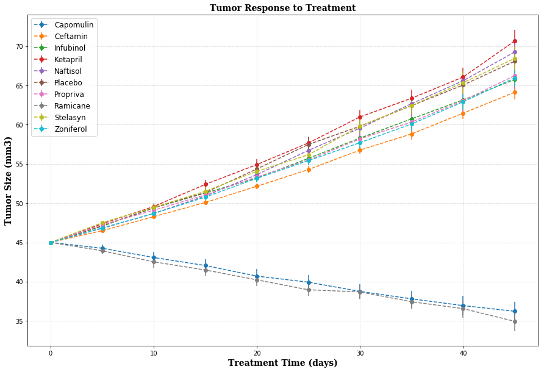
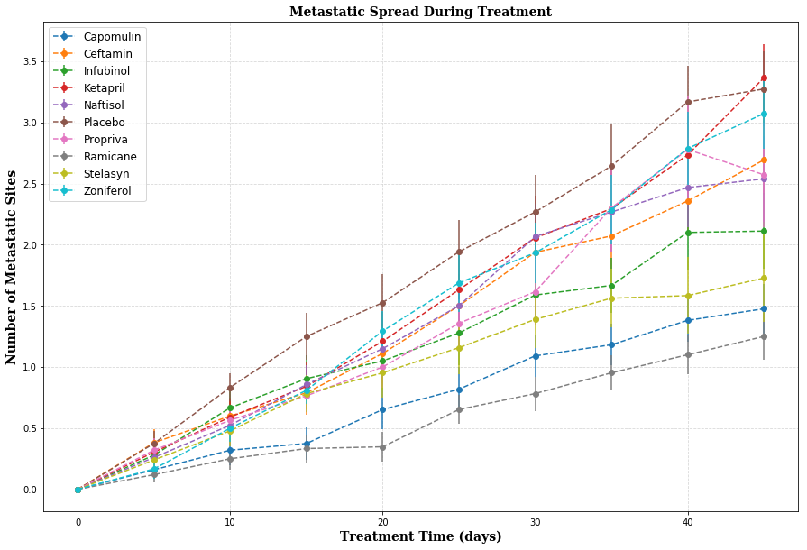
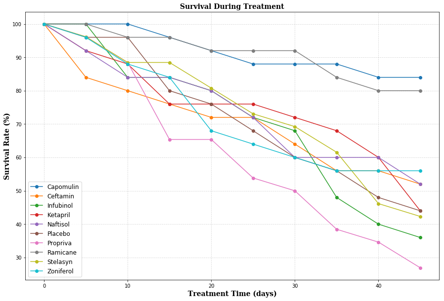
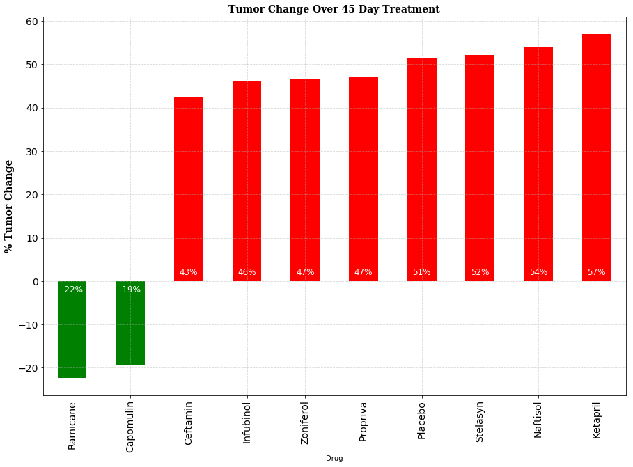

## PyPharmaceuticals
This script takes cancer study data in mice and summarizes drug effectiveness by graphing the results.Error was calculated using the standard error.


### Analysis:
    1. Ramicane and Capomulin are the only drugs that reduced tumor growth
    2. Ramicane and Capomulin saw the highest survival rates and lowest metastatic site growth
    3. Placebo performed similary to the drugs other than Ramicane and Capomulin 


```python
import pandas as pd
import os
import numpy as np
import matplotlib.pyplot as plt
```


```python
mouse_data=pd.read_csv("mouse_drug_data.csv",encoding="utf-8")
trial_data=pd.read_csv("clinicaltrial_data.csv",encoding="utf-8")
mouse_df=pd.DataFrame(mouse_data)
trial_df=pd.DataFrame(trial_data)
```


```python
mouse_df.head()
```


<div>
<style>
    .dataframe thead tr:only-child th {
        text-align: right;
    }

    .dataframe thead th {
        text-align: left;
    }

    .dataframe tbody tr th {
        vertical-align: top;
    }
</style>
<table border="1" class="dataframe">
  <thead>
    <tr style="text-align: right;">
      <th></th>
      <th>Mouse ID</th>
      <th>Drug</th>
    </tr>
  </thead>
  <tbody>
    <tr>
      <th>0</th>
      <td>f234</td>
      <td>Stelasyn</td>
    </tr>
    <tr>
      <th>1</th>
      <td>x402</td>
      <td>Stelasyn</td>
    </tr>
    <tr>
      <th>2</th>
      <td>a492</td>
      <td>Stelasyn</td>
    </tr>
    <tr>
      <th>3</th>
      <td>w540</td>
      <td>Stelasyn</td>
    </tr>
    <tr>
      <th>4</th>
      <td>v764</td>
      <td>Stelasyn</td>
    </tr>
  </tbody>
</table>
</div>


```python
trial_df.head()
mouse_trial_df=pd.merge(mouse_df,trial_df,how="inner",on="Mouse ID")
mouse_trial_df.head()
```


<div>
<style>
    .dataframe thead tr:only-child th {
        text-align: right;
    }

    .dataframe thead th {
        text-align: left;
    }

    .dataframe tbody tr th {
        vertical-align: top;
    }
</style>
<table border="1" class="dataframe">
  <thead>
    <tr style="text-align: right;">
      <th></th>
      <th>Mouse ID</th>
      <th>Drug</th>
      <th>Timepoint</th>
      <th>Tumor Volume (mm3)</th>
      <th>Metastatic Sites</th>
    </tr>
  </thead>
  <tbody>
    <tr>
      <th>0</th>
      <td>f234</td>
      <td>Stelasyn</td>
      <td>0</td>
      <td>45.000000</td>
      <td>0</td>
    </tr>
    <tr>
      <th>1</th>
      <td>f234</td>
      <td>Stelasyn</td>
      <td>5</td>
      <td>47.313491</td>
      <td>0</td>
    </tr>
    <tr>
      <th>2</th>
      <td>f234</td>
      <td>Stelasyn</td>
      <td>10</td>
      <td>47.904324</td>
      <td>0</td>
    </tr>
    <tr>
      <th>3</th>
      <td>f234</td>
      <td>Stelasyn</td>
      <td>15</td>
      <td>48.735197</td>
      <td>1</td>
    </tr>
    <tr>
      <th>4</th>
      <td>f234</td>
      <td>Stelasyn</td>
      <td>20</td>
      <td>51.112713</td>
      <td>2</td>
    </tr>
  </tbody>
</table>
</div>


### Tumorsize Over Time


```python
stdtumorsize=mouse_trial_df["Tumor Volume (mm3)"].groupby([mouse_trial_df["Timepoint"],mouse_trial_df["Drug"]]).std().unstack()
stdtumorsize_cols=list(stdtumorsize.columns)
stdtumorsize
```


<div>
<style>
    .dataframe thead tr:only-child th {
        text-align: right;
    }

    .dataframe thead th {
        text-align: left;
    }

    .dataframe tbody tr th {
        vertical-align: top;
    }
</style>
<table border="1" class="dataframe">
  <thead>
    <tr style="text-align: right;">
      <th>Drug</th>
      <th>Capomulin</th>
      <th>Ceftamin</th>
      <th>Infubinol</th>
      <th>Ketapril</th>
      <th>Naftisol</th>
      <th>Placebo</th>
      <th>Propriva</th>
      <th>Ramicane</th>
      <th>Stelasyn</th>
      <th>Zoniferol</th>
    </tr>
    <tr>
      <th>Timepoint</th>
      <th></th>
      <th></th>
      <th></th>
      <th></th>
      <th></th>
      <th></th>
      <th></th>
      <th></th>
      <th></th>
      <th></th>
    </tr>
  </thead>
  <tbody>
    <tr>
      <th>0</th>
      <td>0.000000</td>
      <td>0.000000</td>
      <td>0.000000</td>
      <td>0.000000</td>
      <td>0.000000</td>
      <td>0.000000</td>
      <td>0.000000</td>
      <td>0.000000</td>
      <td>0.000000</td>
      <td>0.000000</td>
    </tr>
    <tr>
      <th>5</th>
      <td>2.242964</td>
      <td>0.753856</td>
      <td>1.175512</td>
      <td>1.270025</td>
      <td>0.970606</td>
      <td>1.068422</td>
      <td>1.158540</td>
      <td>2.414777</td>
      <td>1.199312</td>
      <td>0.925664</td>
    </tr>
    <tr>
      <th>10</th>
      <td>3.513422</td>
      <td>1.056070</td>
      <td>1.293872</td>
      <td>1.676454</td>
      <td>1.463744</td>
      <td>1.969702</td>
      <td>1.804167</td>
      <td>3.528366</td>
      <td>2.079848</td>
      <td>1.238033</td>
    </tr>
    <tr>
      <th>15</th>
      <td>4.108369</td>
      <td>1.447385</td>
      <td>1.639210</td>
      <td>2.529329</td>
      <td>2.036395</td>
      <td>2.747955</td>
      <td>1.921818</td>
      <td>3.774331</td>
      <td>2.365597</td>
      <td>1.698048</td>
    </tr>
    <tr>
      <th>20</th>
      <td>4.362915</td>
      <td>1.525155</td>
      <td>2.129674</td>
      <td>3.166670</td>
      <td>2.662084</td>
      <td>3.659772</td>
      <td>2.289070</td>
      <td>3.770480</td>
      <td>2.849853</td>
      <td>2.198367</td>
    </tr>
    <tr>
      <th>25</th>
      <td>4.135268</td>
      <td>1.864031</td>
      <td>2.334787</td>
      <td>3.292768</td>
      <td>3.452264</td>
      <td>4.266887</td>
      <td>2.160438</td>
      <td>3.582445</td>
      <td>3.233965</td>
      <td>2.410052</td>
    </tr>
    <tr>
      <th>30</th>
      <td>4.383004</td>
      <td>1.962481</td>
      <td>2.601931</td>
      <td>3.963139</td>
      <td>3.778081</td>
      <td>4.718189</td>
      <td>2.689902</td>
      <td>4.147942</td>
      <td>3.816460</td>
      <td>3.098552</td>
    </tr>
    <tr>
      <th>35</th>
      <td>4.935447</td>
      <td>2.590153</td>
      <td>3.409213</td>
      <td>4.650315</td>
      <td>3.926309</td>
      <td>4.817311</td>
      <td>3.430847</td>
      <td>4.433337</td>
      <td>4.012745</td>
      <td>3.297993</td>
    </tr>
    <tr>
      <th>40</th>
      <td>5.607278</td>
      <td>2.650983</td>
      <td>3.336898</td>
      <td>4.486653</td>
      <td>4.332193</td>
      <td>4.748016</td>
      <td>4.694337</td>
      <td>5.046561</td>
      <td>4.885891</td>
      <td>3.736102</td>
    </tr>
    <tr>
      <th>45</th>
      <td>5.608969</td>
      <td>3.253497</td>
      <td>3.433282</td>
      <td>4.819674</td>
      <td>5.106770</td>
      <td>4.483167</td>
      <td>4.996728</td>
      <td>5.486439</td>
      <td>5.228845</td>
      <td>3.755037</td>
    </tr>
  </tbody>
</table>
</div>


```python
semtumorsize=mouse_trial_df["Tumor Volume (mm3)"].groupby([mouse_trial_df["Timepoint"],mouse_trial_df["Drug"]]).sem().unstack()
semtumorsize_cols=list(semtumorsize.columns)
semtumorsize
```


<div>
<style>
    .dataframe thead tr:only-child th {
        text-align: right;
    }

    .dataframe thead th {
        text-align: left;
    }

    .dataframe tbody tr th {
        vertical-align: top;
    }
</style>
<table border="1" class="dataframe">
  <thead>
    <tr style="text-align: right;">
      <th>Drug</th>
      <th>Capomulin</th>
      <th>Ceftamin</th>
      <th>Infubinol</th>
      <th>Ketapril</th>
      <th>Naftisol</th>
      <th>Placebo</th>
      <th>Propriva</th>
      <th>Ramicane</th>
      <th>Stelasyn</th>
      <th>Zoniferol</th>
    </tr>
    <tr>
      <th>Timepoint</th>
      <th></th>
      <th></th>
      <th></th>
      <th></th>
      <th></th>
      <th></th>
      <th></th>
      <th></th>
      <th></th>
      <th></th>
    </tr>
  </thead>
  <tbody>
    <tr>
      <th>0</th>
      <td>0.000000</td>
      <td>0.000000</td>
      <td>0.000000</td>
      <td>0.000000</td>
      <td>0.000000</td>
      <td>0.000000</td>
      <td>0.000000</td>
      <td>0.000000</td>
      <td>0.000000</td>
      <td>0.000000</td>
    </tr>
    <tr>
      <th>5</th>
      <td>0.448593</td>
      <td>0.164505</td>
      <td>0.235102</td>
      <td>0.264819</td>
      <td>0.202385</td>
      <td>0.218091</td>
      <td>0.231708</td>
      <td>0.482955</td>
      <td>0.239862</td>
      <td>0.188950</td>
    </tr>
    <tr>
      <th>10</th>
      <td>0.702684</td>
      <td>0.236144</td>
      <td>0.282346</td>
      <td>0.357421</td>
      <td>0.319415</td>
      <td>0.402064</td>
      <td>0.376195</td>
      <td>0.720225</td>
      <td>0.433678</td>
      <td>0.263949</td>
    </tr>
    <tr>
      <th>15</th>
      <td>0.838617</td>
      <td>0.332053</td>
      <td>0.357705</td>
      <td>0.580268</td>
      <td>0.444378</td>
      <td>0.614461</td>
      <td>0.466109</td>
      <td>0.770432</td>
      <td>0.493261</td>
      <td>0.370544</td>
    </tr>
    <tr>
      <th>20</th>
      <td>0.909731</td>
      <td>0.359482</td>
      <td>0.476210</td>
      <td>0.726484</td>
      <td>0.595260</td>
      <td>0.839609</td>
      <td>0.555181</td>
      <td>0.786199</td>
      <td>0.621889</td>
      <td>0.533182</td>
    </tr>
    <tr>
      <th>25</th>
      <td>0.881642</td>
      <td>0.439356</td>
      <td>0.550315</td>
      <td>0.755413</td>
      <td>0.813706</td>
      <td>1.034872</td>
      <td>0.577401</td>
      <td>0.746991</td>
      <td>0.741922</td>
      <td>0.602513</td>
    </tr>
    <tr>
      <th>30</th>
      <td>0.934460</td>
      <td>0.490620</td>
      <td>0.631061</td>
      <td>0.934121</td>
      <td>0.975496</td>
      <td>1.218231</td>
      <td>0.746045</td>
      <td>0.864906</td>
      <td>0.899548</td>
      <td>0.800043</td>
    </tr>
    <tr>
      <th>35</th>
      <td>1.052241</td>
      <td>0.692248</td>
      <td>0.984155</td>
      <td>1.127867</td>
      <td>1.013769</td>
      <td>1.287481</td>
      <td>1.084929</td>
      <td>0.967433</td>
      <td>1.003186</td>
      <td>0.881426</td>
    </tr>
    <tr>
      <th>40</th>
      <td>1.223608</td>
      <td>0.708505</td>
      <td>1.055220</td>
      <td>1.158449</td>
      <td>1.118567</td>
      <td>1.370634</td>
      <td>1.564779</td>
      <td>1.128445</td>
      <td>1.410435</td>
      <td>0.998515</td>
    </tr>
    <tr>
      <th>45</th>
      <td>1.223977</td>
      <td>0.902358</td>
      <td>1.144427</td>
      <td>1.453186</td>
      <td>1.416363</td>
      <td>1.351726</td>
      <td>1.888586</td>
      <td>1.226805</td>
      <td>1.576556</td>
      <td>1.003576</td>
    </tr>
  </tbody>
</table>
</div>


```python
#Tumor volume changes over time for each treatment
tumorsize=mouse_trial_df["Tumor Volume (mm3)"].groupby([mouse_trial_df["Timepoint"],mouse_trial_df["Drug"]]).mean().unstack()
tumorsize_cols=list(tumorsize.columns) #create a list of the drugs in tumorsize df
tumorsize

```


<div>
<style>
    .dataframe thead tr:only-child th {
        text-align: right;
    }

    .dataframe thead th {
        text-align: left;
    }

    .dataframe tbody tr th {
        vertical-align: top;
    }
</style>
<table border="1" class="dataframe">
  <thead>
    <tr style="text-align: right;">
      <th>Drug</th>
      <th>Capomulin</th>
      <th>Ceftamin</th>
      <th>Infubinol</th>
      <th>Ketapril</th>
      <th>Naftisol</th>
      <th>Placebo</th>
      <th>Propriva</th>
      <th>Ramicane</th>
      <th>Stelasyn</th>
      <th>Zoniferol</th>
    </tr>
    <tr>
      <th>Timepoint</th>
      <th></th>
      <th></th>
      <th></th>
      <th></th>
      <th></th>
      <th></th>
      <th></th>
      <th></th>
      <th></th>
      <th></th>
    </tr>
  </thead>
  <tbody>
    <tr>
      <th>0</th>
      <td>45.000000</td>
      <td>45.000000</td>
      <td>45.000000</td>
      <td>45.000000</td>
      <td>45.000000</td>
      <td>45.000000</td>
      <td>45.000000</td>
      <td>45.000000</td>
      <td>45.000000</td>
      <td>45.000000</td>
    </tr>
    <tr>
      <th>5</th>
      <td>44.266086</td>
      <td>46.503051</td>
      <td>47.062001</td>
      <td>47.389175</td>
      <td>46.796098</td>
      <td>47.125589</td>
      <td>47.248967</td>
      <td>43.944859</td>
      <td>47.527452</td>
      <td>46.851818</td>
    </tr>
    <tr>
      <th>10</th>
      <td>43.084291</td>
      <td>48.285125</td>
      <td>49.403909</td>
      <td>49.582269</td>
      <td>48.694210</td>
      <td>49.423329</td>
      <td>49.101541</td>
      <td>42.531957</td>
      <td>49.463844</td>
      <td>48.689881</td>
    </tr>
    <tr>
      <th>15</th>
      <td>42.064317</td>
      <td>50.094055</td>
      <td>51.296397</td>
      <td>52.399974</td>
      <td>50.933018</td>
      <td>51.359742</td>
      <td>51.067318</td>
      <td>41.495061</td>
      <td>51.529409</td>
      <td>50.779059</td>
    </tr>
    <tr>
      <th>20</th>
      <td>40.716325</td>
      <td>52.157049</td>
      <td>53.197691</td>
      <td>54.920935</td>
      <td>53.644087</td>
      <td>54.364417</td>
      <td>53.346737</td>
      <td>40.238325</td>
      <td>54.067395</td>
      <td>53.170334</td>
    </tr>
    <tr>
      <th>25</th>
      <td>39.939528</td>
      <td>54.287674</td>
      <td>55.715252</td>
      <td>57.678982</td>
      <td>56.731968</td>
      <td>57.482574</td>
      <td>55.504138</td>
      <td>38.974300</td>
      <td>56.166123</td>
      <td>55.432935</td>
    </tr>
    <tr>
      <th>30</th>
      <td>38.769339</td>
      <td>56.769517</td>
      <td>58.299397</td>
      <td>60.994507</td>
      <td>59.559509</td>
      <td>59.809063</td>
      <td>58.196374</td>
      <td>38.703137</td>
      <td>59.826738</td>
      <td>57.713531</td>
    </tr>
    <tr>
      <th>35</th>
      <td>37.816839</td>
      <td>58.827548</td>
      <td>60.742461</td>
      <td>63.371686</td>
      <td>62.685087</td>
      <td>62.420615</td>
      <td>60.350199</td>
      <td>37.451996</td>
      <td>62.440699</td>
      <td>60.089372</td>
    </tr>
    <tr>
      <th>40</th>
      <td>36.958001</td>
      <td>61.467895</td>
      <td>63.162824</td>
      <td>66.068580</td>
      <td>65.600754</td>
      <td>65.052675</td>
      <td>63.045537</td>
      <td>36.574081</td>
      <td>65.356386</td>
      <td>62.916692</td>
    </tr>
    <tr>
      <th>45</th>
      <td>36.236114</td>
      <td>64.132421</td>
      <td>65.755562</td>
      <td>70.662958</td>
      <td>69.265506</td>
      <td>68.084082</td>
      <td>66.258529</td>
      <td>34.955595</td>
      <td>68.438310</td>
      <td>65.960888</td>
    </tr>
  </tbody>
</table>
</div>


```python
# #create a for loop for all the drugs
# for i in range(len(tumorsize_columns)):
#     capplot=plt.scatter(tumorsize.index,tumorsize[tumorsize_columns[i]])#,marker="^",facecolors="red",alpha=0.75
# plt.show()
```


```python
font={'family': 'serif',
        'color':  'black',
        'weight': 'bold',
        'size': 14,
        }
```


```python
plt.figure(figsize=(15,10))
for i in range(len(tumorsize_cols)):
    capplot=plt.errorbar(tumorsize.index,tumorsize[tumorsize_cols[i]],semtumorsize[tumorsize_cols[i]],xerr=None,fmt='--o')
plt.title("Tumor Response to Treatment",fontdict=font)
plt.xlabel("Treatment Time (days)",fontdict=font)
plt.ylabel("Tumor Size (mm3)",fontdict=font)
plt.legend(loc="upper left",prop={'size':'large'})
plt.grid(alpha=0.5,linestyle='--')
plt.show()
```





### MetaStatic Sites Over Time


```python
metasites=mouse_trial_df["Metastatic Sites"].groupby([mouse_trial_df["Timepoint"],mouse_trial_df["Drug"]]).mean().unstack()
metasites_cols=list(metasites.columns)
metasites
```


<div>
<style>
    .dataframe thead tr:only-child th {
        text-align: right;
    }

    .dataframe thead th {
        text-align: left;
    }

    .dataframe tbody tr th {
        vertical-align: top;
    }
</style>
<table border="1" class="dataframe">
  <thead>
    <tr style="text-align: right;">
      <th>Drug</th>
      <th>Capomulin</th>
      <th>Ceftamin</th>
      <th>Infubinol</th>
      <th>Ketapril</th>
      <th>Naftisol</th>
      <th>Placebo</th>
      <th>Propriva</th>
      <th>Ramicane</th>
      <th>Stelasyn</th>
      <th>Zoniferol</th>
    </tr>
    <tr>
      <th>Timepoint</th>
      <th></th>
      <th></th>
      <th></th>
      <th></th>
      <th></th>
      <th></th>
      <th></th>
      <th></th>
      <th></th>
      <th></th>
    </tr>
  </thead>
  <tbody>
    <tr>
      <th>0</th>
      <td>0.000000</td>
      <td>0.000000</td>
      <td>0.000000</td>
      <td>0.000000</td>
      <td>0.000000</td>
      <td>0.000000</td>
      <td>0.000000</td>
      <td>0.000000</td>
      <td>0.000000</td>
      <td>0.000000</td>
    </tr>
    <tr>
      <th>5</th>
      <td>0.160000</td>
      <td>0.380952</td>
      <td>0.280000</td>
      <td>0.304348</td>
      <td>0.260870</td>
      <td>0.375000</td>
      <td>0.320000</td>
      <td>0.120000</td>
      <td>0.240000</td>
      <td>0.166667</td>
    </tr>
    <tr>
      <th>10</th>
      <td>0.320000</td>
      <td>0.600000</td>
      <td>0.666667</td>
      <td>0.590909</td>
      <td>0.523810</td>
      <td>0.833333</td>
      <td>0.565217</td>
      <td>0.250000</td>
      <td>0.478261</td>
      <td>0.500000</td>
    </tr>
    <tr>
      <th>15</th>
      <td>0.375000</td>
      <td>0.789474</td>
      <td>0.904762</td>
      <td>0.842105</td>
      <td>0.857143</td>
      <td>1.250000</td>
      <td>0.764706</td>
      <td>0.333333</td>
      <td>0.782609</td>
      <td>0.809524</td>
    </tr>
    <tr>
      <th>20</th>
      <td>0.652174</td>
      <td>1.111111</td>
      <td>1.050000</td>
      <td>1.210526</td>
      <td>1.150000</td>
      <td>1.526316</td>
      <td>1.000000</td>
      <td>0.347826</td>
      <td>0.952381</td>
      <td>1.294118</td>
    </tr>
    <tr>
      <th>25</th>
      <td>0.818182</td>
      <td>1.500000</td>
      <td>1.277778</td>
      <td>1.631579</td>
      <td>1.500000</td>
      <td>1.941176</td>
      <td>1.357143</td>
      <td>0.652174</td>
      <td>1.157895</td>
      <td>1.687500</td>
    </tr>
    <tr>
      <th>30</th>
      <td>1.090909</td>
      <td>1.937500</td>
      <td>1.588235</td>
      <td>2.055556</td>
      <td>2.066667</td>
      <td>2.266667</td>
      <td>1.615385</td>
      <td>0.782609</td>
      <td>1.388889</td>
      <td>1.933333</td>
    </tr>
    <tr>
      <th>35</th>
      <td>1.181818</td>
      <td>2.071429</td>
      <td>1.666667</td>
      <td>2.294118</td>
      <td>2.266667</td>
      <td>2.642857</td>
      <td>2.300000</td>
      <td>0.952381</td>
      <td>1.562500</td>
      <td>2.285714</td>
    </tr>
    <tr>
      <th>40</th>
      <td>1.380952</td>
      <td>2.357143</td>
      <td>2.100000</td>
      <td>2.733333</td>
      <td>2.466667</td>
      <td>3.166667</td>
      <td>2.777778</td>
      <td>1.100000</td>
      <td>1.583333</td>
      <td>2.785714</td>
    </tr>
    <tr>
      <th>45</th>
      <td>1.476190</td>
      <td>2.692308</td>
      <td>2.111111</td>
      <td>3.363636</td>
      <td>2.538462</td>
      <td>3.272727</td>
      <td>2.571429</td>
      <td>1.250000</td>
      <td>1.727273</td>
      <td>3.071429</td>
    </tr>
  </tbody>
</table>
</div>


```python
semmetasites=mouse_trial_df["Metastatic Sites"].groupby([mouse_trial_df["Timepoint"],mouse_trial_df["Drug"]]).sem().unstack()
semmetasites
```


<div>
<style>
    .dataframe thead tr:only-child th {
        text-align: right;
    }

    .dataframe thead th {
        text-align: left;
    }

    .dataframe tbody tr th {
        vertical-align: top;
    }
</style>
<table border="1" class="dataframe">
  <thead>
    <tr style="text-align: right;">
      <th>Drug</th>
      <th>Capomulin</th>
      <th>Ceftamin</th>
      <th>Infubinol</th>
      <th>Ketapril</th>
      <th>Naftisol</th>
      <th>Placebo</th>
      <th>Propriva</th>
      <th>Ramicane</th>
      <th>Stelasyn</th>
      <th>Zoniferol</th>
    </tr>
    <tr>
      <th>Timepoint</th>
      <th></th>
      <th></th>
      <th></th>
      <th></th>
      <th></th>
      <th></th>
      <th></th>
      <th></th>
      <th></th>
      <th></th>
    </tr>
  </thead>
  <tbody>
    <tr>
      <th>0</th>
      <td>0.000000</td>
      <td>0.000000</td>
      <td>0.000000</td>
      <td>0.000000</td>
      <td>0.000000</td>
      <td>0.000000</td>
      <td>0.000000</td>
      <td>0.000000</td>
      <td>0.000000</td>
      <td>0.000000</td>
    </tr>
    <tr>
      <th>5</th>
      <td>0.074833</td>
      <td>0.108588</td>
      <td>0.091652</td>
      <td>0.098100</td>
      <td>0.093618</td>
      <td>0.100947</td>
      <td>0.095219</td>
      <td>0.066332</td>
      <td>0.087178</td>
      <td>0.077709</td>
    </tr>
    <tr>
      <th>10</th>
      <td>0.125433</td>
      <td>0.152177</td>
      <td>0.159364</td>
      <td>0.142018</td>
      <td>0.163577</td>
      <td>0.115261</td>
      <td>0.105690</td>
      <td>0.090289</td>
      <td>0.123672</td>
      <td>0.109109</td>
    </tr>
    <tr>
      <th>15</th>
      <td>0.132048</td>
      <td>0.180625</td>
      <td>0.194015</td>
      <td>0.191381</td>
      <td>0.158651</td>
      <td>0.190221</td>
      <td>0.136377</td>
      <td>0.115261</td>
      <td>0.153439</td>
      <td>0.111677</td>
    </tr>
    <tr>
      <th>20</th>
      <td>0.161621</td>
      <td>0.241034</td>
      <td>0.234801</td>
      <td>0.236680</td>
      <td>0.181731</td>
      <td>0.234064</td>
      <td>0.171499</td>
      <td>0.119430</td>
      <td>0.200905</td>
      <td>0.166378</td>
    </tr>
    <tr>
      <th>25</th>
      <td>0.181818</td>
      <td>0.258831</td>
      <td>0.265753</td>
      <td>0.288275</td>
      <td>0.185240</td>
      <td>0.263888</td>
      <td>0.199095</td>
      <td>0.119430</td>
      <td>0.219824</td>
      <td>0.236621</td>
    </tr>
    <tr>
      <th>30</th>
      <td>0.172944</td>
      <td>0.249479</td>
      <td>0.227823</td>
      <td>0.347467</td>
      <td>0.266667</td>
      <td>0.300264</td>
      <td>0.266469</td>
      <td>0.139968</td>
      <td>0.230641</td>
      <td>0.248168</td>
    </tr>
    <tr>
      <th>35</th>
      <td>0.169496</td>
      <td>0.266526</td>
      <td>0.224733</td>
      <td>0.361418</td>
      <td>0.330464</td>
      <td>0.341412</td>
      <td>0.366667</td>
      <td>0.145997</td>
      <td>0.240983</td>
      <td>0.285714</td>
    </tr>
    <tr>
      <th>40</th>
      <td>0.175610</td>
      <td>0.289128</td>
      <td>0.314466</td>
      <td>0.315725</td>
      <td>0.321702</td>
      <td>0.297294</td>
      <td>0.433903</td>
      <td>0.160591</td>
      <td>0.312815</td>
      <td>0.299791</td>
    </tr>
    <tr>
      <th>45</th>
      <td>0.202591</td>
      <td>0.286101</td>
      <td>0.309320</td>
      <td>0.278722</td>
      <td>0.351104</td>
      <td>0.304240</td>
      <td>0.428571</td>
      <td>0.190221</td>
      <td>0.359062</td>
      <td>0.286400</td>
    </tr>
  </tbody>
</table>
</div>


```python
plt.figure(figsize=(15,10))
for i in range(len(tumorsize_cols)):
    capplot=plt.errorbar(metasites.index,metasites[metasites_cols[i]],semmetasites[metasites_cols[i]],xerr=None,fmt='--o')
plt.title("Metastatic Spread During Treatment",fontdict=font)
plt.xlabel("Treatment Time (days)",fontdict=font)
plt.ylabel("Number of Metastatic Sites",fontdict=font)
plt.legend(loc="upper left",prop={'size':'large'})
plt.grid(alpha=0.5,linestyle='--')
plt.show()
```





```python
micecount=mouse_trial_df["Mouse ID"].groupby([mouse_trial_df["Timepoint"],mouse_trial_df["Drug"]]).count().unstack()
micecount
micecount_cols=list(micecount.columns)
```


```python
plt.figure(figsize=(15,10))
for i in range(len(micecount_cols)):
    capplot=plt.plot(micecount.index,((micecount[micecount_cols[i]]/micecount[micecount_cols[i]][0])*100),'-o')
plt.title("Survival During Treatment",fontdict=font)
plt.ylabel("Survival Rate (%)",fontdict=font)
plt.xlabel("Treatment Time (days)",fontdict=font)
plt.legend(loc="lower left",prop={'size':'large'})
plt.grid(alpha=0.5,linestyle='--')
plt.show()
```





### Average Tumor Change Over Treatment Time


```python
mouse_trial_df.head()
tumorsize
```


<div>
<style>
    .dataframe thead tr:only-child th {
        text-align: right;
    }

    .dataframe thead th {
        text-align: left;
    }

    .dataframe tbody tr th {
        vertical-align: top;
    }
</style>
<table border="1" class="dataframe">
  <thead>
    <tr style="text-align: right;">
      <th>Drug</th>
      <th>Capomulin</th>
      <th>Ceftamin</th>
      <th>Infubinol</th>
      <th>Ketapril</th>
      <th>Naftisol</th>
      <th>Placebo</th>
      <th>Propriva</th>
      <th>Ramicane</th>
      <th>Stelasyn</th>
      <th>Zoniferol</th>
    </tr>
    <tr>
      <th>Timepoint</th>
      <th></th>
      <th></th>
      <th></th>
      <th></th>
      <th></th>
      <th></th>
      <th></th>
      <th></th>
      <th></th>
      <th></th>
    </tr>
  </thead>
  <tbody>
    <tr>
      <th>0</th>
      <td>45.000000</td>
      <td>45.000000</td>
      <td>45.000000</td>
      <td>45.000000</td>
      <td>45.000000</td>
      <td>45.000000</td>
      <td>45.000000</td>
      <td>45.000000</td>
      <td>45.000000</td>
      <td>45.000000</td>
    </tr>
    <tr>
      <th>5</th>
      <td>44.266086</td>
      <td>46.503051</td>
      <td>47.062001</td>
      <td>47.389175</td>
      <td>46.796098</td>
      <td>47.125589</td>
      <td>47.248967</td>
      <td>43.944859</td>
      <td>47.527452</td>
      <td>46.851818</td>
    </tr>
    <tr>
      <th>10</th>
      <td>43.084291</td>
      <td>48.285125</td>
      <td>49.403909</td>
      <td>49.582269</td>
      <td>48.694210</td>
      <td>49.423329</td>
      <td>49.101541</td>
      <td>42.531957</td>
      <td>49.463844</td>
      <td>48.689881</td>
    </tr>
    <tr>
      <th>15</th>
      <td>42.064317</td>
      <td>50.094055</td>
      <td>51.296397</td>
      <td>52.399974</td>
      <td>50.933018</td>
      <td>51.359742</td>
      <td>51.067318</td>
      <td>41.495061</td>
      <td>51.529409</td>
      <td>50.779059</td>
    </tr>
    <tr>
      <th>20</th>
      <td>40.716325</td>
      <td>52.157049</td>
      <td>53.197691</td>
      <td>54.920935</td>
      <td>53.644087</td>
      <td>54.364417</td>
      <td>53.346737</td>
      <td>40.238325</td>
      <td>54.067395</td>
      <td>53.170334</td>
    </tr>
    <tr>
      <th>25</th>
      <td>39.939528</td>
      <td>54.287674</td>
      <td>55.715252</td>
      <td>57.678982</td>
      <td>56.731968</td>
      <td>57.482574</td>
      <td>55.504138</td>
      <td>38.974300</td>
      <td>56.166123</td>
      <td>55.432935</td>
    </tr>
    <tr>
      <th>30</th>
      <td>38.769339</td>
      <td>56.769517</td>
      <td>58.299397</td>
      <td>60.994507</td>
      <td>59.559509</td>
      <td>59.809063</td>
      <td>58.196374</td>
      <td>38.703137</td>
      <td>59.826738</td>
      <td>57.713531</td>
    </tr>
    <tr>
      <th>35</th>
      <td>37.816839</td>
      <td>58.827548</td>
      <td>60.742461</td>
      <td>63.371686</td>
      <td>62.685087</td>
      <td>62.420615</td>
      <td>60.350199</td>
      <td>37.451996</td>
      <td>62.440699</td>
      <td>60.089372</td>
    </tr>
    <tr>
      <th>40</th>
      <td>36.958001</td>
      <td>61.467895</td>
      <td>63.162824</td>
      <td>66.068580</td>
      <td>65.600754</td>
      <td>65.052675</td>
      <td>63.045537</td>
      <td>36.574081</td>
      <td>65.356386</td>
      <td>62.916692</td>
    </tr>
    <tr>
      <th>45</th>
      <td>36.236114</td>
      <td>64.132421</td>
      <td>65.755562</td>
      <td>70.662958</td>
      <td>69.265506</td>
      <td>68.084082</td>
      <td>66.258529</td>
      <td>34.955595</td>
      <td>68.438310</td>
      <td>65.960888</td>
    </tr>
  </tbody>
</table>
</div>


```python
#Average tumor size at 0 compared to avg tumorsize at day 45-- Size(45)-Size(0)/Size(0)
tumor_change=[]
lstindex=tumorsize.index[len(tumorsize.index)-1]
fstindex=tumorsize.index[0]

for i in range(len(tumorsize_cols)):
    tumor_change.append(((tumorsize[tumorsize_cols[i]][lstindex]-tumorsize[tumorsize_cols[i]][fstindex])/tumorsize[tumorsize_cols[i]][fstindex])*100)
tumor_change_df=pd.DataFrame({"Drug": tumorsize_cols,"Tumor Growth":tumor_change})
tumor_change_df=tumor_change_df.sort_values("Tumor Growth")
tumor_change_df.set_index("Drug",drop=True,append=False,inplace=True)
colors=np.where(tumor_change_df["Tumor Growth"] > 0,"r","g")
heights=list(np.where(tumor_change_df["Tumor Growth"] > 0, 1,-3))
colors="".join(colors)
```


```python
plt.figure(figsize=(15,10))
tumplot=tumor_change_df["Tumor Growth"].plot.bar(color=colors,fontsize=14)
tumplot.grid(alpha=0.5,linestyle='--')
plt.title("Tumor Change Over 45 Day Treatment",fontdict=font)
plt.ylabel("% Tumor Change",fontdict=font)   

rects=tumplot.patches # get rectangles from graph
datalabels=list(tumor_change_df["Tumor Growth"])
datalabels=["{:.0f}%".format(label) for label in datalabels]

for height,rect,label in zip(heights,rects,datalabels):
    plt.text(rect.get_x()+rect.get_width()/2,height,label,horizontalalignment="center",verticalalignment="bottom",fontsize=12,color="white")
plt.show()
```




