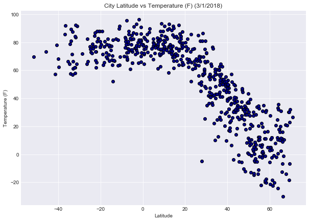
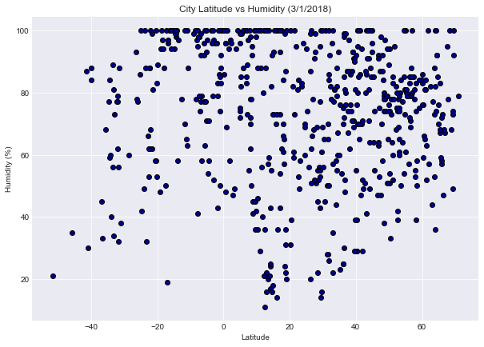
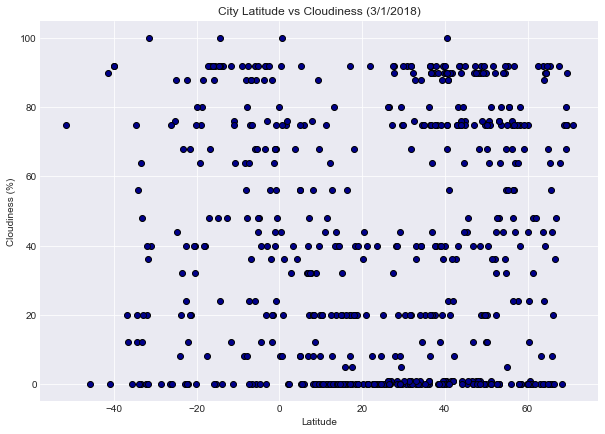
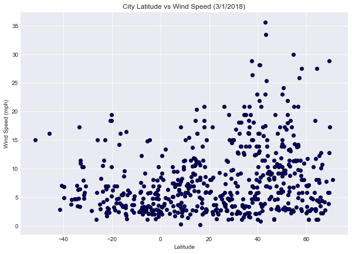

## WeatherPy

### Analysis:
    1. Temperature decreases as latitude increases from the equator (latitude > 0)
    2. Most cities below the equator (latitudes < 0) have temperatures between 60 and 100 degrees F, 
    indicating summer in the southern hemisphere
    3. Highest wind speeds (>25mph) are currently only in the northern hemisphere with latitudes greater than 10
    


```python
import pandas as pd
import os
import numpy as np
import matplotlib.pyplot as plt
import seaborn as sns
from citipy import citipy
import random
import requests as req
import json
import time
```


```python
apikey="a0f4ad483dfe2b70590d60e151064065"
url="http://api.openweathermap.org/data/2.5/weather?"
units="imperial"
query_url = url + "appid=" + apikey + "&units=" + units + "&q="
```


```python
#Create Random List of Lat and Long Coordinates
latrange=list(np.arange(-90,90,0.01))   
longrange=list(np.arange(-180,180,0.01))
lat=random.sample(latrange,3000)
long=random.sample(longrange,3000)
```


```python
cities=pd.DataFrame({"Latitude":lat,"Longitude":long})
cities["City"]=""
cities["Country"]=""
```


```python
for index in range(len(cities.index)):
    lati=cities.at[index,"Latitude"]
    longi=cities.at[index,"Longitude"]
    city=citipy.nearest_city(lati,longi)
    cities.at[index,"City"]=city.city_name
    cities.at[index,"Country"]=city.country_code
cities.head()
```


<div>
<style scoped>
    .dataframe tbody tr th:only-of-type {
        vertical-align: middle;
    }

    .dataframe tbody tr th {
        vertical-align: top;
    }

    .dataframe thead th {
        text-align: right;
    }
</style>
<table border="1" class="dataframe">
  <thead>
    <tr style="text-align: right;">
      <th></th>
      <th>Latitude</th>
      <th>Longitude</th>
      <th>City</th>
      <th>Country</th>
    </tr>
  </thead>
  <tbody>
    <tr>
      <th>0</th>
      <td>-56.04</td>
      <td>-11.27</td>
      <td>cape town</td>
      <td>za</td>
    </tr>
    <tr>
      <th>1</th>
      <td>-87.53</td>
      <td>57.74</td>
      <td>port alfred</td>
      <td>za</td>
    </tr>
    <tr>
      <th>2</th>
      <td>-54.20</td>
      <td>102.98</td>
      <td>busselton</td>
      <td>au</td>
    </tr>
    <tr>
      <th>3</th>
      <td>-42.83</td>
      <td>-179.24</td>
      <td>vaini</td>
      <td>to</td>
    </tr>
    <tr>
      <th>4</th>
      <td>76.33</td>
      <td>-0.38</td>
      <td>barentsburg</td>
      <td>sj</td>
    </tr>
  </tbody>
</table>
</div>


```python
#Create columns for weather data, drop duplicate cities, reset index
cities["Temperature"]=""
cities["Cloudiness"]=""
cities["Humidity"]=""
cities["Wind Speed"]=""
cities["Updated Latitude"]=""
cities=cities.drop_duplicates(subset=["City"],keep=False)
cities=cities.reset_index(drop=True)
numcities=len(cities.index)
```


```python
for row in range(numcities):
    url=query_url+cities.at[row,"City"]+","+cities.at[row,"Country"]
    print("Processing Request {} out of {} | {}".format(row+1,numcities,cities.at[row,"City"]))
    print(url)
    try:
        weather=req.get(url).json()
        cities.at[row,"Humidity"]=weather["main"]["humidity"]
        cities.at[row,"Temperature"]=weather["main"]["temp"]
        cities.at[row,"Cloudiness"]=weather["clouds"]["all"]
        cities.at[row,"Wind Speed"]=weather["wind"]["speed"]
        cities.at[row,"Updated Latitude"]=weather["coord"]["lat"]
        time.sleep(1) #wait for 1 second
    except KeyError:
        cities.at[row,"Humidity"]=np.nan
        cities.at[row,"Temperature"]=np.nan
        cities.at[row,"Cloudiness"]=np.nan
        cities.at[row,"Wind Speed"]=np.nan
        cities.at[row,"Updated Latitude"]=np.nan
        time.sleep(1) #wait for 1 second
        
cities.head(10)
```

    Processing Request 1 out of 685 | carutapera
    http://api.openweathermap.org/data/2.5/weather?appid=a0f4ad483dfe2b70590d60e151064065&units=imperial&q=carutapera,br
    Processing Request 2 out of 685 | ondjiva
    http://api.openweathermap.org/data/2.5/weather?appid=a0f4ad483dfe2b70590d60e151064065&units=imperial&q=ondjiva,ao
    Processing Request 3 out of 685 | acajutla
    http://api.openweathermap.org/data/2.5/weather?appid=a0f4ad483dfe2b70590d60e151064065&units=imperial&q=acajutla,sv
    Processing Request 4 out of 685 | oktyabrskoye
    http://api.openweathermap.org/data/2.5/weather?appid=a0f4ad483dfe2b70590d60e151064065&units=imperial&q=oktyabrskoye,ru
    Processing Request 5 out of 685 | samdari
    http://api.openweathermap.org/data/2.5/weather?appid=a0f4ad483dfe2b70590d60e151064065&units=imperial&q=samdari,in
    Processing Request 6 out of 685 | otane
    http://api.openweathermap.org/data/2.5/weather?appid=a0f4ad483dfe2b70590d60e151064065&units=imperial&q=otane,nz
    Processing Request 7 out of 685 | anapskaya
    http://api.openweathermap.org/data/2.5/weather?appid=a0f4ad483dfe2b70590d60e151064065&units=imperial&q=anapskaya,ru
    Processing Request 8 out of 685 | yeletskiy
    http://api.openweathermap.org/data/2.5/weather?appid=a0f4ad483dfe2b70590d60e151064065&units=imperial&q=yeletskiy,ru
    Processing Request 9 out of 685 | mahroni
    http://api.openweathermap.org/data/2.5/weather?appid=a0f4ad483dfe2b70590d60e151064065&units=imperial&q=mahroni,in
    Processing Request 10 out of 685 | djibo
    http://api.openweathermap.org/data/2.5/weather?appid=a0f4ad483dfe2b70590d60e151064065&units=imperial&q=djibo,bf
    Processing Request 11 out of 685 | victor harbor
    http://api.openweathermap.org/data/2.5/weather?appid=a0f4ad483dfe2b70590d60e151064065&units=imperial&q=victor harbor,au
    Processing Request 12 out of 685 | hanting
    http://api.openweathermap.org/data/2.5/weather?appid=a0f4ad483dfe2b70590d60e151064065&units=imperial&q=hanting,cn
    Processing Request 13 out of 685 | nanzhou
    http://api.openweathermap.org/data/2.5/weather?appid=a0f4ad483dfe2b70590d60e151064065&units=imperial&q=nanzhou,cn
    Processing Request 14 out of 685 | stephenville crossing
    http://api.openweathermap.org/data/2.5/weather?appid=a0f4ad483dfe2b70590d60e151064065&units=imperial&q=stephenville crossing,ca
    Processing Request 15 out of 685 | iquique
    http://api.openweathermap.org/data/2.5/weather?appid=a0f4ad483dfe2b70590d60e151064065&units=imperial&q=iquique,cl
    Processing Request 16 out of 685 | mogadishu
    http://api.openweathermap.org/data/2.5/weather?appid=a0f4ad483dfe2b70590d60e151064065&units=imperial&q=mogadishu,so
    Processing Request 17 out of 685 | beloha
    http://api.openweathermap.org/data/2.5/weather?appid=a0f4ad483dfe2b70590d60e151064065&units=imperial&q=beloha,mg
    Processing Request 18 out of 685 | bystryy istok
    http://api.openweathermap.org/data/2.5/weather?appid=a0f4ad483dfe2b70590d60e151064065&units=imperial&q=bystryy istok,ru
    Processing Request 19 out of 685 | tazmalt
    http://api.openweathermap.org/data/2.5/weather?appid=a0f4ad483dfe2b70590d60e151064065&units=imperial&q=tazmalt,dz
    Processing Request 20 out of 685 | el playon
    http://api.openweathermap.org/data/2.5/weather?appid=a0f4ad483dfe2b70590d60e151064065&units=imperial&q=el playon,co
    Processing Request 21 out of 685 | lengshuijiang
    http://api.openweathermap.org/data/2.5/weather?appid=a0f4ad483dfe2b70590d60e151064065&units=imperial&q=lengshuijiang,cn
    Processing Request 22 out of 685 | luganville
    http://api.openweathermap.org/data/2.5/weather?appid=a0f4ad483dfe2b70590d60e151064065&units=imperial&q=luganville,vu
    Processing Request 23 out of 685 | sfantu gheorghe
    http://api.openweathermap.org/data/2.5/weather?appid=a0f4ad483dfe2b70590d60e151064065&units=imperial&q=sfantu gheorghe,ro
    Processing Request 24 out of 685 | macusani
    http://api.openweathermap.org/data/2.5/weather?appid=a0f4ad483dfe2b70590d60e151064065&units=imperial&q=macusani,pe
    Processing Request 25 out of 685 | doka
    http://api.openweathermap.org/data/2.5/weather?appid=a0f4ad483dfe2b70590d60e151064065&units=imperial&q=doka,sd
    Processing Request 26 out of 685 | palu
    http://api.openweathermap.org/data/2.5/weather?appid=a0f4ad483dfe2b70590d60e151064065&units=imperial&q=palu,id
    Processing Request 27 out of 685 | kouango
    http://api.openweathermap.org/data/2.5/weather?appid=a0f4ad483dfe2b70590d60e151064065&units=imperial&q=kouango,cf
    Processing Request 28 out of 685 | pula
    http://api.openweathermap.org/data/2.5/weather?appid=a0f4ad483dfe2b70590d60e151064065&units=imperial&q=pula,hr
    Processing Request 29 out of 685 | mehtar lam
    http://api.openweathermap.org/data/2.5/weather?appid=a0f4ad483dfe2b70590d60e151064065&units=imperial&q=mehtar lam,af
    Processing Request 30 out of 685 | antalaha
    http://api.openweathermap.org/data/2.5/weather?appid=a0f4ad483dfe2b70590d60e151064065&units=imperial&q=antalaha,mg
    Processing Request 31 out of 685 | rehoboth
    http://api.openweathermap.org/data/2.5/weather?appid=a0f4ad483dfe2b70590d60e151064065&units=imperial&q=rehoboth,na
    Processing Request 32 out of 685 | athabasca
    http://api.openweathermap.org/data/2.5/weather?appid=a0f4ad483dfe2b70590d60e151064065&units=imperial&q=athabasca,ca
    Processing Request 33 out of 685 | dinsor
    http://api.openweathermap.org/data/2.5/weather?appid=a0f4ad483dfe2b70590d60e151064065&units=imperial&q=dinsor,so
    Processing Request 34 out of 685 | metro
    http://api.openweathermap.org/data/2.5/weather?appid=a0f4ad483dfe2b70590d60e151064065&units=imperial&q=metro,id
    Processing Request 35 out of 685 | merauke
    http://api.openweathermap.org/data/2.5/weather?appid=a0f4ad483dfe2b70590d60e151064065&units=imperial&q=merauke,id
    Processing Request 36 out of 685 | gazanjyk
    http://api.openweathermap.org/data/2.5/weather?appid=a0f4ad483dfe2b70590d60e151064065&units=imperial&q=gazanjyk,tm
    Processing Request 37 out of 685 | takestan
    http://api.openweathermap.org/data/2.5/weather?appid=a0f4ad483dfe2b70590d60e151064065&units=imperial&q=takestan,ir
    Processing Request 38 out of 685 | broken hill
    http://api.openweathermap.org/data/2.5/weather?appid=a0f4ad483dfe2b70590d60e151064065&units=imperial&q=broken hill,au
    Processing Request 39 out of 685 | summerville
    http://api.openweathermap.org/data/2.5/weather?appid=a0f4ad483dfe2b70590d60e151064065&units=imperial&q=summerville,us
    Processing Request 40 out of 685 | gasa
    http://api.openweathermap.org/data/2.5/weather?appid=a0f4ad483dfe2b70590d60e151064065&units=imperial&q=gasa,bt
    Processing Request 41 out of 685 | troitskoye
    http://api.openweathermap.org/data/2.5/weather?appid=a0f4ad483dfe2b70590d60e151064065&units=imperial&q=troitskoye,ru
    Processing Request 42 out of 685 | solnechnyy
    http://api.openweathermap.org/data/2.5/weather?appid=a0f4ad483dfe2b70590d60e151064065&units=imperial&q=solnechnyy,ru
    Processing Request 43 out of 685 | great falls
    http://api.openweathermap.org/data/2.5/weather?appid=a0f4ad483dfe2b70590d60e151064065&units=imperial&q=great falls,us
    Processing Request 44 out of 685 | burica
    http://api.openweathermap.org/data/2.5/weather?appid=a0f4ad483dfe2b70590d60e151064065&units=imperial&q=burica,pa
    Processing Request 45 out of 685 | dom pedrito
    http://api.openweathermap.org/data/2.5/weather?appid=a0f4ad483dfe2b70590d60e151064065&units=imperial&q=dom pedrito,br
    Processing Request 46 out of 685 | rokytne
    http://api.openweathermap.org/data/2.5/weather?appid=a0f4ad483dfe2b70590d60e151064065&units=imperial&q=rokytne,ua
    Processing Request 47 out of 685 | lerwick
    http://api.openweathermap.org/data/2.5/weather?appid=a0f4ad483dfe2b70590d60e151064065&units=imperial&q=lerwick,gb
    Processing Request 48 out of 685 | sambava
    http://api.openweathermap.org/data/2.5/weather?appid=a0f4ad483dfe2b70590d60e151064065&units=imperial&q=sambava,mg
    Processing Request 49 out of 685 | kenai
    http://api.openweathermap.org/data/2.5/weather?appid=a0f4ad483dfe2b70590d60e151064065&units=imperial&q=kenai,us
    Processing Request 50 out of 685 | yuksekova
    http://api.openweathermap.org/data/2.5/weather?appid=a0f4ad483dfe2b70590d60e151064065&units=imperial&q=yuksekova,tr
    Processing Request 51 out of 685 | tchollire
    http://api.openweathermap.org/data/2.5/weather?appid=a0f4ad483dfe2b70590d60e151064065&units=imperial&q=tchollire,cm
    Processing Request 52 out of 685 | novobirilyussy
    http://api.openweathermap.org/data/2.5/weather?appid=a0f4ad483dfe2b70590d60e151064065&units=imperial&q=novobirilyussy,ru
    Processing Request 53 out of 685 | gorno-chuyskiy
    http://api.openweathermap.org/data/2.5/weather?appid=a0f4ad483dfe2b70590d60e151064065&units=imperial&q=gorno-chuyskiy,ru
    Processing Request 54 out of 685 | nioro
    http://api.openweathermap.org/data/2.5/weather?appid=a0f4ad483dfe2b70590d60e151064065&units=imperial&q=nioro,ml
    Processing Request 55 out of 685 | koungou
    http://api.openweathermap.org/data/2.5/weather?appid=a0f4ad483dfe2b70590d60e151064065&units=imperial&q=koungou,yt
    Processing Request 56 out of 685 | champerico
    http://api.openweathermap.org/data/2.5/weather?appid=a0f4ad483dfe2b70590d60e151064065&units=imperial&q=champerico,gt
    Processing Request 57 out of 685 | alekseyevsk
    http://api.openweathermap.org/data/2.5/weather?appid=a0f4ad483dfe2b70590d60e151064065&units=imperial&q=alekseyevsk,ru
    Processing Request 58 out of 685 | segezha
    http://api.openweathermap.org/data/2.5/weather?appid=a0f4ad483dfe2b70590d60e151064065&units=imperial&q=segezha,ru
    Processing Request 59 out of 685 | linxia
    http://api.openweathermap.org/data/2.5/weather?appid=a0f4ad483dfe2b70590d60e151064065&units=imperial&q=linxia,cn
    Processing Request 60 out of 685 | viareggio
    http://api.openweathermap.org/data/2.5/weather?appid=a0f4ad483dfe2b70590d60e151064065&units=imperial&q=viareggio,it
    Processing Request 61 out of 685 | ravar
    http://api.openweathermap.org/data/2.5/weather?appid=a0f4ad483dfe2b70590d60e151064065&units=imperial&q=ravar,ir
    Processing Request 62 out of 685 | ankang
    http://api.openweathermap.org/data/2.5/weather?appid=a0f4ad483dfe2b70590d60e151064065&units=imperial&q=ankang,cn
    Processing Request 63 out of 685 | lafiagi
    http://api.openweathermap.org/data/2.5/weather?appid=a0f4ad483dfe2b70590d60e151064065&units=imperial&q=lafiagi,ng
    Processing Request 64 out of 685 | chifeng
    http://api.openweathermap.org/data/2.5/weather?appid=a0f4ad483dfe2b70590d60e151064065&units=imperial&q=chifeng,cn
    Processing Request 65 out of 685 | madera
    http://api.openweathermap.org/data/2.5/weather?appid=a0f4ad483dfe2b70590d60e151064065&units=imperial&q=madera,mx
    Processing Request 66 out of 685 | skalistyy
    http://api.openweathermap.org/data/2.5/weather?appid=a0f4ad483dfe2b70590d60e151064065&units=imperial&q=skalistyy,ru
    Processing Request 67 out of 685 | tromso
    http://api.openweathermap.org/data/2.5/weather?appid=a0f4ad483dfe2b70590d60e151064065&units=imperial&q=tromso,no
    Processing Request 68 out of 685 | pafos
    http://api.openweathermap.org/data/2.5/weather?appid=a0f4ad483dfe2b70590d60e151064065&units=imperial&q=pafos,cy
    Processing Request 69 out of 685 | ulaangom
    http://api.openweathermap.org/data/2.5/weather?appid=a0f4ad483dfe2b70590d60e151064065&units=imperial&q=ulaangom,mn
    Processing Request 70 out of 685 | perbaungan
    http://api.openweathermap.org/data/2.5/weather?appid=a0f4ad483dfe2b70590d60e151064065&units=imperial&q=perbaungan,id
    Processing Request 71 out of 685 | honningsvag
    http://api.openweathermap.org/data/2.5/weather?appid=a0f4ad483dfe2b70590d60e151064065&units=imperial&q=honningsvag,no
    Processing Request 72 out of 685 | kegayli
    http://api.openweathermap.org/data/2.5/weather?appid=a0f4ad483dfe2b70590d60e151064065&units=imperial&q=kegayli,uz
    Processing Request 73 out of 685 | bonavista
    http://api.openweathermap.org/data/2.5/weather?appid=a0f4ad483dfe2b70590d60e151064065&units=imperial&q=bonavista,ca
    Processing Request 74 out of 685 | achalpur
    http://api.openweathermap.org/data/2.5/weather?appid=a0f4ad483dfe2b70590d60e151064065&units=imperial&q=achalpur,in
    Processing Request 75 out of 685 | zonguldak
    http://api.openweathermap.org/data/2.5/weather?appid=a0f4ad483dfe2b70590d60e151064065&units=imperial&q=zonguldak,tr
    Processing Request 76 out of 685 | brunico
    http://api.openweathermap.org/data/2.5/weather?appid=a0f4ad483dfe2b70590d60e151064065&units=imperial&q=brunico,it
    Processing Request 77 out of 685 | tete
    http://api.openweathermap.org/data/2.5/weather?appid=a0f4ad483dfe2b70590d60e151064065&units=imperial&q=tete,mz
    Processing Request 78 out of 685 | tungor
    http://api.openweathermap.org/data/2.5/weather?appid=a0f4ad483dfe2b70590d60e151064065&units=imperial&q=tungor,ru
    Processing Request 79 out of 685 | kingman
    http://api.openweathermap.org/data/2.5/weather?appid=a0f4ad483dfe2b70590d60e151064065&units=imperial&q=kingman,us
    Processing Request 80 out of 685 | dasoguz
    http://api.openweathermap.org/data/2.5/weather?appid=a0f4ad483dfe2b70590d60e151064065&units=imperial&q=dasoguz,tm
    Processing Request 81 out of 685 | mountain home
    http://api.openweathermap.org/data/2.5/weather?appid=a0f4ad483dfe2b70590d60e151064065&units=imperial&q=mountain home,us
    Processing Request 82 out of 685 | puksoozero
    http://api.openweathermap.org/data/2.5/weather?appid=a0f4ad483dfe2b70590d60e151064065&units=imperial&q=puksoozero,ru
    Processing Request 83 out of 685 | baltiysk
    http://api.openweathermap.org/data/2.5/weather?appid=a0f4ad483dfe2b70590d60e151064065&units=imperial&q=baltiysk,ru
    Processing Request 84 out of 685 | peniche
    http://api.openweathermap.org/data/2.5/weather?appid=a0f4ad483dfe2b70590d60e151064065&units=imperial&q=peniche,pt
    Processing Request 85 out of 685 | jalu
    http://api.openweathermap.org/data/2.5/weather?appid=a0f4ad483dfe2b70590d60e151064065&units=imperial&q=jalu,ly
    Processing Request 86 out of 685 | bolonchen
    http://api.openweathermap.org/data/2.5/weather?appid=a0f4ad483dfe2b70590d60e151064065&units=imperial&q=bolonchen,mx
    Processing Request 87 out of 685 | assare
    http://api.openweathermap.org/data/2.5/weather?appid=a0f4ad483dfe2b70590d60e151064065&units=imperial&q=assare,br
    Processing Request 88 out of 685 | edson
    http://api.openweathermap.org/data/2.5/weather?appid=a0f4ad483dfe2b70590d60e151064065&units=imperial&q=edson,ca
    Processing Request 89 out of 685 | batagay-alyta
    http://api.openweathermap.org/data/2.5/weather?appid=a0f4ad483dfe2b70590d60e151064065&units=imperial&q=batagay-alyta,ru
    Processing Request 90 out of 685 | bagdarin
    http://api.openweathermap.org/data/2.5/weather?appid=a0f4ad483dfe2b70590d60e151064065&units=imperial&q=bagdarin,ru
    Processing Request 91 out of 685 | kiama
    http://api.openweathermap.org/data/2.5/weather?appid=a0f4ad483dfe2b70590d60e151064065&units=imperial&q=kiama,au
    Processing Request 92 out of 685 | payo
    http://api.openweathermap.org/data/2.5/weather?appid=a0f4ad483dfe2b70590d60e151064065&units=imperial&q=payo,ph
    Processing Request 93 out of 685 | keflavik
    http://api.openweathermap.org/data/2.5/weather?appid=a0f4ad483dfe2b70590d60e151064065&units=imperial&q=keflavik,is
    Processing Request 94 out of 685 | wufeng
    http://api.openweathermap.org/data/2.5/weather?appid=a0f4ad483dfe2b70590d60e151064065&units=imperial&q=wufeng,cn
    Processing Request 95 out of 685 | benicia
    http://api.openweathermap.org/data/2.5/weather?appid=a0f4ad483dfe2b70590d60e151064065&units=imperial&q=benicia,us
    Processing Request 96 out of 685 | patterson
    http://api.openweathermap.org/data/2.5/weather?appid=a0f4ad483dfe2b70590d60e151064065&units=imperial&q=patterson,us
    Processing Request 97 out of 685 | emerald
    http://api.openweathermap.org/data/2.5/weather?appid=a0f4ad483dfe2b70590d60e151064065&units=imperial&q=emerald,au
    Processing Request 98 out of 685 | deogarh
    http://api.openweathermap.org/data/2.5/weather?appid=a0f4ad483dfe2b70590d60e151064065&units=imperial&q=deogarh,in
    Processing Request 99 out of 685 | kropotkin
    http://api.openweathermap.org/data/2.5/weather?appid=a0f4ad483dfe2b70590d60e151064065&units=imperial&q=kropotkin,ru
    Processing Request 100 out of 685 | houma
    http://api.openweathermap.org/data/2.5/weather?appid=a0f4ad483dfe2b70590d60e151064065&units=imperial&q=houma,us
    Processing Request 101 out of 685 | domingos martins
    http://api.openweathermap.org/data/2.5/weather?appid=a0f4ad483dfe2b70590d60e151064065&units=imperial&q=domingos martins,br
    Processing Request 102 out of 685 | bondoukou
    http://api.openweathermap.org/data/2.5/weather?appid=a0f4ad483dfe2b70590d60e151064065&units=imperial&q=bondoukou,ci
    Processing Request 103 out of 685 | helena
    http://api.openweathermap.org/data/2.5/weather?appid=a0f4ad483dfe2b70590d60e151064065&units=imperial&q=helena,us
    Processing Request 104 out of 685 | santa cruz
    http://api.openweathermap.org/data/2.5/weather?appid=a0f4ad483dfe2b70590d60e151064065&units=imperial&q=santa cruz,cr
    Processing Request 105 out of 685 | saravan
    http://api.openweathermap.org/data/2.5/weather?appid=a0f4ad483dfe2b70590d60e151064065&units=imperial&q=saravan,la
    Processing Request 106 out of 685 | bereda
    http://api.openweathermap.org/data/2.5/weather?appid=a0f4ad483dfe2b70590d60e151064065&units=imperial&q=bereda,so
    Processing Request 107 out of 685 | yangjiang
    http://api.openweathermap.org/data/2.5/weather?appid=a0f4ad483dfe2b70590d60e151064065&units=imperial&q=yangjiang,cn
    Processing Request 108 out of 685 | keti bandar
    http://api.openweathermap.org/data/2.5/weather?appid=a0f4ad483dfe2b70590d60e151064065&units=imperial&q=keti bandar,pk
    Processing Request 109 out of 685 | wuxue
    http://api.openweathermap.org/data/2.5/weather?appid=a0f4ad483dfe2b70590d60e151064065&units=imperial&q=wuxue,cn
    Processing Request 110 out of 685 | chase
    http://api.openweathermap.org/data/2.5/weather?appid=a0f4ad483dfe2b70590d60e151064065&units=imperial&q=chase,ca
    Processing Request 111 out of 685 | smithfield
    http://api.openweathermap.org/data/2.5/weather?appid=a0f4ad483dfe2b70590d60e151064065&units=imperial&q=smithfield,us
    Processing Request 112 out of 685 | kenitra
    http://api.openweathermap.org/data/2.5/weather?appid=a0f4ad483dfe2b70590d60e151064065&units=imperial&q=kenitra,ma
    Processing Request 113 out of 685 | chagda
    http://api.openweathermap.org/data/2.5/weather?appid=a0f4ad483dfe2b70590d60e151064065&units=imperial&q=chagda,ru
    Processing Request 114 out of 685 | mumford
    http://api.openweathermap.org/data/2.5/weather?appid=a0f4ad483dfe2b70590d60e151064065&units=imperial&q=mumford,gh
    Processing Request 115 out of 685 | kolpashevo
    http://api.openweathermap.org/data/2.5/weather?appid=a0f4ad483dfe2b70590d60e151064065&units=imperial&q=kolpashevo,ru
    Processing Request 116 out of 685 | lebyazhye
    http://api.openweathermap.org/data/2.5/weather?appid=a0f4ad483dfe2b70590d60e151064065&units=imperial&q=lebyazhye,ru
    Processing Request 117 out of 685 | indianola
    http://api.openweathermap.org/data/2.5/weather?appid=a0f4ad483dfe2b70590d60e151064065&units=imperial&q=indianola,us
    Processing Request 118 out of 685 | powell river
    http://api.openweathermap.org/data/2.5/weather?appid=a0f4ad483dfe2b70590d60e151064065&units=imperial&q=powell river,ca
    Processing Request 119 out of 685 | kitimat
    http://api.openweathermap.org/data/2.5/weather?appid=a0f4ad483dfe2b70590d60e151064065&units=imperial&q=kitimat,ca
    Processing Request 120 out of 685 | maryville
    http://api.openweathermap.org/data/2.5/weather?appid=a0f4ad483dfe2b70590d60e151064065&units=imperial&q=maryville,us
    Processing Request 121 out of 685 | pahrump
    http://api.openweathermap.org/data/2.5/weather?appid=a0f4ad483dfe2b70590d60e151064065&units=imperial&q=pahrump,us
    Processing Request 122 out of 685 | isla mujeres
    http://api.openweathermap.org/data/2.5/weather?appid=a0f4ad483dfe2b70590d60e151064065&units=imperial&q=isla mujeres,mx
    Processing Request 123 out of 685 | ksenyevka
    http://api.openweathermap.org/data/2.5/weather?appid=a0f4ad483dfe2b70590d60e151064065&units=imperial&q=ksenyevka,ru
    Processing Request 124 out of 685 | presidente medici
    http://api.openweathermap.org/data/2.5/weather?appid=a0f4ad483dfe2b70590d60e151064065&units=imperial&q=presidente medici,br
    Processing Request 125 out of 685 | san julian
    http://api.openweathermap.org/data/2.5/weather?appid=a0f4ad483dfe2b70590d60e151064065&units=imperial&q=san julian,mx
    Processing Request 126 out of 685 | grand centre
    http://api.openweathermap.org/data/2.5/weather?appid=a0f4ad483dfe2b70590d60e151064065&units=imperial&q=grand centre,ca
    Processing Request 127 out of 685 | tabialan
    http://api.openweathermap.org/data/2.5/weather?appid=a0f4ad483dfe2b70590d60e151064065&units=imperial&q=tabialan,ph
    Processing Request 128 out of 685 | las margaritas
    http://api.openweathermap.org/data/2.5/weather?appid=a0f4ad483dfe2b70590d60e151064065&units=imperial&q=las margaritas,mx
    Processing Request 129 out of 685 | buin
    http://api.openweathermap.org/data/2.5/weather?appid=a0f4ad483dfe2b70590d60e151064065&units=imperial&q=buin,pg
    Processing Request 130 out of 685 | kysyl-syr
    http://api.openweathermap.org/data/2.5/weather?appid=a0f4ad483dfe2b70590d60e151064065&units=imperial&q=kysyl-syr,ru
    Processing Request 131 out of 685 | comodoro rivadavia
    http://api.openweathermap.org/data/2.5/weather?appid=a0f4ad483dfe2b70590d60e151064065&units=imperial&q=comodoro rivadavia,ar
    Processing Request 132 out of 685 | faro
    http://api.openweathermap.org/data/2.5/weather?appid=a0f4ad483dfe2b70590d60e151064065&units=imperial&q=faro,pt
    Processing Request 133 out of 685 | cinco esquinas
    http://api.openweathermap.org/data/2.5/weather?appid=a0f4ad483dfe2b70590d60e151064065&units=imperial&q=cinco esquinas,cr
    Processing Request 134 out of 685 | socorro
    http://api.openweathermap.org/data/2.5/weather?appid=a0f4ad483dfe2b70590d60e151064065&units=imperial&q=socorro,us
    Processing Request 135 out of 685 | avera
    http://api.openweathermap.org/data/2.5/weather?appid=a0f4ad483dfe2b70590d60e151064065&units=imperial&q=avera,pf
    Processing Request 136 out of 685 | macamic
    http://api.openweathermap.org/data/2.5/weather?appid=a0f4ad483dfe2b70590d60e151064065&units=imperial&q=macamic,ca
    Processing Request 137 out of 685 | malinyi
    http://api.openweathermap.org/data/2.5/weather?appid=a0f4ad483dfe2b70590d60e151064065&units=imperial&q=malinyi,tz
    Processing Request 138 out of 685 | garcia
    http://api.openweathermap.org/data/2.5/weather?appid=a0f4ad483dfe2b70590d60e151064065&units=imperial&q=garcia,mx
    Processing Request 139 out of 685 | simao
    http://api.openweathermap.org/data/2.5/weather?appid=a0f4ad483dfe2b70590d60e151064065&units=imperial&q=simao,cn
    Processing Request 140 out of 685 | marrakesh
    http://api.openweathermap.org/data/2.5/weather?appid=a0f4ad483dfe2b70590d60e151064065&units=imperial&q=marrakesh,ma
    Processing Request 141 out of 685 | malmesbury
    http://api.openweathermap.org/data/2.5/weather?appid=a0f4ad483dfe2b70590d60e151064065&units=imperial&q=malmesbury,za
    Processing Request 142 out of 685 | jabiru
    http://api.openweathermap.org/data/2.5/weather?appid=a0f4ad483dfe2b70590d60e151064065&units=imperial&q=jabiru,au
    Processing Request 143 out of 685 | venice
    http://api.openweathermap.org/data/2.5/weather?appid=a0f4ad483dfe2b70590d60e151064065&units=imperial&q=venice,us
    Processing Request 144 out of 685 | pachino
    http://api.openweathermap.org/data/2.5/weather?appid=a0f4ad483dfe2b70590d60e151064065&units=imperial&q=pachino,it
    Processing Request 145 out of 685 | toropets
    http://api.openweathermap.org/data/2.5/weather?appid=a0f4ad483dfe2b70590d60e151064065&units=imperial&q=toropets,ru
    Processing Request 146 out of 685 | griffith
    http://api.openweathermap.org/data/2.5/weather?appid=a0f4ad483dfe2b70590d60e151064065&units=imperial&q=griffith,au
    Processing Request 147 out of 685 | karlshamn
    http://api.openweathermap.org/data/2.5/weather?appid=a0f4ad483dfe2b70590d60e151064065&units=imperial&q=karlshamn,se
    Processing Request 148 out of 685 | alim
    http://api.openweathermap.org/data/2.5/weather?appid=a0f4ad483dfe2b70590d60e151064065&units=imperial&q=alim,ph
    Processing Request 149 out of 685 | sunrise manor
    http://api.openweathermap.org/data/2.5/weather?appid=a0f4ad483dfe2b70590d60e151064065&units=imperial&q=sunrise manor,us
    Processing Request 150 out of 685 | bikapur
    http://api.openweathermap.org/data/2.5/weather?appid=a0f4ad483dfe2b70590d60e151064065&units=imperial&q=bikapur,in
    Processing Request 151 out of 685 | conselheiro pena
    http://api.openweathermap.org/data/2.5/weather?appid=a0f4ad483dfe2b70590d60e151064065&units=imperial&q=conselheiro pena,br
    Processing Request 152 out of 685 | mandeville
    http://api.openweathermap.org/data/2.5/weather?appid=a0f4ad483dfe2b70590d60e151064065&units=imperial&q=mandeville,jm
    Processing Request 153 out of 685 | manokwari
    http://api.openweathermap.org/data/2.5/weather?appid=a0f4ad483dfe2b70590d60e151064065&units=imperial&q=manokwari,id
    Processing Request 154 out of 685 | ilhabela
    http://api.openweathermap.org/data/2.5/weather?appid=a0f4ad483dfe2b70590d60e151064065&units=imperial&q=ilhabela,br
    Processing Request 155 out of 685 | khomeyn
    http://api.openweathermap.org/data/2.5/weather?appid=a0f4ad483dfe2b70590d60e151064065&units=imperial&q=khomeyn,ir
    Processing Request 156 out of 685 | idah
    http://api.openweathermap.org/data/2.5/weather?appid=a0f4ad483dfe2b70590d60e151064065&units=imperial&q=idah,ng
    Processing Request 157 out of 685 | kadoma
    http://api.openweathermap.org/data/2.5/weather?appid=a0f4ad483dfe2b70590d60e151064065&units=imperial&q=kadoma,zw
    Processing Request 158 out of 685 | saint-ambroise
    http://api.openweathermap.org/data/2.5/weather?appid=a0f4ad483dfe2b70590d60e151064065&units=imperial&q=saint-ambroise,ca
    Processing Request 159 out of 685 | mokhsogollokh
    http://api.openweathermap.org/data/2.5/weather?appid=a0f4ad483dfe2b70590d60e151064065&units=imperial&q=mokhsogollokh,ru
    Processing Request 160 out of 685 | foz
    http://api.openweathermap.org/data/2.5/weather?appid=a0f4ad483dfe2b70590d60e151064065&units=imperial&q=foz,es
    Processing Request 161 out of 685 | rabo de peixe
    http://api.openweathermap.org/data/2.5/weather?appid=a0f4ad483dfe2b70590d60e151064065&units=imperial&q=rabo de peixe,pt
    Processing Request 162 out of 685 | half moon bay
    http://api.openweathermap.org/data/2.5/weather?appid=a0f4ad483dfe2b70590d60e151064065&units=imperial&q=half moon bay,us
    Processing Request 163 out of 685 | mahon
    http://api.openweathermap.org/data/2.5/weather?appid=a0f4ad483dfe2b70590d60e151064065&units=imperial&q=mahon,es
    Processing Request 164 out of 685 | mattru
    http://api.openweathermap.org/data/2.5/weather?appid=a0f4ad483dfe2b70590d60e151064065&units=imperial&q=mattru,sl
    Processing Request 165 out of 685 | sechura
    http://api.openweathermap.org/data/2.5/weather?appid=a0f4ad483dfe2b70590d60e151064065&units=imperial&q=sechura,pe
    Processing Request 166 out of 685 | portland
    http://api.openweathermap.org/data/2.5/weather?appid=a0f4ad483dfe2b70590d60e151064065&units=imperial&q=portland,au
    Processing Request 167 out of 685 | zelenoborskiy
    http://api.openweathermap.org/data/2.5/weather?appid=a0f4ad483dfe2b70590d60e151064065&units=imperial&q=zelenoborskiy,ru
    Processing Request 168 out of 685 | tawnat
    http://api.openweathermap.org/data/2.5/weather?appid=a0f4ad483dfe2b70590d60e151064065&units=imperial&q=tawnat,ma
    Processing Request 169 out of 685 | mount darwin
    http://api.openweathermap.org/data/2.5/weather?appid=a0f4ad483dfe2b70590d60e151064065&units=imperial&q=mount darwin,zw
    Processing Request 170 out of 685 | la baule-escoublac
    http://api.openweathermap.org/data/2.5/weather?appid=a0f4ad483dfe2b70590d60e151064065&units=imperial&q=la baule-escoublac,fr
    Processing Request 171 out of 685 | kpandu
    http://api.openweathermap.org/data/2.5/weather?appid=a0f4ad483dfe2b70590d60e151064065&units=imperial&q=kpandu,gh
    Processing Request 172 out of 685 | massaguet
    http://api.openweathermap.org/data/2.5/weather?appid=a0f4ad483dfe2b70590d60e151064065&units=imperial&q=massaguet,td
    Processing Request 173 out of 685 | zaterechnyy
    http://api.openweathermap.org/data/2.5/weather?appid=a0f4ad483dfe2b70590d60e151064065&units=imperial&q=zaterechnyy,ru
    Processing Request 174 out of 685 | palembang
    http://api.openweathermap.org/data/2.5/weather?appid=a0f4ad483dfe2b70590d60e151064065&units=imperial&q=palembang,id
    Processing Request 175 out of 685 | liverpool
    http://api.openweathermap.org/data/2.5/weather?appid=a0f4ad483dfe2b70590d60e151064065&units=imperial&q=liverpool,ca
    Processing Request 176 out of 685 | faya
    http://api.openweathermap.org/data/2.5/weather?appid=a0f4ad483dfe2b70590d60e151064065&units=imperial&q=faya,td
    Processing Request 177 out of 685 | yovon
    http://api.openweathermap.org/data/2.5/weather?appid=a0f4ad483dfe2b70590d60e151064065&units=imperial&q=yovon,tj
    Processing Request 178 out of 685 | gagarin
    http://api.openweathermap.org/data/2.5/weather?appid=a0f4ad483dfe2b70590d60e151064065&units=imperial&q=gagarin,uz
    Processing Request 179 out of 685 | tanout
    http://api.openweathermap.org/data/2.5/weather?appid=a0f4ad483dfe2b70590d60e151064065&units=imperial&q=tanout,ne
    Processing Request 180 out of 685 | shido
    http://api.openweathermap.org/data/2.5/weather?appid=a0f4ad483dfe2b70590d60e151064065&units=imperial&q=shido,jp
    Processing Request 181 out of 685 | buala
    http://api.openweathermap.org/data/2.5/weather?appid=a0f4ad483dfe2b70590d60e151064065&units=imperial&q=buala,sb
    Processing Request 182 out of 685 | wexford
    http://api.openweathermap.org/data/2.5/weather?appid=a0f4ad483dfe2b70590d60e151064065&units=imperial&q=wexford,ie
    Processing Request 183 out of 685 | may pen
    http://api.openweathermap.org/data/2.5/weather?appid=a0f4ad483dfe2b70590d60e151064065&units=imperial&q=may pen,jm
    Processing Request 184 out of 685 | ambon
    http://api.openweathermap.org/data/2.5/weather?appid=a0f4ad483dfe2b70590d60e151064065&units=imperial&q=ambon,id
    Processing Request 185 out of 685 | mgandu
    http://api.openweathermap.org/data/2.5/weather?appid=a0f4ad483dfe2b70590d60e151064065&units=imperial&q=mgandu,tz
    Processing Request 186 out of 685 | condega
    http://api.openweathermap.org/data/2.5/weather?appid=a0f4ad483dfe2b70590d60e151064065&units=imperial&q=condega,ni
    Processing Request 187 out of 685 | samalaeulu
    http://api.openweathermap.org/data/2.5/weather?appid=a0f4ad483dfe2b70590d60e151064065&units=imperial&q=samalaeulu,ws
    Processing Request 188 out of 685 | rock springs
    http://api.openweathermap.org/data/2.5/weather?appid=a0f4ad483dfe2b70590d60e151064065&units=imperial&q=rock springs,us
    Processing Request 189 out of 685 | algete
    http://api.openweathermap.org/data/2.5/weather?appid=a0f4ad483dfe2b70590d60e151064065&units=imperial&q=algete,es
    Processing Request 190 out of 685 | severodvinsk
    http://api.openweathermap.org/data/2.5/weather?appid=a0f4ad483dfe2b70590d60e151064065&units=imperial&q=severodvinsk,ru
    Processing Request 191 out of 685 | kall
    http://api.openweathermap.org/data/2.5/weather?appid=a0f4ad483dfe2b70590d60e151064065&units=imperial&q=kall,de
    Processing Request 192 out of 685 | mangrol
    http://api.openweathermap.org/data/2.5/weather?appid=a0f4ad483dfe2b70590d60e151064065&units=imperial&q=mangrol,in
    Processing Request 193 out of 685 | fare
    http://api.openweathermap.org/data/2.5/weather?appid=a0f4ad483dfe2b70590d60e151064065&units=imperial&q=fare,pf
    Processing Request 194 out of 685 | olavarria
    http://api.openweathermap.org/data/2.5/weather?appid=a0f4ad483dfe2b70590d60e151064065&units=imperial&q=olavarria,ar
    Processing Request 195 out of 685 | valkeala
    http://api.openweathermap.org/data/2.5/weather?appid=a0f4ad483dfe2b70590d60e151064065&units=imperial&q=valkeala,fi
    Processing Request 196 out of 685 | kaliua
    http://api.openweathermap.org/data/2.5/weather?appid=a0f4ad483dfe2b70590d60e151064065&units=imperial&q=kaliua,tz
    Processing Request 197 out of 685 | port macquarie
    http://api.openweathermap.org/data/2.5/weather?appid=a0f4ad483dfe2b70590d60e151064065&units=imperial&q=port macquarie,au
    Processing Request 198 out of 685 | loa janan
    http://api.openweathermap.org/data/2.5/weather?appid=a0f4ad483dfe2b70590d60e151064065&units=imperial&q=loa janan,id
    Processing Request 199 out of 685 | bayanday
    http://api.openweathermap.org/data/2.5/weather?appid=a0f4ad483dfe2b70590d60e151064065&units=imperial&q=bayanday,ru
    Processing Request 200 out of 685 | akhisar
    http://api.openweathermap.org/data/2.5/weather?appid=a0f4ad483dfe2b70590d60e151064065&units=imperial&q=akhisar,tr
    Processing Request 201 out of 685 | bajil
    http://api.openweathermap.org/data/2.5/weather?appid=a0f4ad483dfe2b70590d60e151064065&units=imperial&q=bajil,ye
    Processing Request 202 out of 685 | alugan
    http://api.openweathermap.org/data/2.5/weather?appid=a0f4ad483dfe2b70590d60e151064065&units=imperial&q=alugan,ph
    Processing Request 203 out of 685 | changuinola
    http://api.openweathermap.org/data/2.5/weather?appid=a0f4ad483dfe2b70590d60e151064065&units=imperial&q=changuinola,pa
    Processing Request 204 out of 685 | the valley
    http://api.openweathermap.org/data/2.5/weather?appid=a0f4ad483dfe2b70590d60e151064065&units=imperial&q=the valley,ai
    Processing Request 205 out of 685 | porto walter
    http://api.openweathermap.org/data/2.5/weather?appid=a0f4ad483dfe2b70590d60e151064065&units=imperial&q=porto walter,br
    Processing Request 206 out of 685 | gushikawa
    http://api.openweathermap.org/data/2.5/weather?appid=a0f4ad483dfe2b70590d60e151064065&units=imperial&q=gushikawa,jp
    Processing Request 207 out of 685 | arlit
    http://api.openweathermap.org/data/2.5/weather?appid=a0f4ad483dfe2b70590d60e151064065&units=imperial&q=arlit,ne
    Processing Request 208 out of 685 | olinda
    http://api.openweathermap.org/data/2.5/weather?appid=a0f4ad483dfe2b70590d60e151064065&units=imperial&q=olinda,br
    Processing Request 209 out of 685 | lappeenranta
    http://api.openweathermap.org/data/2.5/weather?appid=a0f4ad483dfe2b70590d60e151064065&units=imperial&q=lappeenranta,fi
    Processing Request 210 out of 685 | sitio novo do tocantins
    http://api.openweathermap.org/data/2.5/weather?appid=a0f4ad483dfe2b70590d60e151064065&units=imperial&q=sitio novo do tocantins,br
    Processing Request 211 out of 685 | goderich
    http://api.openweathermap.org/data/2.5/weather?appid=a0f4ad483dfe2b70590d60e151064065&units=imperial&q=goderich,sl
    Processing Request 212 out of 685 | desbiens
    http://api.openweathermap.org/data/2.5/weather?appid=a0f4ad483dfe2b70590d60e151064065&units=imperial&q=desbiens,ca
    Processing Request 213 out of 685 | wanganui
    http://api.openweathermap.org/data/2.5/weather?appid=a0f4ad483dfe2b70590d60e151064065&units=imperial&q=wanganui,nz
    Processing Request 214 out of 685 | putatan
    http://api.openweathermap.org/data/2.5/weather?appid=a0f4ad483dfe2b70590d60e151064065&units=imperial&q=putatan,my
    Processing Request 215 out of 685 | tawkar
    http://api.openweathermap.org/data/2.5/weather?appid=a0f4ad483dfe2b70590d60e151064065&units=imperial&q=tawkar,sd
    Processing Request 216 out of 685 | boulder
    http://api.openweathermap.org/data/2.5/weather?appid=a0f4ad483dfe2b70590d60e151064065&units=imperial&q=boulder,us
    Processing Request 217 out of 685 | sandnessjoen
    http://api.openweathermap.org/data/2.5/weather?appid=a0f4ad483dfe2b70590d60e151064065&units=imperial&q=sandnessjoen,no
    Processing Request 218 out of 685 | niksar
    http://api.openweathermap.org/data/2.5/weather?appid=a0f4ad483dfe2b70590d60e151064065&units=imperial&q=niksar,tr
    Processing Request 219 out of 685 | torrington
    http://api.openweathermap.org/data/2.5/weather?appid=a0f4ad483dfe2b70590d60e151064065&units=imperial&q=torrington,us
    Processing Request 220 out of 685 | mawlaik
    http://api.openweathermap.org/data/2.5/weather?appid=a0f4ad483dfe2b70590d60e151064065&units=imperial&q=mawlaik,mm
    Processing Request 221 out of 685 | mundybash
    http://api.openweathermap.org/data/2.5/weather?appid=a0f4ad483dfe2b70590d60e151064065&units=imperial&q=mundybash,ru
    Processing Request 222 out of 685 | petatlan
    http://api.openweathermap.org/data/2.5/weather?appid=a0f4ad483dfe2b70590d60e151064065&units=imperial&q=petatlan,mx
    Processing Request 223 out of 685 | rassvet
    http://api.openweathermap.org/data/2.5/weather?appid=a0f4ad483dfe2b70590d60e151064065&units=imperial&q=rassvet,ru
    Processing Request 224 out of 685 | amahai
    http://api.openweathermap.org/data/2.5/weather?appid=a0f4ad483dfe2b70590d60e151064065&units=imperial&q=amahai,id
    Processing Request 225 out of 685 | araouane
    http://api.openweathermap.org/data/2.5/weather?appid=a0f4ad483dfe2b70590d60e151064065&units=imperial&q=araouane,ml
    Processing Request 226 out of 685 | yamada
    http://api.openweathermap.org/data/2.5/weather?appid=a0f4ad483dfe2b70590d60e151064065&units=imperial&q=yamada,jp
    Processing Request 227 out of 685 | bogale
    http://api.openweathermap.org/data/2.5/weather?appid=a0f4ad483dfe2b70590d60e151064065&units=imperial&q=bogale,mm
    Processing Request 228 out of 685 | harur
    http://api.openweathermap.org/data/2.5/weather?appid=a0f4ad483dfe2b70590d60e151064065&units=imperial&q=harur,in
    Processing Request 229 out of 685 | hita
    http://api.openweathermap.org/data/2.5/weather?appid=a0f4ad483dfe2b70590d60e151064065&units=imperial&q=hita,jp
    Processing Request 230 out of 685 | gobabis
    http://api.openweathermap.org/data/2.5/weather?appid=a0f4ad483dfe2b70590d60e151064065&units=imperial&q=gobabis,na
    Processing Request 231 out of 685 | kumluca
    http://api.openweathermap.org/data/2.5/weather?appid=a0f4ad483dfe2b70590d60e151064065&units=imperial&q=kumluca,tr
    Processing Request 232 out of 685 | manavalakurichi
    http://api.openweathermap.org/data/2.5/weather?appid=a0f4ad483dfe2b70590d60e151064065&units=imperial&q=manavalakurichi,in
    Processing Request 233 out of 685 | leh
    http://api.openweathermap.org/data/2.5/weather?appid=a0f4ad483dfe2b70590d60e151064065&units=imperial&q=leh,in
    Processing Request 234 out of 685 | kayerkan
    http://api.openweathermap.org/data/2.5/weather?appid=a0f4ad483dfe2b70590d60e151064065&units=imperial&q=kayerkan,ru
    Processing Request 235 out of 685 | kilindoni
    http://api.openweathermap.org/data/2.5/weather?appid=a0f4ad483dfe2b70590d60e151064065&units=imperial&q=kilindoni,tz
    Processing Request 236 out of 685 | cabedelo
    http://api.openweathermap.org/data/2.5/weather?appid=a0f4ad483dfe2b70590d60e151064065&units=imperial&q=cabedelo,br
    Processing Request 237 out of 685 | koson
    http://api.openweathermap.org/data/2.5/weather?appid=a0f4ad483dfe2b70590d60e151064065&units=imperial&q=koson,uz
    Processing Request 238 out of 685 | bud
    http://api.openweathermap.org/data/2.5/weather?appid=a0f4ad483dfe2b70590d60e151064065&units=imperial&q=bud,no
    Processing Request 239 out of 685 | hofn
    http://api.openweathermap.org/data/2.5/weather?appid=a0f4ad483dfe2b70590d60e151064065&units=imperial&q=hofn,is
    Processing Request 240 out of 685 | sherghati
    http://api.openweathermap.org/data/2.5/weather?appid=a0f4ad483dfe2b70590d60e151064065&units=imperial&q=sherghati,in
    Processing Request 241 out of 685 | ngukurr
    http://api.openweathermap.org/data/2.5/weather?appid=a0f4ad483dfe2b70590d60e151064065&units=imperial&q=ngukurr,au
    Processing Request 242 out of 685 | urengoy
    http://api.openweathermap.org/data/2.5/weather?appid=a0f4ad483dfe2b70590d60e151064065&units=imperial&q=urengoy,ru
    Processing Request 243 out of 685 | gambela
    http://api.openweathermap.org/data/2.5/weather?appid=a0f4ad483dfe2b70590d60e151064065&units=imperial&q=gambela,et
    Processing Request 244 out of 685 | scarborough
    http://api.openweathermap.org/data/2.5/weather?appid=a0f4ad483dfe2b70590d60e151064065&units=imperial&q=scarborough,tt
    Processing Request 245 out of 685 | yataity del norte
    http://api.openweathermap.org/data/2.5/weather?appid=a0f4ad483dfe2b70590d60e151064065&units=imperial&q=yataity del norte,py
    Processing Request 246 out of 685 | sassandra
    http://api.openweathermap.org/data/2.5/weather?appid=a0f4ad483dfe2b70590d60e151064065&units=imperial&q=sassandra,ci
    Processing Request 247 out of 685 | barela
    http://api.openweathermap.org/data/2.5/weather?appid=a0f4ad483dfe2b70590d60e151064065&units=imperial&q=barela,in
    Processing Request 248 out of 685 | tamalameque
    http://api.openweathermap.org/data/2.5/weather?appid=a0f4ad483dfe2b70590d60e151064065&units=imperial&q=tamalameque,co
    Processing Request 249 out of 685 | khakhea
    http://api.openweathermap.org/data/2.5/weather?appid=a0f4ad483dfe2b70590d60e151064065&units=imperial&q=khakhea,bw
    Processing Request 250 out of 685 | trincomalee
    http://api.openweathermap.org/data/2.5/weather?appid=a0f4ad483dfe2b70590d60e151064065&units=imperial&q=trincomalee,lk
    Processing Request 251 out of 685 | falkoping
    http://api.openweathermap.org/data/2.5/weather?appid=a0f4ad483dfe2b70590d60e151064065&units=imperial&q=falkoping,se
    Processing Request 252 out of 685 | pauini
    http://api.openweathermap.org/data/2.5/weather?appid=a0f4ad483dfe2b70590d60e151064065&units=imperial&q=pauini,br
    Processing Request 253 out of 685 | sapai
    http://api.openweathermap.org/data/2.5/weather?appid=a0f4ad483dfe2b70590d60e151064065&units=imperial&q=sapai,gr
    Processing Request 254 out of 685 | stepnyak
    http://api.openweathermap.org/data/2.5/weather?appid=a0f4ad483dfe2b70590d60e151064065&units=imperial&q=stepnyak,kz
    Processing Request 255 out of 685 | bilma
    http://api.openweathermap.org/data/2.5/weather?appid=a0f4ad483dfe2b70590d60e151064065&units=imperial&q=bilma,ne
    Processing Request 256 out of 685 | loukhi
    http://api.openweathermap.org/data/2.5/weather?appid=a0f4ad483dfe2b70590d60e151064065&units=imperial&q=loukhi,ru
    Processing Request 257 out of 685 | nivala
    http://api.openweathermap.org/data/2.5/weather?appid=a0f4ad483dfe2b70590d60e151064065&units=imperial&q=nivala,fi
    Processing Request 258 out of 685 | gizo
    http://api.openweathermap.org/data/2.5/weather?appid=a0f4ad483dfe2b70590d60e151064065&units=imperial&q=gizo,sb
    Processing Request 259 out of 685 | petropavlovsk-kamchatskiy
    http://api.openweathermap.org/data/2.5/weather?appid=a0f4ad483dfe2b70590d60e151064065&units=imperial&q=petropavlovsk-kamchatskiy,ru
    Processing Request 260 out of 685 | mezen
    http://api.openweathermap.org/data/2.5/weather?appid=a0f4ad483dfe2b70590d60e151064065&units=imperial&q=mezen,ru
    Processing Request 261 out of 685 | babanusah
    http://api.openweathermap.org/data/2.5/weather?appid=a0f4ad483dfe2b70590d60e151064065&units=imperial&q=babanusah,sd
    Processing Request 262 out of 685 | tarudant
    http://api.openweathermap.org/data/2.5/weather?appid=a0f4ad483dfe2b70590d60e151064065&units=imperial&q=tarudant,ma
    Processing Request 263 out of 685 | kyra
    http://api.openweathermap.org/data/2.5/weather?appid=a0f4ad483dfe2b70590d60e151064065&units=imperial&q=kyra,ru
    Processing Request 264 out of 685 | katangli
    http://api.openweathermap.org/data/2.5/weather?appid=a0f4ad483dfe2b70590d60e151064065&units=imperial&q=katangli,ru
    Processing Request 265 out of 685 | coahuayana
    http://api.openweathermap.org/data/2.5/weather?appid=a0f4ad483dfe2b70590d60e151064065&units=imperial&q=coahuayana,mx
    Processing Request 266 out of 685 | redlands
    http://api.openweathermap.org/data/2.5/weather?appid=a0f4ad483dfe2b70590d60e151064065&units=imperial&q=redlands,us
    Processing Request 267 out of 685 | martapura
    http://api.openweathermap.org/data/2.5/weather?appid=a0f4ad483dfe2b70590d60e151064065&units=imperial&q=martapura,id
    Processing Request 268 out of 685 | abbeville
    http://api.openweathermap.org/data/2.5/weather?appid=a0f4ad483dfe2b70590d60e151064065&units=imperial&q=abbeville,us
    Processing Request 269 out of 685 | matadi
    http://api.openweathermap.org/data/2.5/weather?appid=a0f4ad483dfe2b70590d60e151064065&units=imperial&q=matadi,cd
    Processing Request 270 out of 685 | yurimaguas
    http://api.openweathermap.org/data/2.5/weather?appid=a0f4ad483dfe2b70590d60e151064065&units=imperial&q=yurimaguas,pe
    Processing Request 271 out of 685 | hillsborough
    http://api.openweathermap.org/data/2.5/weather?appid=a0f4ad483dfe2b70590d60e151064065&units=imperial&q=hillsborough,gd
    Processing Request 272 out of 685 | thinadhoo
    http://api.openweathermap.org/data/2.5/weather?appid=a0f4ad483dfe2b70590d60e151064065&units=imperial&q=thinadhoo,mv
    Processing Request 273 out of 685 | wagar
    http://api.openweathermap.org/data/2.5/weather?appid=a0f4ad483dfe2b70590d60e151064065&units=imperial&q=wagar,sd
    Processing Request 274 out of 685 | likasi
    http://api.openweathermap.org/data/2.5/weather?appid=a0f4ad483dfe2b70590d60e151064065&units=imperial&q=likasi,cd
    Processing Request 275 out of 685 | savinka
    http://api.openweathermap.org/data/2.5/weather?appid=a0f4ad483dfe2b70590d60e151064065&units=imperial&q=savinka,ru
    Processing Request 276 out of 685 | lolua
    http://api.openweathermap.org/data/2.5/weather?appid=a0f4ad483dfe2b70590d60e151064065&units=imperial&q=lolua,tv
    Processing Request 277 out of 685 | monterey
    http://api.openweathermap.org/data/2.5/weather?appid=a0f4ad483dfe2b70590d60e151064065&units=imperial&q=monterey,us
    Processing Request 278 out of 685 | jiroft
    http://api.openweathermap.org/data/2.5/weather?appid=a0f4ad483dfe2b70590d60e151064065&units=imperial&q=jiroft,ir
    Processing Request 279 out of 685 | kimbe
    http://api.openweathermap.org/data/2.5/weather?appid=a0f4ad483dfe2b70590d60e151064065&units=imperial&q=kimbe,pg
    Processing Request 280 out of 685 | kisangani
    http://api.openweathermap.org/data/2.5/weather?appid=a0f4ad483dfe2b70590d60e151064065&units=imperial&q=kisangani,cd
    Processing Request 281 out of 685 | petauke
    http://api.openweathermap.org/data/2.5/weather?appid=a0f4ad483dfe2b70590d60e151064065&units=imperial&q=petauke,zm
    Processing Request 282 out of 685 | kushiro
    http://api.openweathermap.org/data/2.5/weather?appid=a0f4ad483dfe2b70590d60e151064065&units=imperial&q=kushiro,jp
    Processing Request 283 out of 685 | iranshahr
    http://api.openweathermap.org/data/2.5/weather?appid=a0f4ad483dfe2b70590d60e151064065&units=imperial&q=iranshahr,ir
    Processing Request 284 out of 685 | turayf
    http://api.openweathermap.org/data/2.5/weather?appid=a0f4ad483dfe2b70590d60e151064065&units=imperial&q=turayf,sa
    Processing Request 285 out of 685 | dano
    http://api.openweathermap.org/data/2.5/weather?appid=a0f4ad483dfe2b70590d60e151064065&units=imperial&q=dano,bf
    Processing Request 286 out of 685 | banmo
    http://api.openweathermap.org/data/2.5/weather?appid=a0f4ad483dfe2b70590d60e151064065&units=imperial&q=banmo,mm
    Processing Request 287 out of 685 | cape canaveral
    http://api.openweathermap.org/data/2.5/weather?appid=a0f4ad483dfe2b70590d60e151064065&units=imperial&q=cape canaveral,us
    Processing Request 288 out of 685 | zapolyarnyy
    http://api.openweathermap.org/data/2.5/weather?appid=a0f4ad483dfe2b70590d60e151064065&units=imperial&q=zapolyarnyy,ru
    Processing Request 289 out of 685 | tilichiki
    http://api.openweathermap.org/data/2.5/weather?appid=a0f4ad483dfe2b70590d60e151064065&units=imperial&q=tilichiki,ru
    Processing Request 290 out of 685 | kampong thum
    http://api.openweathermap.org/data/2.5/weather?appid=a0f4ad483dfe2b70590d60e151064065&units=imperial&q=kampong thum,kh
    Processing Request 291 out of 685 | sosnovo-ozerskoye
    http://api.openweathermap.org/data/2.5/weather?appid=a0f4ad483dfe2b70590d60e151064065&units=imperial&q=sosnovo-ozerskoye,ru
    Processing Request 292 out of 685 | sept-iles
    http://api.openweathermap.org/data/2.5/weather?appid=a0f4ad483dfe2b70590d60e151064065&units=imperial&q=sept-iles,ca
    Processing Request 293 out of 685 | izhma
    http://api.openweathermap.org/data/2.5/weather?appid=a0f4ad483dfe2b70590d60e151064065&units=imperial&q=izhma,ru
    Processing Request 294 out of 685 | manzini
    http://api.openweathermap.org/data/2.5/weather?appid=a0f4ad483dfe2b70590d60e151064065&units=imperial&q=manzini,sz
    Processing Request 295 out of 685 | kutum
    http://api.openweathermap.org/data/2.5/weather?appid=a0f4ad483dfe2b70590d60e151064065&units=imperial&q=kutum,sd
    Processing Request 296 out of 685 | maraa
    http://api.openweathermap.org/data/2.5/weather?appid=a0f4ad483dfe2b70590d60e151064065&units=imperial&q=maraa,br
    Processing Request 297 out of 685 | palana
    http://api.openweathermap.org/data/2.5/weather?appid=a0f4ad483dfe2b70590d60e151064065&units=imperial&q=palana,ru
    Processing Request 298 out of 685 | changqing
    http://api.openweathermap.org/data/2.5/weather?appid=a0f4ad483dfe2b70590d60e151064065&units=imperial&q=changqing,cn
    Processing Request 299 out of 685 | yarada
    http://api.openweathermap.org/data/2.5/weather?appid=a0f4ad483dfe2b70590d60e151064065&units=imperial&q=yarada,in
    Processing Request 300 out of 685 | vila do maio
    http://api.openweathermap.org/data/2.5/weather?appid=a0f4ad483dfe2b70590d60e151064065&units=imperial&q=vila do maio,cv
    Processing Request 301 out of 685 | manica
    http://api.openweathermap.org/data/2.5/weather?appid=a0f4ad483dfe2b70590d60e151064065&units=imperial&q=manica,mz
    Processing Request 302 out of 685 | chumikan
    http://api.openweathermap.org/data/2.5/weather?appid=a0f4ad483dfe2b70590d60e151064065&units=imperial&q=chumikan,ru
    Processing Request 303 out of 685 | deputatskiy
    http://api.openweathermap.org/data/2.5/weather?appid=a0f4ad483dfe2b70590d60e151064065&units=imperial&q=deputatskiy,ru
    Processing Request 304 out of 685 | pithiviers
    http://api.openweathermap.org/data/2.5/weather?appid=a0f4ad483dfe2b70590d60e151064065&units=imperial&q=pithiviers,fr
    Processing Request 305 out of 685 | jamame
    http://api.openweathermap.org/data/2.5/weather?appid=a0f4ad483dfe2b70590d60e151064065&units=imperial&q=jamame,so
    Processing Request 306 out of 685 | nakhon thai
    http://api.openweathermap.org/data/2.5/weather?appid=a0f4ad483dfe2b70590d60e151064065&units=imperial&q=nakhon thai,th
    Processing Request 307 out of 685 | rexburg
    http://api.openweathermap.org/data/2.5/weather?appid=a0f4ad483dfe2b70590d60e151064065&units=imperial&q=rexburg,us
    Processing Request 308 out of 685 | puerto palomas
    http://api.openweathermap.org/data/2.5/weather?appid=a0f4ad483dfe2b70590d60e151064065&units=imperial&q=puerto palomas,mx
    Processing Request 309 out of 685 | krasnoarmeysk
    http://api.openweathermap.org/data/2.5/weather?appid=a0f4ad483dfe2b70590d60e151064065&units=imperial&q=krasnoarmeysk,kz
    Processing Request 310 out of 685 | kovdor
    http://api.openweathermap.org/data/2.5/weather?appid=a0f4ad483dfe2b70590d60e151064065&units=imperial&q=kovdor,ru
    Processing Request 311 out of 685 | kawalu
    http://api.openweathermap.org/data/2.5/weather?appid=a0f4ad483dfe2b70590d60e151064065&units=imperial&q=kawalu,id
    Processing Request 312 out of 685 | massakory
    http://api.openweathermap.org/data/2.5/weather?appid=a0f4ad483dfe2b70590d60e151064065&units=imperial&q=massakory,td
    Processing Request 313 out of 685 | ascension
    http://api.openweathermap.org/data/2.5/weather?appid=a0f4ad483dfe2b70590d60e151064065&units=imperial&q=ascension,bo
    Processing Request 314 out of 685 | tadine
    http://api.openweathermap.org/data/2.5/weather?appid=a0f4ad483dfe2b70590d60e151064065&units=imperial&q=tadine,nc
    Processing Request 315 out of 685 | guarapari
    http://api.openweathermap.org/data/2.5/weather?appid=a0f4ad483dfe2b70590d60e151064065&units=imperial&q=guarapari,br
    Processing Request 316 out of 685 | baracoa
    http://api.openweathermap.org/data/2.5/weather?appid=a0f4ad483dfe2b70590d60e151064065&units=imperial&q=baracoa,cu
    Processing Request 317 out of 685 | robertsport
    http://api.openweathermap.org/data/2.5/weather?appid=a0f4ad483dfe2b70590d60e151064065&units=imperial&q=robertsport,lr
    Processing Request 318 out of 685 | tsiroanomandidy
    http://api.openweathermap.org/data/2.5/weather?appid=a0f4ad483dfe2b70590d60e151064065&units=imperial&q=tsiroanomandidy,mg
    Processing Request 319 out of 685 | chazuta
    http://api.openweathermap.org/data/2.5/weather?appid=a0f4ad483dfe2b70590d60e151064065&units=imperial&q=chazuta,pe
    Processing Request 320 out of 685 | siva
    http://api.openweathermap.org/data/2.5/weather?appid=a0f4ad483dfe2b70590d60e151064065&units=imperial&q=siva,ru
    Processing Request 321 out of 685 | abu kamal
    http://api.openweathermap.org/data/2.5/weather?appid=a0f4ad483dfe2b70590d60e151064065&units=imperial&q=abu kamal,sy
    Processing Request 322 out of 685 | kimi
    http://api.openweathermap.org/data/2.5/weather?appid=a0f4ad483dfe2b70590d60e151064065&units=imperial&q=kimi,gr
    Processing Request 323 out of 685 | moose factory
    http://api.openweathermap.org/data/2.5/weather?appid=a0f4ad483dfe2b70590d60e151064065&units=imperial&q=moose factory,ca
    Processing Request 324 out of 685 | vallenar
    http://api.openweathermap.org/data/2.5/weather?appid=a0f4ad483dfe2b70590d60e151064065&units=imperial&q=vallenar,cl
    Processing Request 325 out of 685 | baldeo
    http://api.openweathermap.org/data/2.5/weather?appid=a0f4ad483dfe2b70590d60e151064065&units=imperial&q=baldeo,in
    Processing Request 326 out of 685 | berdigestyakh
    http://api.openweathermap.org/data/2.5/weather?appid=a0f4ad483dfe2b70590d60e151064065&units=imperial&q=berdigestyakh,ru
    Processing Request 327 out of 685 | bandar-e lengeh
    http://api.openweathermap.org/data/2.5/weather?appid=a0f4ad483dfe2b70590d60e151064065&units=imperial&q=bandar-e lengeh,ir
    Processing Request 328 out of 685 | skala fourkas
    http://api.openweathermap.org/data/2.5/weather?appid=a0f4ad483dfe2b70590d60e151064065&units=imperial&q=skala fourkas,gr
    Processing Request 329 out of 685 | muisne
    http://api.openweathermap.org/data/2.5/weather?appid=a0f4ad483dfe2b70590d60e151064065&units=imperial&q=muisne,ec
    Processing Request 330 out of 685 | ojinaga
    http://api.openweathermap.org/data/2.5/weather?appid=a0f4ad483dfe2b70590d60e151064065&units=imperial&q=ojinaga,mx
    Processing Request 331 out of 685 | muravlenko
    http://api.openweathermap.org/data/2.5/weather?appid=a0f4ad483dfe2b70590d60e151064065&units=imperial&q=muravlenko,ru
    Processing Request 332 out of 685 | cetraro
    http://api.openweathermap.org/data/2.5/weather?appid=a0f4ad483dfe2b70590d60e151064065&units=imperial&q=cetraro,it
    Processing Request 333 out of 685 | oyama
    http://api.openweathermap.org/data/2.5/weather?appid=a0f4ad483dfe2b70590d60e151064065&units=imperial&q=oyama,jp
    Processing Request 334 out of 685 | shelburne
    http://api.openweathermap.org/data/2.5/weather?appid=a0f4ad483dfe2b70590d60e151064065&units=imperial&q=shelburne,ca
    Processing Request 335 out of 685 | nizhnyaya tavda
    http://api.openweathermap.org/data/2.5/weather?appid=a0f4ad483dfe2b70590d60e151064065&units=imperial&q=nizhnyaya tavda,ru
    Processing Request 336 out of 685 | sistranda
    http://api.openweathermap.org/data/2.5/weather?appid=a0f4ad483dfe2b70590d60e151064065&units=imperial&q=sistranda,no
    Processing Request 337 out of 685 | bayan
    http://api.openweathermap.org/data/2.5/weather?appid=a0f4ad483dfe2b70590d60e151064065&units=imperial&q=bayan,kw
    Processing Request 338 out of 685 | uribia
    http://api.openweathermap.org/data/2.5/weather?appid=a0f4ad483dfe2b70590d60e151064065&units=imperial&q=uribia,co
    Processing Request 339 out of 685 | novodugino
    http://api.openweathermap.org/data/2.5/weather?appid=a0f4ad483dfe2b70590d60e151064065&units=imperial&q=novodugino,ru
    Processing Request 340 out of 685 | sidi ali
    http://api.openweathermap.org/data/2.5/weather?appid=a0f4ad483dfe2b70590d60e151064065&units=imperial&q=sidi ali,dz
    Processing Request 341 out of 685 | kirksville
    http://api.openweathermap.org/data/2.5/weather?appid=a0f4ad483dfe2b70590d60e151064065&units=imperial&q=kirksville,us
    Processing Request 342 out of 685 | tarpon springs
    http://api.openweathermap.org/data/2.5/weather?appid=a0f4ad483dfe2b70590d60e151064065&units=imperial&q=tarpon springs,us
    Processing Request 343 out of 685 | dakar
    http://api.openweathermap.org/data/2.5/weather?appid=a0f4ad483dfe2b70590d60e151064065&units=imperial&q=dakar,sn
    Processing Request 344 out of 685 | zambezi
    http://api.openweathermap.org/data/2.5/weather?appid=a0f4ad483dfe2b70590d60e151064065&units=imperial&q=zambezi,zm
    Processing Request 345 out of 685 | namioka
    http://api.openweathermap.org/data/2.5/weather?appid=a0f4ad483dfe2b70590d60e151064065&units=imperial&q=namioka,jp
    Processing Request 346 out of 685 | jinchengjiang
    http://api.openweathermap.org/data/2.5/weather?appid=a0f4ad483dfe2b70590d60e151064065&units=imperial&q=jinchengjiang,cn
    Processing Request 347 out of 685 | pelym
    http://api.openweathermap.org/data/2.5/weather?appid=a0f4ad483dfe2b70590d60e151064065&units=imperial&q=pelym,ru
    Processing Request 348 out of 685 | pontianak
    http://api.openweathermap.org/data/2.5/weather?appid=a0f4ad483dfe2b70590d60e151064065&units=imperial&q=pontianak,id
    Processing Request 349 out of 685 | carman
    http://api.openweathermap.org/data/2.5/weather?appid=a0f4ad483dfe2b70590d60e151064065&units=imperial&q=carman,ca
    Processing Request 350 out of 685 | aitape
    http://api.openweathermap.org/data/2.5/weather?appid=a0f4ad483dfe2b70590d60e151064065&units=imperial&q=aitape,pg
    Processing Request 351 out of 685 | matay
    http://api.openweathermap.org/data/2.5/weather?appid=a0f4ad483dfe2b70590d60e151064065&units=imperial&q=matay,eg
    Processing Request 352 out of 685 | hobyo
    http://api.openweathermap.org/data/2.5/weather?appid=a0f4ad483dfe2b70590d60e151064065&units=imperial&q=hobyo,so
    Processing Request 353 out of 685 | aberdeen
    http://api.openweathermap.org/data/2.5/weather?appid=a0f4ad483dfe2b70590d60e151064065&units=imperial&q=aberdeen,us
    Processing Request 354 out of 685 | tubuala
    http://api.openweathermap.org/data/2.5/weather?appid=a0f4ad483dfe2b70590d60e151064065&units=imperial&q=tubuala,pa
    Processing Request 355 out of 685 | mamontovo
    http://api.openweathermap.org/data/2.5/weather?appid=a0f4ad483dfe2b70590d60e151064065&units=imperial&q=mamontovo,ru
    Processing Request 356 out of 685 | valparaiso
    http://api.openweathermap.org/data/2.5/weather?appid=a0f4ad483dfe2b70590d60e151064065&units=imperial&q=valparaiso,cl
    Processing Request 357 out of 685 | svetlogorsk
    http://api.openweathermap.org/data/2.5/weather?appid=a0f4ad483dfe2b70590d60e151064065&units=imperial&q=svetlogorsk,ru
    Processing Request 358 out of 685 | bin qirdan
    http://api.openweathermap.org/data/2.5/weather?appid=a0f4ad483dfe2b70590d60e151064065&units=imperial&q=bin qirdan,tn
    Processing Request 359 out of 685 | rafsanjan
    http://api.openweathermap.org/data/2.5/weather?appid=a0f4ad483dfe2b70590d60e151064065&units=imperial&q=rafsanjan,ir
    Processing Request 360 out of 685 | whitley bay
    http://api.openweathermap.org/data/2.5/weather?appid=a0f4ad483dfe2b70590d60e151064065&units=imperial&q=whitley bay,gb
    Processing Request 361 out of 685 | matara
    http://api.openweathermap.org/data/2.5/weather?appid=a0f4ad483dfe2b70590d60e151064065&units=imperial&q=matara,lk
    Processing Request 362 out of 685 | afogados da ingazeira
    http://api.openweathermap.org/data/2.5/weather?appid=a0f4ad483dfe2b70590d60e151064065&units=imperial&q=afogados da ingazeira,br
    Processing Request 363 out of 685 | muzhi
    http://api.openweathermap.org/data/2.5/weather?appid=a0f4ad483dfe2b70590d60e151064065&units=imperial&q=muzhi,ru
    Processing Request 364 out of 685 | jumla
    http://api.openweathermap.org/data/2.5/weather?appid=a0f4ad483dfe2b70590d60e151064065&units=imperial&q=jumla,np
    Processing Request 365 out of 685 | taft
    http://api.openweathermap.org/data/2.5/weather?appid=a0f4ad483dfe2b70590d60e151064065&units=imperial&q=taft,ir
    Processing Request 366 out of 685 | partenit
    http://api.openweathermap.org/data/2.5/weather?appid=a0f4ad483dfe2b70590d60e151064065&units=imperial&q=partenit,ua
    Processing Request 367 out of 685 | cagayan de tawi-tawi
    http://api.openweathermap.org/data/2.5/weather?appid=a0f4ad483dfe2b70590d60e151064065&units=imperial&q=cagayan de tawi-tawi,ph
    Processing Request 368 out of 685 | carmen
    http://api.openweathermap.org/data/2.5/weather?appid=a0f4ad483dfe2b70590d60e151064065&units=imperial&q=carmen,mx
    Processing Request 369 out of 685 | charlestown
    http://api.openweathermap.org/data/2.5/weather?appid=a0f4ad483dfe2b70590d60e151064065&units=imperial&q=charlestown,kn
    Processing Request 370 out of 685 | teya
    http://api.openweathermap.org/data/2.5/weather?appid=a0f4ad483dfe2b70590d60e151064065&units=imperial&q=teya,ru
    Processing Request 371 out of 685 | polovinnoye
    http://api.openweathermap.org/data/2.5/weather?appid=a0f4ad483dfe2b70590d60e151064065&units=imperial&q=polovinnoye,ru
    Processing Request 372 out of 685 | shuangcheng
    http://api.openweathermap.org/data/2.5/weather?appid=a0f4ad483dfe2b70590d60e151064065&units=imperial&q=shuangcheng,cn
    Processing Request 373 out of 685 | erzin
    http://api.openweathermap.org/data/2.5/weather?appid=a0f4ad483dfe2b70590d60e151064065&units=imperial&q=erzin,ru
    Processing Request 374 out of 685 | makuyuni
    http://api.openweathermap.org/data/2.5/weather?appid=a0f4ad483dfe2b70590d60e151064065&units=imperial&q=makuyuni,tz
    Processing Request 375 out of 685 | eguia
    http://api.openweathermap.org/data/2.5/weather?appid=a0f4ad483dfe2b70590d60e151064065&units=imperial&q=eguia,ph
    Processing Request 376 out of 685 | labuhan
    http://api.openweathermap.org/data/2.5/weather?appid=a0f4ad483dfe2b70590d60e151064065&units=imperial&q=labuhan,id
    Processing Request 377 out of 685 | nemuro
    http://api.openweathermap.org/data/2.5/weather?appid=a0f4ad483dfe2b70590d60e151064065&units=imperial&q=nemuro,jp
    Processing Request 378 out of 685 | cedar lake
    http://api.openweathermap.org/data/2.5/weather?appid=a0f4ad483dfe2b70590d60e151064065&units=imperial&q=cedar lake,us
    Processing Request 379 out of 685 | lata
    http://api.openweathermap.org/data/2.5/weather?appid=a0f4ad483dfe2b70590d60e151064065&units=imperial&q=lata,sb
    Processing Request 380 out of 685 | eirunepe
    http://api.openweathermap.org/data/2.5/weather?appid=a0f4ad483dfe2b70590d60e151064065&units=imperial&q=eirunepe,br
    Processing Request 381 out of 685 | ponta delgada
    http://api.openweathermap.org/data/2.5/weather?appid=a0f4ad483dfe2b70590d60e151064065&units=imperial&q=ponta delgada,pt
    Processing Request 382 out of 685 | davila
    http://api.openweathermap.org/data/2.5/weather?appid=a0f4ad483dfe2b70590d60e151064065&units=imperial&q=davila,ph
    Processing Request 383 out of 685 | benghazi
    http://api.openweathermap.org/data/2.5/weather?appid=a0f4ad483dfe2b70590d60e151064065&units=imperial&q=benghazi,ly
    Processing Request 384 out of 685 | oga
    http://api.openweathermap.org/data/2.5/weather?appid=a0f4ad483dfe2b70590d60e151064065&units=imperial&q=oga,jp
    Processing Request 385 out of 685 | biala podlaska
    http://api.openweathermap.org/data/2.5/weather?appid=a0f4ad483dfe2b70590d60e151064065&units=imperial&q=biala podlaska,pl
    Processing Request 386 out of 685 | zaozerne
    http://api.openweathermap.org/data/2.5/weather?appid=a0f4ad483dfe2b70590d60e151064065&units=imperial&q=zaozerne,ua
    Processing Request 387 out of 685 | raub
    http://api.openweathermap.org/data/2.5/weather?appid=a0f4ad483dfe2b70590d60e151064065&units=imperial&q=raub,my
    Processing Request 388 out of 685 | leon
    http://api.openweathermap.org/data/2.5/weather?appid=a0f4ad483dfe2b70590d60e151064065&units=imperial&q=leon,ni
    Processing Request 389 out of 685 | port-gentil
    http://api.openweathermap.org/data/2.5/weather?appid=a0f4ad483dfe2b70590d60e151064065&units=imperial&q=port-gentil,ga
    Processing Request 390 out of 685 | maniitsoq
    http://api.openweathermap.org/data/2.5/weather?appid=a0f4ad483dfe2b70590d60e151064065&units=imperial&q=maniitsoq,gl
    Processing Request 391 out of 685 | galveston
    http://api.openweathermap.org/data/2.5/weather?appid=a0f4ad483dfe2b70590d60e151064065&units=imperial&q=galveston,us
    Processing Request 392 out of 685 | dolbeau
    http://api.openweathermap.org/data/2.5/weather?appid=a0f4ad483dfe2b70590d60e151064065&units=imperial&q=dolbeau,ca
    Processing Request 393 out of 685 | jiangyou
    http://api.openweathermap.org/data/2.5/weather?appid=a0f4ad483dfe2b70590d60e151064065&units=imperial&q=jiangyou,cn
    Processing Request 394 out of 685 | san andres
    http://api.openweathermap.org/data/2.5/weather?appid=a0f4ad483dfe2b70590d60e151064065&units=imperial&q=san andres,co
    Processing Request 395 out of 685 | shirvan
    http://api.openweathermap.org/data/2.5/weather?appid=a0f4ad483dfe2b70590d60e151064065&units=imperial&q=shirvan,ir
    Processing Request 396 out of 685 | jiexiu
    http://api.openweathermap.org/data/2.5/weather?appid=a0f4ad483dfe2b70590d60e151064065&units=imperial&q=jiexiu,cn
    Processing Request 397 out of 685 | broome
    http://api.openweathermap.org/data/2.5/weather?appid=a0f4ad483dfe2b70590d60e151064065&units=imperial&q=broome,au
    Processing Request 398 out of 685 | bulembu
    http://api.openweathermap.org/data/2.5/weather?appid=a0f4ad483dfe2b70590d60e151064065&units=imperial&q=bulembu,sz
    Processing Request 399 out of 685 | beech grove
    http://api.openweathermap.org/data/2.5/weather?appid=a0f4ad483dfe2b70590d60e151064065&units=imperial&q=beech grove,us
    Processing Request 400 out of 685 | kuching
    http://api.openweathermap.org/data/2.5/weather?appid=a0f4ad483dfe2b70590d60e151064065&units=imperial&q=kuching,my
    Processing Request 401 out of 685 | sapatgram
    http://api.openweathermap.org/data/2.5/weather?appid=a0f4ad483dfe2b70590d60e151064065&units=imperial&q=sapatgram,in
    Processing Request 402 out of 685 | la ronge
    http://api.openweathermap.org/data/2.5/weather?appid=a0f4ad483dfe2b70590d60e151064065&units=imperial&q=la ronge,ca
    Processing Request 403 out of 685 | vucje
    http://api.openweathermap.org/data/2.5/weather?appid=a0f4ad483dfe2b70590d60e151064065&units=imperial&q=vucje,rs
    Processing Request 404 out of 685 | bosaso
    http://api.openweathermap.org/data/2.5/weather?appid=a0f4ad483dfe2b70590d60e151064065&units=imperial&q=bosaso,so
    Processing Request 405 out of 685 | rocha
    http://api.openweathermap.org/data/2.5/weather?appid=a0f4ad483dfe2b70590d60e151064065&units=imperial&q=rocha,uy
    Processing Request 406 out of 685 | sarakhs
    http://api.openweathermap.org/data/2.5/weather?appid=a0f4ad483dfe2b70590d60e151064065&units=imperial&q=sarakhs,ir
    Processing Request 407 out of 685 | kirovskiy
    http://api.openweathermap.org/data/2.5/weather?appid=a0f4ad483dfe2b70590d60e151064065&units=imperial&q=kirovskiy,tj
    Processing Request 408 out of 685 | mazara del vallo
    http://api.openweathermap.org/data/2.5/weather?appid=a0f4ad483dfe2b70590d60e151064065&units=imperial&q=mazara del vallo,it
    Processing Request 409 out of 685 | sladkovo
    http://api.openweathermap.org/data/2.5/weather?appid=a0f4ad483dfe2b70590d60e151064065&units=imperial&q=sladkovo,ru
    Processing Request 410 out of 685 | ditrau
    http://api.openweathermap.org/data/2.5/weather?appid=a0f4ad483dfe2b70590d60e151064065&units=imperial&q=ditrau,ro
    Processing Request 411 out of 685 | muromtsevo
    http://api.openweathermap.org/data/2.5/weather?appid=a0f4ad483dfe2b70590d60e151064065&units=imperial&q=muromtsevo,ru
    Processing Request 412 out of 685 | dedza
    http://api.openweathermap.org/data/2.5/weather?appid=a0f4ad483dfe2b70590d60e151064065&units=imperial&q=dedza,mw
    Processing Request 413 out of 685 | ijaki
    http://api.openweathermap.org/data/2.5/weather?appid=a0f4ad483dfe2b70590d60e151064065&units=imperial&q=ijaki,ki
    Processing Request 414 out of 685 | ous
    http://api.openweathermap.org/data/2.5/weather?appid=a0f4ad483dfe2b70590d60e151064065&units=imperial&q=ous,ru
    Processing Request 415 out of 685 | nan
    http://api.openweathermap.org/data/2.5/weather?appid=a0f4ad483dfe2b70590d60e151064065&units=imperial&q=nan,th
    Processing Request 416 out of 685 | kuche
    http://api.openweathermap.org/data/2.5/weather?appid=a0f4ad483dfe2b70590d60e151064065&units=imperial&q=kuche,cn
    Processing Request 417 out of 685 | kushima
    http://api.openweathermap.org/data/2.5/weather?appid=a0f4ad483dfe2b70590d60e151064065&units=imperial&q=kushima,jp
    Processing Request 418 out of 685 | labis
    http://api.openweathermap.org/data/2.5/weather?appid=a0f4ad483dfe2b70590d60e151064065&units=imperial&q=labis,my
    Processing Request 419 out of 685 | puerto rico
    http://api.openweathermap.org/data/2.5/weather?appid=a0f4ad483dfe2b70590d60e151064065&units=imperial&q=puerto rico,co
    Processing Request 420 out of 685 | cururupu
    http://api.openweathermap.org/data/2.5/weather?appid=a0f4ad483dfe2b70590d60e151064065&units=imperial&q=cururupu,br
    Processing Request 421 out of 685 | bezhetsk
    http://api.openweathermap.org/data/2.5/weather?appid=a0f4ad483dfe2b70590d60e151064065&units=imperial&q=bezhetsk,ru
    Processing Request 422 out of 685 | florida
    http://api.openweathermap.org/data/2.5/weather?appid=a0f4ad483dfe2b70590d60e151064065&units=imperial&q=florida,uy
    Processing Request 423 out of 685 | namibe
    http://api.openweathermap.org/data/2.5/weather?appid=a0f4ad483dfe2b70590d60e151064065&units=imperial&q=namibe,ao
    Processing Request 424 out of 685 | salalah
    http://api.openweathermap.org/data/2.5/weather?appid=a0f4ad483dfe2b70590d60e151064065&units=imperial&q=salalah,om
    Processing Request 425 out of 685 | mbanza-ngungu
    http://api.openweathermap.org/data/2.5/weather?appid=a0f4ad483dfe2b70590d60e151064065&units=imperial&q=mbanza-ngungu,cd
    Processing Request 426 out of 685 | nguiu
    http://api.openweathermap.org/data/2.5/weather?appid=a0f4ad483dfe2b70590d60e151064065&units=imperial&q=nguiu,au
    Processing Request 427 out of 685 | saint-pierre
    http://api.openweathermap.org/data/2.5/weather?appid=a0f4ad483dfe2b70590d60e151064065&units=imperial&q=saint-pierre,pm
    Processing Request 428 out of 685 | setermoen
    http://api.openweathermap.org/data/2.5/weather?appid=a0f4ad483dfe2b70590d60e151064065&units=imperial&q=setermoen,no
    Processing Request 429 out of 685 | kloulklubed
    http://api.openweathermap.org/data/2.5/weather?appid=a0f4ad483dfe2b70590d60e151064065&units=imperial&q=kloulklubed,pw
    Processing Request 430 out of 685 | uarini
    http://api.openweathermap.org/data/2.5/weather?appid=a0f4ad483dfe2b70590d60e151064065&units=imperial&q=uarini,br
    Processing Request 431 out of 685 | luau
    http://api.openweathermap.org/data/2.5/weather?appid=a0f4ad483dfe2b70590d60e151064065&units=imperial&q=luau,ao
    Processing Request 432 out of 685 | ye
    http://api.openweathermap.org/data/2.5/weather?appid=a0f4ad483dfe2b70590d60e151064065&units=imperial&q=ye,mm
    Processing Request 433 out of 685 | mwinilunga
    http://api.openweathermap.org/data/2.5/weather?appid=a0f4ad483dfe2b70590d60e151064065&units=imperial&q=mwinilunga,zm
    Processing Request 434 out of 685 | kirkkonummi
    http://api.openweathermap.org/data/2.5/weather?appid=a0f4ad483dfe2b70590d60e151064065&units=imperial&q=kirkkonummi,fi
    Processing Request 435 out of 685 | tacuarembo
    http://api.openweathermap.org/data/2.5/weather?appid=a0f4ad483dfe2b70590d60e151064065&units=imperial&q=tacuarembo,uy
    Processing Request 436 out of 685 | juneau
    http://api.openweathermap.org/data/2.5/weather?appid=a0f4ad483dfe2b70590d60e151064065&units=imperial&q=juneau,us
    Processing Request 437 out of 685 | mentok
    http://api.openweathermap.org/data/2.5/weather?appid=a0f4ad483dfe2b70590d60e151064065&units=imperial&q=mentok,id
    Processing Request 438 out of 685 | helmsdale
    http://api.openweathermap.org/data/2.5/weather?appid=a0f4ad483dfe2b70590d60e151064065&units=imperial&q=helmsdale,gb
    Processing Request 439 out of 685 | yerbogachen
    http://api.openweathermap.org/data/2.5/weather?appid=a0f4ad483dfe2b70590d60e151064065&units=imperial&q=yerbogachen,ru
    Processing Request 440 out of 685 | balkanabat
    http://api.openweathermap.org/data/2.5/weather?appid=a0f4ad483dfe2b70590d60e151064065&units=imperial&q=balkanabat,tm
    Processing Request 441 out of 685 | el angel
    http://api.openweathermap.org/data/2.5/weather?appid=a0f4ad483dfe2b70590d60e151064065&units=imperial&q=el angel,ec
    Processing Request 442 out of 685 | hovd
    http://api.openweathermap.org/data/2.5/weather?appid=a0f4ad483dfe2b70590d60e151064065&units=imperial&q=hovd,mn
    Processing Request 443 out of 685 | siemiatycze
    http://api.openweathermap.org/data/2.5/weather?appid=a0f4ad483dfe2b70590d60e151064065&units=imperial&q=siemiatycze,pl
    Processing Request 444 out of 685 | candolim
    http://api.openweathermap.org/data/2.5/weather?appid=a0f4ad483dfe2b70590d60e151064065&units=imperial&q=candolim,in
    Processing Request 445 out of 685 | nikolayevka
    http://api.openweathermap.org/data/2.5/weather?appid=a0f4ad483dfe2b70590d60e151064065&units=imperial&q=nikolayevka,ru
    Processing Request 446 out of 685 | wiang sa
    http://api.openweathermap.org/data/2.5/weather?appid=a0f4ad483dfe2b70590d60e151064065&units=imperial&q=wiang sa,th
    Processing Request 447 out of 685 | krasnogorskiy
    http://api.openweathermap.org/data/2.5/weather?appid=a0f4ad483dfe2b70590d60e151064065&units=imperial&q=krasnogorskiy,uz
    Processing Request 448 out of 685 | harrisburg
    http://api.openweathermap.org/data/2.5/weather?appid=a0f4ad483dfe2b70590d60e151064065&units=imperial&q=harrisburg,us
    Processing Request 449 out of 685 | milingimbi
    http://api.openweathermap.org/data/2.5/weather?appid=a0f4ad483dfe2b70590d60e151064065&units=imperial&q=milingimbi,au
    Processing Request 450 out of 685 | djougou
    http://api.openweathermap.org/data/2.5/weather?appid=a0f4ad483dfe2b70590d60e151064065&units=imperial&q=djougou,bj
    Processing Request 451 out of 685 | abu zabad
    http://api.openweathermap.org/data/2.5/weather?appid=a0f4ad483dfe2b70590d60e151064065&units=imperial&q=abu zabad,sd
    Processing Request 452 out of 685 | praia da vitoria
    http://api.openweathermap.org/data/2.5/weather?appid=a0f4ad483dfe2b70590d60e151064065&units=imperial&q=praia da vitoria,pt
    Processing Request 453 out of 685 | itacoatiara
    http://api.openweathermap.org/data/2.5/weather?appid=a0f4ad483dfe2b70590d60e151064065&units=imperial&q=itacoatiara,br
    Processing Request 454 out of 685 | toliary
    http://api.openweathermap.org/data/2.5/weather?appid=a0f4ad483dfe2b70590d60e151064065&units=imperial&q=toliary,mg
    Processing Request 455 out of 685 | tandalti
    http://api.openweathermap.org/data/2.5/weather?appid=a0f4ad483dfe2b70590d60e151064065&units=imperial&q=tandalti,sd
    Processing Request 456 out of 685 | kovur
    http://api.openweathermap.org/data/2.5/weather?appid=a0f4ad483dfe2b70590d60e151064065&units=imperial&q=kovur,in
    Processing Request 457 out of 685 | chamba
    http://api.openweathermap.org/data/2.5/weather?appid=a0f4ad483dfe2b70590d60e151064065&units=imperial&q=chamba,in
    Processing Request 458 out of 685 | borba
    http://api.openweathermap.org/data/2.5/weather?appid=a0f4ad483dfe2b70590d60e151064065&units=imperial&q=borba,br
    Processing Request 459 out of 685 | changtu
    http://api.openweathermap.org/data/2.5/weather?appid=a0f4ad483dfe2b70590d60e151064065&units=imperial&q=changtu,cn
    Processing Request 460 out of 685 | malegaon
    http://api.openweathermap.org/data/2.5/weather?appid=a0f4ad483dfe2b70590d60e151064065&units=imperial&q=malegaon,in
    Processing Request 461 out of 685 | shivrajpur
    http://api.openweathermap.org/data/2.5/weather?appid=a0f4ad483dfe2b70590d60e151064065&units=imperial&q=shivrajpur,in
    Processing Request 462 out of 685 | praxedis guerrero
    http://api.openweathermap.org/data/2.5/weather?appid=a0f4ad483dfe2b70590d60e151064065&units=imperial&q=praxedis guerrero,mx
    Processing Request 463 out of 685 | sungaipenuh
    http://api.openweathermap.org/data/2.5/weather?appid=a0f4ad483dfe2b70590d60e151064065&units=imperial&q=sungaipenuh,id
    Processing Request 464 out of 685 | northampton
    http://api.openweathermap.org/data/2.5/weather?appid=a0f4ad483dfe2b70590d60e151064065&units=imperial&q=northampton,gb
    Processing Request 465 out of 685 | atchison
    http://api.openweathermap.org/data/2.5/weather?appid=a0f4ad483dfe2b70590d60e151064065&units=imperial&q=atchison,us
    Processing Request 466 out of 685 | mont-dore
    http://api.openweathermap.org/data/2.5/weather?appid=a0f4ad483dfe2b70590d60e151064065&units=imperial&q=mont-dore,nc
    Processing Request 467 out of 685 | padang
    http://api.openweathermap.org/data/2.5/weather?appid=a0f4ad483dfe2b70590d60e151064065&units=imperial&q=padang,id
    Processing Request 468 out of 685 | nyimba
    http://api.openweathermap.org/data/2.5/weather?appid=a0f4ad483dfe2b70590d60e151064065&units=imperial&q=nyimba,zm
    Processing Request 469 out of 685 | launceston
    http://api.openweathermap.org/data/2.5/weather?appid=a0f4ad483dfe2b70590d60e151064065&units=imperial&q=launceston,au
    Processing Request 470 out of 685 | yuzhno-yeniseyskiy
    http://api.openweathermap.org/data/2.5/weather?appid=a0f4ad483dfe2b70590d60e151064065&units=imperial&q=yuzhno-yeniseyskiy,ru
    Processing Request 471 out of 685 | nuuk
    http://api.openweathermap.org/data/2.5/weather?appid=a0f4ad483dfe2b70590d60e151064065&units=imperial&q=nuuk,gl
    Processing Request 472 out of 685 | dhidhdhoo
    http://api.openweathermap.org/data/2.5/weather?appid=a0f4ad483dfe2b70590d60e151064065&units=imperial&q=dhidhdhoo,mv
    Processing Request 473 out of 685 | rio grande
    http://api.openweathermap.org/data/2.5/weather?appid=a0f4ad483dfe2b70590d60e151064065&units=imperial&q=rio grande,br
    Processing Request 474 out of 685 | dongning
    http://api.openweathermap.org/data/2.5/weather?appid=a0f4ad483dfe2b70590d60e151064065&units=imperial&q=dongning,cn
    Processing Request 475 out of 685 | manono
    http://api.openweathermap.org/data/2.5/weather?appid=a0f4ad483dfe2b70590d60e151064065&units=imperial&q=manono,cd
    Processing Request 476 out of 685 | phan rang
    http://api.openweathermap.org/data/2.5/weather?appid=a0f4ad483dfe2b70590d60e151064065&units=imperial&q=phan rang,vn
    Processing Request 477 out of 685 | kungsbacka
    http://api.openweathermap.org/data/2.5/weather?appid=a0f4ad483dfe2b70590d60e151064065&units=imperial&q=kungsbacka,se
    Processing Request 478 out of 685 | kamenka
    http://api.openweathermap.org/data/2.5/weather?appid=a0f4ad483dfe2b70590d60e151064065&units=imperial&q=kamenka,ru
    Processing Request 479 out of 685 | bur gabo
    http://api.openweathermap.org/data/2.5/weather?appid=a0f4ad483dfe2b70590d60e151064065&units=imperial&q=bur gabo,so
    Processing Request 480 out of 685 | korla
    http://api.openweathermap.org/data/2.5/weather?appid=a0f4ad483dfe2b70590d60e151064065&units=imperial&q=korla,cn
    Processing Request 481 out of 685 | fangshan
    http://api.openweathermap.org/data/2.5/weather?appid=a0f4ad483dfe2b70590d60e151064065&units=imperial&q=fangshan,cn
    Processing Request 482 out of 685 | kidodi
    http://api.openweathermap.org/data/2.5/weather?appid=a0f4ad483dfe2b70590d60e151064065&units=imperial&q=kidodi,tz
    Processing Request 483 out of 685 | haimen
    http://api.openweathermap.org/data/2.5/weather?appid=a0f4ad483dfe2b70590d60e151064065&units=imperial&q=haimen,cn
    Processing Request 484 out of 685 | boguchany
    http://api.openweathermap.org/data/2.5/weather?appid=a0f4ad483dfe2b70590d60e151064065&units=imperial&q=boguchany,ru
    Processing Request 485 out of 685 | ozgon
    http://api.openweathermap.org/data/2.5/weather?appid=a0f4ad483dfe2b70590d60e151064065&units=imperial&q=ozgon,kg
    Processing Request 486 out of 685 | san luis
    http://api.openweathermap.org/data/2.5/weather?appid=a0f4ad483dfe2b70590d60e151064065&units=imperial&q=san luis,ar
    Processing Request 487 out of 685 | zhaoyuan
    http://api.openweathermap.org/data/2.5/weather?appid=a0f4ad483dfe2b70590d60e151064065&units=imperial&q=zhaoyuan,cn
    Processing Request 488 out of 685 | toba
    http://api.openweathermap.org/data/2.5/weather?appid=a0f4ad483dfe2b70590d60e151064065&units=imperial&q=toba,jp
    Processing Request 489 out of 685 | udachnyy
    http://api.openweathermap.org/data/2.5/weather?appid=a0f4ad483dfe2b70590d60e151064065&units=imperial&q=udachnyy,ru
    Processing Request 490 out of 685 | synya
    http://api.openweathermap.org/data/2.5/weather?appid=a0f4ad483dfe2b70590d60e151064065&units=imperial&q=synya,ru
    Processing Request 491 out of 685 | mangochi
    http://api.openweathermap.org/data/2.5/weather?appid=a0f4ad483dfe2b70590d60e151064065&units=imperial&q=mangochi,mw
    Processing Request 492 out of 685 | skrunda
    http://api.openweathermap.org/data/2.5/weather?appid=a0f4ad483dfe2b70590d60e151064065&units=imperial&q=skrunda,lv
    Processing Request 493 out of 685 | henties bay
    http://api.openweathermap.org/data/2.5/weather?appid=a0f4ad483dfe2b70590d60e151064065&units=imperial&q=henties bay,na
    Processing Request 494 out of 685 | san jose
    http://api.openweathermap.org/data/2.5/weather?appid=a0f4ad483dfe2b70590d60e151064065&units=imperial&q=san jose,gt
    Processing Request 495 out of 685 | lazaro cardenas
    http://api.openweathermap.org/data/2.5/weather?appid=a0f4ad483dfe2b70590d60e151064065&units=imperial&q=lazaro cardenas,mx
    Processing Request 496 out of 685 | port-cartier
    http://api.openweathermap.org/data/2.5/weather?appid=a0f4ad483dfe2b70590d60e151064065&units=imperial&q=port-cartier,ca
    Processing Request 497 out of 685 | cape coast
    http://api.openweathermap.org/data/2.5/weather?appid=a0f4ad483dfe2b70590d60e151064065&units=imperial&q=cape coast,gh
    Processing Request 498 out of 685 | tabas
    http://api.openweathermap.org/data/2.5/weather?appid=a0f4ad483dfe2b70590d60e151064065&units=imperial&q=tabas,ir
    Processing Request 499 out of 685 | monte alto
    http://api.openweathermap.org/data/2.5/weather?appid=a0f4ad483dfe2b70590d60e151064065&units=imperial&q=monte alto,br
    Processing Request 500 out of 685 | manta
    http://api.openweathermap.org/data/2.5/weather?appid=a0f4ad483dfe2b70590d60e151064065&units=imperial&q=manta,ec
    Processing Request 501 out of 685 | morondava
    http://api.openweathermap.org/data/2.5/weather?appid=a0f4ad483dfe2b70590d60e151064065&units=imperial&q=morondava,mg
    Processing Request 502 out of 685 | port-de-paix
    http://api.openweathermap.org/data/2.5/weather?appid=a0f4ad483dfe2b70590d60e151064065&units=imperial&q=port-de-paix,ht
    Processing Request 503 out of 685 | cayenne
    http://api.openweathermap.org/data/2.5/weather?appid=a0f4ad483dfe2b70590d60e151064065&units=imperial&q=cayenne,gf
    Processing Request 504 out of 685 | sawakin
    http://api.openweathermap.org/data/2.5/weather?appid=a0f4ad483dfe2b70590d60e151064065&units=imperial&q=sawakin,sd
    Processing Request 505 out of 685 | marzuq
    http://api.openweathermap.org/data/2.5/weather?appid=a0f4ad483dfe2b70590d60e151064065&units=imperial&q=marzuq,ly
    Processing Request 506 out of 685 | huaiyuan
    http://api.openweathermap.org/data/2.5/weather?appid=a0f4ad483dfe2b70590d60e151064065&units=imperial&q=huaiyuan,cn
    Processing Request 507 out of 685 | tubruq
    http://api.openweathermap.org/data/2.5/weather?appid=a0f4ad483dfe2b70590d60e151064065&units=imperial&q=tubruq,ly
    Processing Request 508 out of 685 | lamu
    http://api.openweathermap.org/data/2.5/weather?appid=a0f4ad483dfe2b70590d60e151064065&units=imperial&q=lamu,ke
    Processing Request 509 out of 685 | siguiri
    http://api.openweathermap.org/data/2.5/weather?appid=a0f4ad483dfe2b70590d60e151064065&units=imperial&q=siguiri,gn
    Processing Request 510 out of 685 | ocos
    http://api.openweathermap.org/data/2.5/weather?appid=a0f4ad483dfe2b70590d60e151064065&units=imperial&q=ocos,gt
    Processing Request 511 out of 685 | pedernales
    http://api.openweathermap.org/data/2.5/weather?appid=a0f4ad483dfe2b70590d60e151064065&units=imperial&q=pedernales,do
    Processing Request 512 out of 685 | beira
    http://api.openweathermap.org/data/2.5/weather?appid=a0f4ad483dfe2b70590d60e151064065&units=imperial&q=beira,mz
    Processing Request 513 out of 685 | kontagora
    http://api.openweathermap.org/data/2.5/weather?appid=a0f4ad483dfe2b70590d60e151064065&units=imperial&q=kontagora,ng
    Processing Request 514 out of 685 | cocobeach
    http://api.openweathermap.org/data/2.5/weather?appid=a0f4ad483dfe2b70590d60e151064065&units=imperial&q=cocobeach,ga
    Processing Request 515 out of 685 | nome
    http://api.openweathermap.org/data/2.5/weather?appid=a0f4ad483dfe2b70590d60e151064065&units=imperial&q=nome,us
    Processing Request 516 out of 685 | gorontalo
    http://api.openweathermap.org/data/2.5/weather?appid=a0f4ad483dfe2b70590d60e151064065&units=imperial&q=gorontalo,id
    Processing Request 517 out of 685 | dukhovshchina
    http://api.openweathermap.org/data/2.5/weather?appid=a0f4ad483dfe2b70590d60e151064065&units=imperial&q=dukhovshchina,ru
    Processing Request 518 out of 685 | puro
    http://api.openweathermap.org/data/2.5/weather?appid=a0f4ad483dfe2b70590d60e151064065&units=imperial&q=puro,ph
    Processing Request 519 out of 685 | yingkou
    http://api.openweathermap.org/data/2.5/weather?appid=a0f4ad483dfe2b70590d60e151064065&units=imperial&q=yingkou,cn
    Processing Request 520 out of 685 | viedma
    http://api.openweathermap.org/data/2.5/weather?appid=a0f4ad483dfe2b70590d60e151064065&units=imperial&q=viedma,ar
    Processing Request 521 out of 685 | sontra
    http://api.openweathermap.org/data/2.5/weather?appid=a0f4ad483dfe2b70590d60e151064065&units=imperial&q=sontra,de
    Processing Request 522 out of 685 | tilsonburg
    http://api.openweathermap.org/data/2.5/weather?appid=a0f4ad483dfe2b70590d60e151064065&units=imperial&q=tilsonburg,ca
    Processing Request 523 out of 685 | orange cove
    http://api.openweathermap.org/data/2.5/weather?appid=a0f4ad483dfe2b70590d60e151064065&units=imperial&q=orange cove,us
    Processing Request 524 out of 685 | usakos
    http://api.openweathermap.org/data/2.5/weather?appid=a0f4ad483dfe2b70590d60e151064065&units=imperial&q=usakos,na
    Processing Request 525 out of 685 | sinazongwe
    http://api.openweathermap.org/data/2.5/weather?appid=a0f4ad483dfe2b70590d60e151064065&units=imperial&q=sinazongwe,zm
    Processing Request 526 out of 685 | umm durman
    http://api.openweathermap.org/data/2.5/weather?appid=a0f4ad483dfe2b70590d60e151064065&units=imperial&q=umm durman,sd
    Processing Request 527 out of 685 | araripe
    http://api.openweathermap.org/data/2.5/weather?appid=a0f4ad483dfe2b70590d60e151064065&units=imperial&q=araripe,br
    Processing Request 528 out of 685 | yei
    http://api.openweathermap.org/data/2.5/weather?appid=a0f4ad483dfe2b70590d60e151064065&units=imperial&q=yei,sd
    Processing Request 529 out of 685 | parkes
    http://api.openweathermap.org/data/2.5/weather?appid=a0f4ad483dfe2b70590d60e151064065&units=imperial&q=parkes,au
    Processing Request 530 out of 685 | liling
    http://api.openweathermap.org/data/2.5/weather?appid=a0f4ad483dfe2b70590d60e151064065&units=imperial&q=liling,cn
    Processing Request 531 out of 685 | derzhavinsk
    http://api.openweathermap.org/data/2.5/weather?appid=a0f4ad483dfe2b70590d60e151064065&units=imperial&q=derzhavinsk,kz
    Processing Request 532 out of 685 | banda aceh
    http://api.openweathermap.org/data/2.5/weather?appid=a0f4ad483dfe2b70590d60e151064065&units=imperial&q=banda aceh,id
    Processing Request 533 out of 685 | springdale
    http://api.openweathermap.org/data/2.5/weather?appid=a0f4ad483dfe2b70590d60e151064065&units=imperial&q=springdale,ca
    Processing Request 534 out of 685 | bhan
    http://api.openweathermap.org/data/2.5/weather?appid=a0f4ad483dfe2b70590d60e151064065&units=imperial&q=bhan,pk
    Processing Request 535 out of 685 | sao bento do sul
    http://api.openweathermap.org/data/2.5/weather?appid=a0f4ad483dfe2b70590d60e151064065&units=imperial&q=sao bento do sul,br
    Processing Request 536 out of 685 | reinosa
    http://api.openweathermap.org/data/2.5/weather?appid=a0f4ad483dfe2b70590d60e151064065&units=imperial&q=reinosa,es
    Processing Request 537 out of 685 | tapaua
    http://api.openweathermap.org/data/2.5/weather?appid=a0f4ad483dfe2b70590d60e151064065&units=imperial&q=tapaua,br
    Processing Request 538 out of 685 | khvorostyanka
    http://api.openweathermap.org/data/2.5/weather?appid=a0f4ad483dfe2b70590d60e151064065&units=imperial&q=khvorostyanka,ru
    Processing Request 539 out of 685 | leshukonskoye
    http://api.openweathermap.org/data/2.5/weather?appid=a0f4ad483dfe2b70590d60e151064065&units=imperial&q=leshukonskoye,ru
    Processing Request 540 out of 685 | dawlatabad
    http://api.openweathermap.org/data/2.5/weather?appid=a0f4ad483dfe2b70590d60e151064065&units=imperial&q=dawlatabad,af
    Processing Request 541 out of 685 | baculin
    http://api.openweathermap.org/data/2.5/weather?appid=a0f4ad483dfe2b70590d60e151064065&units=imperial&q=baculin,ph
    Processing Request 542 out of 685 | azuaga
    http://api.openweathermap.org/data/2.5/weather?appid=a0f4ad483dfe2b70590d60e151064065&units=imperial&q=azuaga,es
    Processing Request 543 out of 685 | bonaventure
    http://api.openweathermap.org/data/2.5/weather?appid=a0f4ad483dfe2b70590d60e151064065&units=imperial&q=bonaventure,ca
    Processing Request 544 out of 685 | turba
    http://api.openweathermap.org/data/2.5/weather?appid=a0f4ad483dfe2b70590d60e151064065&units=imperial&q=turba,ee
    Processing Request 545 out of 685 | port hawkesbury
    http://api.openweathermap.org/data/2.5/weather?appid=a0f4ad483dfe2b70590d60e151064065&units=imperial&q=port hawkesbury,ca
    Processing Request 546 out of 685 | hukuntsi
    http://api.openweathermap.org/data/2.5/weather?appid=a0f4ad483dfe2b70590d60e151064065&units=imperial&q=hukuntsi,bw
    Processing Request 547 out of 685 | idenao
    http://api.openweathermap.org/data/2.5/weather?appid=a0f4ad483dfe2b70590d60e151064065&units=imperial&q=idenao,cm
    Processing Request 548 out of 685 | san jeronimo
    http://api.openweathermap.org/data/2.5/weather?appid=a0f4ad483dfe2b70590d60e151064065&units=imperial&q=san jeronimo,mx
    Processing Request 549 out of 685 | killybegs
    http://api.openweathermap.org/data/2.5/weather?appid=a0f4ad483dfe2b70590d60e151064065&units=imperial&q=killybegs,ie
    Processing Request 550 out of 685 | barcelos
    http://api.openweathermap.org/data/2.5/weather?appid=a0f4ad483dfe2b70590d60e151064065&units=imperial&q=barcelos,br
    Processing Request 551 out of 685 | yarmouth
    http://api.openweathermap.org/data/2.5/weather?appid=a0f4ad483dfe2b70590d60e151064065&units=imperial&q=yarmouth,ca
    Processing Request 552 out of 685 | elk plain
    http://api.openweathermap.org/data/2.5/weather?appid=a0f4ad483dfe2b70590d60e151064065&units=imperial&q=elk plain,us
    Processing Request 553 out of 685 | gigmoto
    http://api.openweathermap.org/data/2.5/weather?appid=a0f4ad483dfe2b70590d60e151064065&units=imperial&q=gigmoto,ph
    Processing Request 554 out of 685 | karakendzha
    http://api.openweathermap.org/data/2.5/weather?appid=a0f4ad483dfe2b70590d60e151064065&units=imperial&q=karakendzha,tj
    Processing Request 555 out of 685 | ust-kamchatsk
    http://api.openweathermap.org/data/2.5/weather?appid=a0f4ad483dfe2b70590d60e151064065&units=imperial&q=ust-kamchatsk,ru
    Processing Request 556 out of 685 | road town
    http://api.openweathermap.org/data/2.5/weather?appid=a0f4ad483dfe2b70590d60e151064065&units=imperial&q=road town,vg
    Processing Request 557 out of 685 | mirnyy
    http://api.openweathermap.org/data/2.5/weather?appid=a0f4ad483dfe2b70590d60e151064065&units=imperial&q=mirnyy,ru
    Processing Request 558 out of 685 | kununurra
    http://api.openweathermap.org/data/2.5/weather?appid=a0f4ad483dfe2b70590d60e151064065&units=imperial&q=kununurra,au
    Processing Request 559 out of 685 | ayan
    http://api.openweathermap.org/data/2.5/weather?appid=a0f4ad483dfe2b70590d60e151064065&units=imperial&q=ayan,ru
    Processing Request 560 out of 685 | goure
    http://api.openweathermap.org/data/2.5/weather?appid=a0f4ad483dfe2b70590d60e151064065&units=imperial&q=goure,ne
    Processing Request 561 out of 685 | los llanos de aridane
    http://api.openweathermap.org/data/2.5/weather?appid=a0f4ad483dfe2b70590d60e151064065&units=imperial&q=los llanos de aridane,es
    Processing Request 562 out of 685 | zyryanka
    http://api.openweathermap.org/data/2.5/weather?appid=a0f4ad483dfe2b70590d60e151064065&units=imperial&q=zyryanka,ru
    Processing Request 563 out of 685 | muhos
    http://api.openweathermap.org/data/2.5/weather?appid=a0f4ad483dfe2b70590d60e151064065&units=imperial&q=muhos,fi
    Processing Request 564 out of 685 | aksu
    http://api.openweathermap.org/data/2.5/weather?appid=a0f4ad483dfe2b70590d60e151064065&units=imperial&q=aksu,cn
    Processing Request 565 out of 685 | kavaratti
    http://api.openweathermap.org/data/2.5/weather?appid=a0f4ad483dfe2b70590d60e151064065&units=imperial&q=kavaratti,in
    Processing Request 566 out of 685 | yomitan
    http://api.openweathermap.org/data/2.5/weather?appid=a0f4ad483dfe2b70590d60e151064065&units=imperial&q=yomitan,jp
    Processing Request 567 out of 685 | louisbourg
    http://api.openweathermap.org/data/2.5/weather?appid=a0f4ad483dfe2b70590d60e151064065&units=imperial&q=louisbourg,ca
    Processing Request 568 out of 685 | kungurtug
    http://api.openweathermap.org/data/2.5/weather?appid=a0f4ad483dfe2b70590d60e151064065&units=imperial&q=kungurtug,ru
    Processing Request 569 out of 685 | bay roberts
    http://api.openweathermap.org/data/2.5/weather?appid=a0f4ad483dfe2b70590d60e151064065&units=imperial&q=bay roberts,ca
    Processing Request 570 out of 685 | quatre cocos
    http://api.openweathermap.org/data/2.5/weather?appid=a0f4ad483dfe2b70590d60e151064065&units=imperial&q=quatre cocos,mu
    Processing Request 571 out of 685 | sao joao da barra
    http://api.openweathermap.org/data/2.5/weather?appid=a0f4ad483dfe2b70590d60e151064065&units=imperial&q=sao joao da barra,br
    Processing Request 572 out of 685 | ust-ilimsk
    http://api.openweathermap.org/data/2.5/weather?appid=a0f4ad483dfe2b70590d60e151064065&units=imperial&q=ust-ilimsk,ru
    Processing Request 573 out of 685 | santo antonio do taua
    http://api.openweathermap.org/data/2.5/weather?appid=a0f4ad483dfe2b70590d60e151064065&units=imperial&q=santo antonio do taua,br
    Processing Request 574 out of 685 | mogapi
    http://api.openweathermap.org/data/2.5/weather?appid=a0f4ad483dfe2b70590d60e151064065&units=imperial&q=mogapi,bw
    Processing Request 575 out of 685 | karamsad
    http://api.openweathermap.org/data/2.5/weather?appid=a0f4ad483dfe2b70590d60e151064065&units=imperial&q=karamsad,in
    Processing Request 576 out of 685 | mitu
    http://api.openweathermap.org/data/2.5/weather?appid=a0f4ad483dfe2b70590d60e151064065&units=imperial&q=mitu,co
    Processing Request 577 out of 685 | vila
    http://api.openweathermap.org/data/2.5/weather?appid=a0f4ad483dfe2b70590d60e151064065&units=imperial&q=vila,vu
    Processing Request 578 out of 685 | salekhard
    http://api.openweathermap.org/data/2.5/weather?appid=a0f4ad483dfe2b70590d60e151064065&units=imperial&q=salekhard,ru
    Processing Request 579 out of 685 | susanville
    http://api.openweathermap.org/data/2.5/weather?appid=a0f4ad483dfe2b70590d60e151064065&units=imperial&q=susanville,us
    Processing Request 580 out of 685 | agdam
    http://api.openweathermap.org/data/2.5/weather?appid=a0f4ad483dfe2b70590d60e151064065&units=imperial&q=agdam,az
    Processing Request 581 out of 685 | toamasina
    http://api.openweathermap.org/data/2.5/weather?appid=a0f4ad483dfe2b70590d60e151064065&units=imperial&q=toamasina,mg
    Processing Request 582 out of 685 | angra
    http://api.openweathermap.org/data/2.5/weather?appid=a0f4ad483dfe2b70590d60e151064065&units=imperial&q=angra,pt
    Processing Request 583 out of 685 | tra vinh
    http://api.openweathermap.org/data/2.5/weather?appid=a0f4ad483dfe2b70590d60e151064065&units=imperial&q=tra vinh,vn
    Processing Request 584 out of 685 | fuxin
    http://api.openweathermap.org/data/2.5/weather?appid=a0f4ad483dfe2b70590d60e151064065&units=imperial&q=fuxin,cn
    Processing Request 585 out of 685 | alotau
    http://api.openweathermap.org/data/2.5/weather?appid=a0f4ad483dfe2b70590d60e151064065&units=imperial&q=alotau,pg
    Processing Request 586 out of 685 | ubinskoye
    http://api.openweathermap.org/data/2.5/weather?appid=a0f4ad483dfe2b70590d60e151064065&units=imperial&q=ubinskoye,ru
    Processing Request 587 out of 685 | nanpiao
    http://api.openweathermap.org/data/2.5/weather?appid=a0f4ad483dfe2b70590d60e151064065&units=imperial&q=nanpiao,cn
    Processing Request 588 out of 685 | yakuplu
    http://api.openweathermap.org/data/2.5/weather?appid=a0f4ad483dfe2b70590d60e151064065&units=imperial&q=yakuplu,tr
    Processing Request 589 out of 685 | nouadhibou
    http://api.openweathermap.org/data/2.5/weather?appid=a0f4ad483dfe2b70590d60e151064065&units=imperial&q=nouadhibou,mr
    Processing Request 590 out of 685 | dzhusaly
    http://api.openweathermap.org/data/2.5/weather?appid=a0f4ad483dfe2b70590d60e151064065&units=imperial&q=dzhusaly,kz
    Processing Request 591 out of 685 | nelidovo
    http://api.openweathermap.org/data/2.5/weather?appid=a0f4ad483dfe2b70590d60e151064065&units=imperial&q=nelidovo,ru
    Processing Request 592 out of 685 | bahia honda
    http://api.openweathermap.org/data/2.5/weather?appid=a0f4ad483dfe2b70590d60e151064065&units=imperial&q=bahia honda,cu
    Processing Request 593 out of 685 | jurm
    http://api.openweathermap.org/data/2.5/weather?appid=a0f4ad483dfe2b70590d60e151064065&units=imperial&q=jurm,af
    Processing Request 594 out of 685 | riachao das neves
    http://api.openweathermap.org/data/2.5/weather?appid=a0f4ad483dfe2b70590d60e151064065&units=imperial&q=riachao das neves,br
    Processing Request 595 out of 685 | sioux lookout
    http://api.openweathermap.org/data/2.5/weather?appid=a0f4ad483dfe2b70590d60e151064065&units=imperial&q=sioux lookout,ca
    Processing Request 596 out of 685 | looc
    http://api.openweathermap.org/data/2.5/weather?appid=a0f4ad483dfe2b70590d60e151064065&units=imperial&q=looc,ph
    Processing Request 597 out of 685 | botro
    http://api.openweathermap.org/data/2.5/weather?appid=a0f4ad483dfe2b70590d60e151064065&units=imperial&q=botro,ci
    Processing Request 598 out of 685 | mao
    http://api.openweathermap.org/data/2.5/weather?appid=a0f4ad483dfe2b70590d60e151064065&units=imperial&q=mao,td
    Processing Request 599 out of 685 | ginir
    http://api.openweathermap.org/data/2.5/weather?appid=a0f4ad483dfe2b70590d60e151064065&units=imperial&q=ginir,et
    Processing Request 600 out of 685 | port hueneme
    http://api.openweathermap.org/data/2.5/weather?appid=a0f4ad483dfe2b70590d60e151064065&units=imperial&q=port hueneme,us
    Processing Request 601 out of 685 | mallaig
    http://api.openweathermap.org/data/2.5/weather?appid=a0f4ad483dfe2b70590d60e151064065&units=imperial&q=mallaig,gb
    Processing Request 602 out of 685 | calamar
    http://api.openweathermap.org/data/2.5/weather?appid=a0f4ad483dfe2b70590d60e151064065&units=imperial&q=calamar,co
    Processing Request 603 out of 685 | beni suef
    http://api.openweathermap.org/data/2.5/weather?appid=a0f4ad483dfe2b70590d60e151064065&units=imperial&q=beni suef,eg
    Processing Request 604 out of 685 | istok
    http://api.openweathermap.org/data/2.5/weather?appid=a0f4ad483dfe2b70590d60e151064065&units=imperial&q=istok,ru
    Processing Request 605 out of 685 | maarianhamina
    http://api.openweathermap.org/data/2.5/weather?appid=a0f4ad483dfe2b70590d60e151064065&units=imperial&q=maarianhamina,fi
    Processing Request 606 out of 685 | gwadar
    http://api.openweathermap.org/data/2.5/weather?appid=a0f4ad483dfe2b70590d60e151064065&units=imperial&q=gwadar,pk
    Processing Request 607 out of 685 | sal rei
    http://api.openweathermap.org/data/2.5/weather?appid=a0f4ad483dfe2b70590d60e151064065&units=imperial&q=sal rei,cv
    Processing Request 608 out of 685 | syamzha
    http://api.openweathermap.org/data/2.5/weather?appid=a0f4ad483dfe2b70590d60e151064065&units=imperial&q=syamzha,ru
    Processing Request 609 out of 685 | truth or consequences
    http://api.openweathermap.org/data/2.5/weather?appid=a0f4ad483dfe2b70590d60e151064065&units=imperial&q=truth or consequences,us
    Processing Request 610 out of 685 | zemio
    http://api.openweathermap.org/data/2.5/weather?appid=a0f4ad483dfe2b70590d60e151064065&units=imperial&q=zemio,cf
    Processing Request 611 out of 685 | yerofey pavlovich
    http://api.openweathermap.org/data/2.5/weather?appid=a0f4ad483dfe2b70590d60e151064065&units=imperial&q=yerofey pavlovich,ru
    Processing Request 612 out of 685 | cockburn town
    http://api.openweathermap.org/data/2.5/weather?appid=a0f4ad483dfe2b70590d60e151064065&units=imperial&q=cockburn town,tc
    Processing Request 613 out of 685 | ayorou
    http://api.openweathermap.org/data/2.5/weather?appid=a0f4ad483dfe2b70590d60e151064065&units=imperial&q=ayorou,ne
    Processing Request 614 out of 685 | chorbog
    http://api.openweathermap.org/data/2.5/weather?appid=a0f4ad483dfe2b70590d60e151064065&units=imperial&q=chorbog,tj
    Processing Request 615 out of 685 | kichera
    http://api.openweathermap.org/data/2.5/weather?appid=a0f4ad483dfe2b70590d60e151064065&units=imperial&q=kichera,ru
    Processing Request 616 out of 685 | dryden
    http://api.openweathermap.org/data/2.5/weather?appid=a0f4ad483dfe2b70590d60e151064065&units=imperial&q=dryden,ca
    Processing Request 617 out of 685 | renqiu
    http://api.openweathermap.org/data/2.5/weather?appid=a0f4ad483dfe2b70590d60e151064065&units=imperial&q=renqiu,cn
    Processing Request 618 out of 685 | ngerengere
    http://api.openweathermap.org/data/2.5/weather?appid=a0f4ad483dfe2b70590d60e151064065&units=imperial&q=ngerengere,tz
    Processing Request 619 out of 685 | baie-comeau
    http://api.openweathermap.org/data/2.5/weather?appid=a0f4ad483dfe2b70590d60e151064065&units=imperial&q=baie-comeau,ca
    Processing Request 620 out of 685 | suba
    http://api.openweathermap.org/data/2.5/weather?appid=a0f4ad483dfe2b70590d60e151064065&units=imperial&q=suba,ph
    Processing Request 621 out of 685 | dubenskiy
    http://api.openweathermap.org/data/2.5/weather?appid=a0f4ad483dfe2b70590d60e151064065&units=imperial&q=dubenskiy,ru
    Processing Request 622 out of 685 | ilabaya
    http://api.openweathermap.org/data/2.5/weather?appid=a0f4ad483dfe2b70590d60e151064065&units=imperial&q=ilabaya,pe
    Processing Request 623 out of 685 | caluquembe
    http://api.openweathermap.org/data/2.5/weather?appid=a0f4ad483dfe2b70590d60e151064065&units=imperial&q=caluquembe,ao
    Processing Request 624 out of 685 | slonim
    http://api.openweathermap.org/data/2.5/weather?appid=a0f4ad483dfe2b70590d60e151064065&units=imperial&q=slonim,by
    Processing Request 625 out of 685 | elat
    http://api.openweathermap.org/data/2.5/weather?appid=a0f4ad483dfe2b70590d60e151064065&units=imperial&q=elat,il
    Processing Request 626 out of 685 | perth
    http://api.openweathermap.org/data/2.5/weather?appid=a0f4ad483dfe2b70590d60e151064065&units=imperial&q=perth,au
    Processing Request 627 out of 685 | praia
    http://api.openweathermap.org/data/2.5/weather?appid=a0f4ad483dfe2b70590d60e151064065&units=imperial&q=praia,cv
    Processing Request 628 out of 685 | muskegon
    http://api.openweathermap.org/data/2.5/weather?appid=a0f4ad483dfe2b70590d60e151064065&units=imperial&q=muskegon,us
    Processing Request 629 out of 685 | evensk
    http://api.openweathermap.org/data/2.5/weather?appid=a0f4ad483dfe2b70590d60e151064065&units=imperial&q=evensk,ru
    Processing Request 630 out of 685 | candido mendes
    http://api.openweathermap.org/data/2.5/weather?appid=a0f4ad483dfe2b70590d60e151064065&units=imperial&q=candido mendes,br
    Processing Request 631 out of 685 | puerto escondido
    http://api.openweathermap.org/data/2.5/weather?appid=a0f4ad483dfe2b70590d60e151064065&units=imperial&q=puerto escondido,mx
    Processing Request 632 out of 685 | belyy yar
    http://api.openweathermap.org/data/2.5/weather?appid=a0f4ad483dfe2b70590d60e151064065&units=imperial&q=belyy yar,ru
    Processing Request 633 out of 685 | kirriemuir
    http://api.openweathermap.org/data/2.5/weather?appid=a0f4ad483dfe2b70590d60e151064065&units=imperial&q=kirriemuir,gb
    Processing Request 634 out of 685 | prabumulih
    http://api.openweathermap.org/data/2.5/weather?appid=a0f4ad483dfe2b70590d60e151064065&units=imperial&q=prabumulih,id
    Processing Request 635 out of 685 | fukue
    http://api.openweathermap.org/data/2.5/weather?appid=a0f4ad483dfe2b70590d60e151064065&units=imperial&q=fukue,jp
    Processing Request 636 out of 685 | dicabisagan
    http://api.openweathermap.org/data/2.5/weather?appid=a0f4ad483dfe2b70590d60e151064065&units=imperial&q=dicabisagan,ph
    Processing Request 637 out of 685 | chanderi
    http://api.openweathermap.org/data/2.5/weather?appid=a0f4ad483dfe2b70590d60e151064065&units=imperial&q=chanderi,in
    Processing Request 638 out of 685 | muscat
    http://api.openweathermap.org/data/2.5/weather?appid=a0f4ad483dfe2b70590d60e151064065&units=imperial&q=muscat,om
    Processing Request 639 out of 685 | phangnga
    http://api.openweathermap.org/data/2.5/weather?appid=a0f4ad483dfe2b70590d60e151064065&units=imperial&q=phangnga,th
    Processing Request 640 out of 685 | hatillo
    http://api.openweathermap.org/data/2.5/weather?appid=a0f4ad483dfe2b70590d60e151064065&units=imperial&q=hatillo,us
    Processing Request 641 out of 685 | havre
    http://api.openweathermap.org/data/2.5/weather?appid=a0f4ad483dfe2b70590d60e151064065&units=imperial&q=havre,us
    Processing Request 642 out of 685 | huntingdon
    http://api.openweathermap.org/data/2.5/weather?appid=a0f4ad483dfe2b70590d60e151064065&units=imperial&q=huntingdon,gb
    Processing Request 643 out of 685 | kizukuri
    http://api.openweathermap.org/data/2.5/weather?appid=a0f4ad483dfe2b70590d60e151064065&units=imperial&q=kizukuri,jp
    Processing Request 644 out of 685 | ornskoldsvik
    http://api.openweathermap.org/data/2.5/weather?appid=a0f4ad483dfe2b70590d60e151064065&units=imperial&q=ornskoldsvik,se
    Processing Request 645 out of 685 | williston
    http://api.openweathermap.org/data/2.5/weather?appid=a0f4ad483dfe2b70590d60e151064065&units=imperial&q=williston,us
    Processing Request 646 out of 685 | divnomorskoye
    http://api.openweathermap.org/data/2.5/weather?appid=a0f4ad483dfe2b70590d60e151064065&units=imperial&q=divnomorskoye,ru
    Processing Request 647 out of 685 | santa rosa
    http://api.openweathermap.org/data/2.5/weather?appid=a0f4ad483dfe2b70590d60e151064065&units=imperial&q=santa rosa,ar
    Processing Request 648 out of 685 | kashan
    http://api.openweathermap.org/data/2.5/weather?appid=a0f4ad483dfe2b70590d60e151064065&units=imperial&q=kashan,ir
    Processing Request 649 out of 685 | kwinana
    http://api.openweathermap.org/data/2.5/weather?appid=a0f4ad483dfe2b70590d60e151064065&units=imperial&q=kwinana,au
    Processing Request 650 out of 685 | riberalta
    http://api.openweathermap.org/data/2.5/weather?appid=a0f4ad483dfe2b70590d60e151064065&units=imperial&q=riberalta,bo
    Processing Request 651 out of 685 | nyaunglebin
    http://api.openweathermap.org/data/2.5/weather?appid=a0f4ad483dfe2b70590d60e151064065&units=imperial&q=nyaunglebin,mm
    Processing Request 652 out of 685 | kangaatsiaq
    http://api.openweathermap.org/data/2.5/weather?appid=a0f4ad483dfe2b70590d60e151064065&units=imperial&q=kangaatsiaq,gl
    Processing Request 653 out of 685 | el alto
    http://api.openweathermap.org/data/2.5/weather?appid=a0f4ad483dfe2b70590d60e151064065&units=imperial&q=el alto,pe
    Processing Request 654 out of 685 | tabulbah
    http://api.openweathermap.org/data/2.5/weather?appid=a0f4ad483dfe2b70590d60e151064065&units=imperial&q=tabulbah,tn
    Processing Request 655 out of 685 | carbonia
    http://api.openweathermap.org/data/2.5/weather?appid=a0f4ad483dfe2b70590d60e151064065&units=imperial&q=carbonia,it
    Processing Request 656 out of 685 | ust-koksa
    http://api.openweathermap.org/data/2.5/weather?appid=a0f4ad483dfe2b70590d60e151064065&units=imperial&q=ust-koksa,ru
    Processing Request 657 out of 685 | norsup
    http://api.openweathermap.org/data/2.5/weather?appid=a0f4ad483dfe2b70590d60e151064065&units=imperial&q=norsup,vu
    Processing Request 658 out of 685 | paciran
    http://api.openweathermap.org/data/2.5/weather?appid=a0f4ad483dfe2b70590d60e151064065&units=imperial&q=paciran,id
    Processing Request 659 out of 685 | aflu
    http://api.openweathermap.org/data/2.5/weather?appid=a0f4ad483dfe2b70590d60e151064065&units=imperial&q=aflu,dz
    Processing Request 660 out of 685 | benjamin constant
    http://api.openweathermap.org/data/2.5/weather?appid=a0f4ad483dfe2b70590d60e151064065&units=imperial&q=benjamin constant,br
    Processing Request 661 out of 685 | fuyu
    http://api.openweathermap.org/data/2.5/weather?appid=a0f4ad483dfe2b70590d60e151064065&units=imperial&q=fuyu,cn
    Processing Request 662 out of 685 | tessalit
    http://api.openweathermap.org/data/2.5/weather?appid=a0f4ad483dfe2b70590d60e151064065&units=imperial&q=tessalit,ml
    Processing Request 663 out of 685 | san juan
    http://api.openweathermap.org/data/2.5/weather?appid=a0f4ad483dfe2b70590d60e151064065&units=imperial&q=san juan,us
    Processing Request 664 out of 685 | mabaruma
    http://api.openweathermap.org/data/2.5/weather?appid=a0f4ad483dfe2b70590d60e151064065&units=imperial&q=mabaruma,gy
    Processing Request 665 out of 685 | hihifo
    http://api.openweathermap.org/data/2.5/weather?appid=a0f4ad483dfe2b70590d60e151064065&units=imperial&q=hihifo,to
    Processing Request 666 out of 685 | parana
    http://api.openweathermap.org/data/2.5/weather?appid=a0f4ad483dfe2b70590d60e151064065&units=imperial&q=parana,ar
    Processing Request 667 out of 685 | qorveh
    http://api.openweathermap.org/data/2.5/weather?appid=a0f4ad483dfe2b70590d60e151064065&units=imperial&q=qorveh,ir
    Processing Request 668 out of 685 | andenes
    http://api.openweathermap.org/data/2.5/weather?appid=a0f4ad483dfe2b70590d60e151064065&units=imperial&q=andenes,no
    Processing Request 669 out of 685 | pergamino
    http://api.openweathermap.org/data/2.5/weather?appid=a0f4ad483dfe2b70590d60e151064065&units=imperial&q=pergamino,ar
    Processing Request 670 out of 685 | labutta
    http://api.openweathermap.org/data/2.5/weather?appid=a0f4ad483dfe2b70590d60e151064065&units=imperial&q=labutta,mm
    Processing Request 671 out of 685 | awjilah
    http://api.openweathermap.org/data/2.5/weather?appid=a0f4ad483dfe2b70590d60e151064065&units=imperial&q=awjilah,ly
    Processing Request 672 out of 685 | panzhihua
    http://api.openweathermap.org/data/2.5/weather?appid=a0f4ad483dfe2b70590d60e151064065&units=imperial&q=panzhihua,cn
    Processing Request 673 out of 685 | montgomery
    http://api.openweathermap.org/data/2.5/weather?appid=a0f4ad483dfe2b70590d60e151064065&units=imperial&q=montgomery,us
    Processing Request 674 out of 685 | mouila
    http://api.openweathermap.org/data/2.5/weather?appid=a0f4ad483dfe2b70590d60e151064065&units=imperial&q=mouila,ga
    Processing Request 675 out of 685 | archidona
    http://api.openweathermap.org/data/2.5/weather?appid=a0f4ad483dfe2b70590d60e151064065&units=imperial&q=archidona,ec
    Processing Request 676 out of 685 | rio gallegos
    http://api.openweathermap.org/data/2.5/weather?appid=a0f4ad483dfe2b70590d60e151064065&units=imperial&q=rio gallegos,ar
    Processing Request 677 out of 685 | nehe
    http://api.openweathermap.org/data/2.5/weather?appid=a0f4ad483dfe2b70590d60e151064065&units=imperial&q=nehe,cn
    Processing Request 678 out of 685 | namwala
    http://api.openweathermap.org/data/2.5/weather?appid=a0f4ad483dfe2b70590d60e151064065&units=imperial&q=namwala,zm
    Processing Request 679 out of 685 | talara
    http://api.openweathermap.org/data/2.5/weather?appid=a0f4ad483dfe2b70590d60e151064065&units=imperial&q=talara,pe
    Processing Request 680 out of 685 | maraba
    http://api.openweathermap.org/data/2.5/weather?appid=a0f4ad483dfe2b70590d60e151064065&units=imperial&q=maraba,br
    Processing Request 681 out of 685 | noumea
    http://api.openweathermap.org/data/2.5/weather?appid=a0f4ad483dfe2b70590d60e151064065&units=imperial&q=noumea,nc
    Processing Request 682 out of 685 | lysva
    http://api.openweathermap.org/data/2.5/weather?appid=a0f4ad483dfe2b70590d60e151064065&units=imperial&q=lysva,ru
    Processing Request 683 out of 685 | paraisopolis
    http://api.openweathermap.org/data/2.5/weather?appid=a0f4ad483dfe2b70590d60e151064065&units=imperial&q=paraisopolis,br
    Processing Request 684 out of 685 | aden
    http://api.openweathermap.org/data/2.5/weather?appid=a0f4ad483dfe2b70590d60e151064065&units=imperial&q=aden,ye
    Processing Request 685 out of 685 | tlacotepec
    http://api.openweathermap.org/data/2.5/weather?appid=a0f4ad483dfe2b70590d60e151064065&units=imperial&q=tlacotepec,mx
    


<div>
<style scoped>
    .dataframe tbody tr th:only-of-type {
        vertical-align: middle;
    }

    .dataframe tbody tr th {
        vertical-align: top;
    }

    .dataframe thead th {
        text-align: right;
    }
</style>
<table border="1" class="dataframe">
  <thead>
    <tr style="text-align: right;">
      <th></th>
      <th>Latitude</th>
      <th>Longitude</th>
      <th>City</th>
      <th>Country</th>
      <th>Temperature</th>
      <th>Cloudiness</th>
      <th>Humidity</th>
      <th>Wind Speed</th>
      <th>Updated Latitude</th>
    </tr>
  </thead>
  <tbody>
    <tr>
      <th>0</th>
      <td>7.15</td>
      <td>-41.01</td>
      <td>carutapera</td>
      <td>br</td>
      <td>80.7</td>
      <td>64</td>
      <td>86</td>
      <td>6.33</td>
      <td>-1.2</td>
    </tr>
    <tr>
      <th>1</th>
      <td>-16.08</td>
      <td>16.01</td>
      <td>ondjiva</td>
      <td>ao</td>
      <td>78.49</td>
      <td>48</td>
      <td>19</td>
      <td>14.16</td>
      <td>-17.07</td>
    </tr>
    <tr>
      <th>2</th>
      <td>13.22</td>
      <td>-89.95</td>
      <td>acajutla</td>
      <td>sv</td>
      <td>88.54</td>
      <td>20</td>
      <td>59</td>
      <td>6.93</td>
      <td>13.59</td>
    </tr>
    <tr>
      <th>3</th>
      <td>45.65</td>
      <td>42.81</td>
      <td>oktyabrskoye</td>
      <td>ru</td>
      <td>-1.21</td>
      <td>56</td>
      <td>79</td>
      <td>4.88</td>
      <td>56.73</td>
    </tr>
    <tr>
      <th>4</th>
      <td>25.78</td>
      <td>72.69</td>
      <td>samdari</td>
      <td>in</td>
      <td>66.66</td>
      <td>0</td>
      <td>56</td>
      <td>4.09</td>
      <td>25.81</td>
    </tr>
    <tr>
      <th>5</th>
      <td>-41.35</td>
      <td>178.23</td>
      <td>otane</td>
      <td>nz</td>
      <td>62.47</td>
      <td>92</td>
      <td>84</td>
      <td>4.88</td>
      <td>-39.89</td>
    </tr>
    <tr>
      <th>6</th>
      <td>44.63</td>
      <td>37.04</td>
      <td>anapskaya</td>
      <td>ru</td>
      <td>26.6</td>
      <td>76</td>
      <td>100</td>
      <td>6.71</td>
      <td>44.9</td>
    </tr>
    <tr>
      <th>7</th>
      <td>66.60</td>
      <td>64.53</td>
      <td>yeletskiy</td>
      <td>ru</td>
      <td>NaN</td>
      <td>NaN</td>
      <td>NaN</td>
      <td>NaN</td>
      <td>NaN</td>
    </tr>
    <tr>
      <th>8</th>
      <td>24.56</td>
      <td>78.78</td>
      <td>mahroni</td>
      <td>in</td>
      <td>66.57</td>
      <td>0</td>
      <td>60</td>
      <td>2.75</td>
      <td>24.59</td>
    </tr>
    <tr>
      <th>9</th>
      <td>13.88</td>
      <td>-1.08</td>
      <td>djibo</td>
      <td>bf</td>
      <td>85.33</td>
      <td>0</td>
      <td>24</td>
      <td>10.47</td>
      <td>14.1</td>
    </tr>
  </tbody>
</table>
</div>


```python
#Drop rows without weather data
cities_filt=cities.dropna(axis=0,how="any")
cities_filt=cities_filt.reset_index()
cities_filt.index
```


    RangeIndex(start=0, stop=599, step=1)


```python
cities_filt.to_csv("RandomCityWeatherData.csv")
```


```python
fig1=plt.figure(figsize=(10,7))
sns.set_style("darkgrid")
templat=plt.scatter(cities_filt["Updated Latitude"],cities_filt["Temperature"],color="darkblue",marker='o',edgecolor="black")
plt.title("City Latitude vs Temperature (F) (3/1/2018)")
plt.xlabel("Latitude")
plt.ylabel("Temperature (F)")
plt.savefig("LatitudevsTemp.png")
plt.show()
```





```python
fig2=plt.figure(figsize=(10,7))
sns.set_style("darkgrid")
templat=plt.scatter(cities_filt["Updated Latitude"],cities_filt["Humidity"],color="darkblue",marker='o',edgecolor="black")
plt.title("City Latitude vs Humidity (3/1/2018)")
plt.xlabel("Latitude")
plt.ylabel("Humidity (%)")
plt.savefig("LatitudevsHumidity.png")
plt.show()
```





```python
fig3=plt.figure(figsize=(10,7))
sns.set_style("darkgrid")
templat=plt.scatter(cities_filt["Updated Latitude"],cities_filt["Cloudiness"],color="darkblue",marker='o',edgecolor="black")
plt.title("City Latitude vs Cloudiness (3/1/2018)")
plt.xlabel("Latitude")
plt.ylabel("Cloudiness (%)")
plt.savefig("LatitudevsCloudiness.png")
plt.show()
```





```python
fig4=plt.figure(figsize=(10,7))
sns.set_style("darkgrid")
templat=plt.scatter(cities_filt["Updated Latitude"],cities_filt["Wind Speed"],color="darkblue",marker='o',edgecolor="black")
plt.title("City Latitude vs Wind Speed (3/1/2018)")
plt.xlabel("Latitude")
plt.ylabel("Wind Speed (mph)")
plt.savefig("LatitudevsWindSpeed.png")
plt.show()
```




