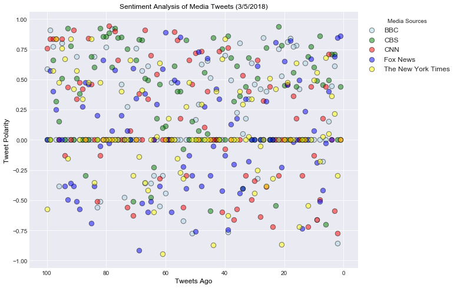
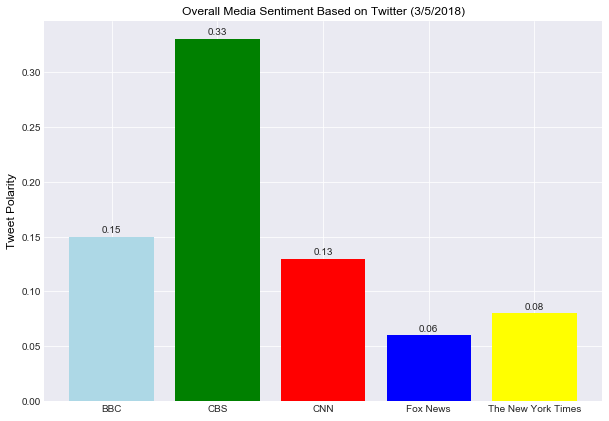

NewsMood
--------

Observations:
^^^^^^^^^^^^^

-  CBS network had the highest compound average sentiment analysis at
   0.33, slightly more than double that of any of the other news
   networks analyzed with BBC following at 0.15 and CNN at 0.13.
-  Interestingly, the New York Times and Fox News, which could be
   considered to be the most politically opposite of the media outlets
   analyzed scored the lowest average sentiment analyses at 0.08 and
   0.06 respectively. This could indicate that news with a more extreme
   political angle is more negative.
-  Overall sentiments from each media source are above 0, indicating a
   generally positive mood. This could be partly due to news reports on
   the 2018 Oscars, which occured the evening of March 4, of which news
   posts tend to be more positive and upbeat.

.. code:: ipython3

    #Import Statements,Twitter UserInformation
    import numpy as np
    import pandas as pd
    import matplotlib.pyplot as plt
    import json
    import tweepy
    import time
    from collections import OrderedDict
    import seaborn as sns
    
    # Initialize Sentiment Analyzer
    from vaderSentiment.vaderSentiment import SentimentIntensityAnalyzer
    analyzer = SentimentIntensityAnalyzer()
    
    # Twitter API Keys
    consumer_key = "JovP5qnpxryY3o0G0dgoMuouc"
    consumer_secret = "Cfvxna8OlA7IFnkRNGR4qJxtOzfhixJl0l5HXmJg0ocDgwaYwD"
    access_token = "967431307176407046-oQRgCSqnwFHBJ4MuK3pq9LtkqflsWBN"
    access_token_secret = "vQ313qjSD1ImvyMQU06zbmvMq9tiIxuA7wrlZfmSSIDRC"
    
    # Setup Tweepy API Authentication
    auth = tweepy.OAuthHandler(consumer_key, consumer_secret)
    auth.set_access_token(access_token, access_token_secret)
    api = tweepy.API(auth)
    
    outlets=["@BBC","@CBS","@CNN","@foxnews","@nytimes"]
    

.. code:: ipython3

    # Loop through last 100 tweets for each news outlet,Perform Sentiment Analysis,Get Timestamp
    timestamp=[]
    text=[]
    user=[]
    compound=[]
    pos=[]
    neu=[]
    neg=[]
    tweetsago=[]
    for outlet in outlets:
        counter=1
        for item in tweepy.Cursor(api.user_timeline,id=outlet).items(100):
            tweetinfo = json.dumps(item._json,indent=5)
            tweet = json.loads(tweetinfo)
    
            text.append(tweet["text"])
            user.append(tweet["user"]["name"])
            timestamp.append(tweet["created_at"])
            compound.append(analyzer.polarity_scores(tweet["text"])["compound"])
            pos.append(analyzer.polarity_scores(tweet["text"])["pos"])
            neu.append(analyzer.polarity_scores(tweet["text"])["neu"])
            neg.append(analyzer.polarity_scores(tweet["text"])["neg"])
            tweetsago.append(counter)
            counter=counter+1
                    
    df=pd.DataFrame(OrderedDict({"User":user,"TweetsAgo":tweetsago,"Text":text,"Timestamp":timestamp,
                                 "Compound":compound,"Pos":pos,"Neu":neu,"Neg":neg}))
    df.to_csv("Last100TweetsMajorNewsOutlets.csv")

.. code:: ipython3

    df.head()

.. raw:: html

    

    
    <table border="1" class="dataframe">
      <thead>
        <tr style="text-align: right;">
          <th></th>
          <th>User</th>
          <th>TweetsAgo</th>
          <th>Text</th>
          <th>Timestamp</th>
          <th>Compound</th>
          <th>Pos</th>
          <th>Neu</th>
          <th>Neg</th>
        </tr>
      </thead>
      <tbody>
        <tr>
          <th>0</th>
          <td>BBC</td>
          <td>1</td>
          <td>😂 Who actually watched the #Oscars? https://t....</td>
          <td>Mon Mar 05 19:30:07 +0000 2018</td>
          <td>0.0000</td>
          <td>0.000</td>
          <td>1.000</td>
          <td>0.000</td>
        </tr>
        <tr>
          <th>1</th>
          <td>BBC</td>
          <td>2</td>
          <td>No meat. No fish. No eggs. No milk. No cheese....</td>
          <td>Mon Mar 05 18:38:04 +0000 2018</td>
          <td>-0.8555</td>
          <td>0.000</td>
          <td>0.592</td>
          <td>0.408</td>
        </tr>
        <tr>
          <th>2</th>
          <td>BBC</td>
          <td>3</td>
          <td>Like father, like daughter.\n\n😂🔥 @GordonRamsa...</td>
          <td>Mon Mar 05 17:23:22 +0000 2018</td>
          <td>0.6124</td>
          <td>0.263</td>
          <td>0.737</td>
          <td>0.000</td>
        </tr>
        <tr>
          <th>3</th>
          <td>BBC</td>
          <td>4</td>
          <td>RT @BBCFOUR: The little mouse that inspired Pi...</td>
          <td>Mon Mar 05 17:15:34 +0000 2018</td>
          <td>0.4472</td>
          <td>0.211</td>
          <td>0.789</td>
          <td>0.000</td>
        </tr>
        <tr>
          <th>4</th>
          <td>BBC</td>
          <td>5</td>
          <td>"I made a promise to our six-year-old lead act...</td>
          <td>Mon Mar 05 17:00:31 +0000 2018</td>
          <td>0.1531</td>
          <td>0.105</td>
          <td>0.818</td>
          <td>0.077</td>
        </tr>
      </tbody>
    </table>
    

.. code:: ipython3

    newsoutlets=list(df["User"].unique())
    mediasources=newsoutlets[:]
    colors=["lightblue","green","red","blue","yellow"]
    countoutlets=list(range(len(newsoutlets)))
    for outlet in range(len(newsoutlets)):
        newsoutlets[outlet]=df.loc[df["User"]==newsoutlets[outlet]]

.. code:: ipython3

    #Plot1: Sentiment Analysis of Media Tweets(Date)
    font={'family': 'arial',
            'color':  'black',
            'size': 12}
    plt.figure(figsize=(10,8))
    sns.set_style("darkgrid")
    for color,source,count in zip(colors,mediasources,countoutlets):
        sentiment=plt.scatter(newsoutlets[count]["TweetsAgo"],newsoutlets[count]["Compound"],
                              c=color,edgecolor="black",alpha=0.5,s=70,label=source)
    plt.gca().invert_xaxis()
    plt.title("Sentiment Analysis of Media Tweets (3/5/2018)",fontdict=font)
    plt.xlabel("Tweets Ago",fontdict=font)
    plt.ylabel("Tweet Polarity",fontdict=font)
    leg=plt.legend(title="Media Sources",fontsize=12,bbox_to_anchor=(1,1))
    plt.savefig("Sentiment_Analysis_Media_Tweets.png",bbox_extra_artists=(leg,), bbox_inches='tight')
    plt.show()

.. code:: ipython3

    #Calculate Avg Compound for Each Media Source
    avgcompound=[]
    for source in mediasources:
        avgcompound.append(round(df.loc[df["User"]==source]["Compound"].mean(),2))
    avgcompound

.. parsed-literal::

    [0.15, 0.33, 0.13, 0.06, 0.08]

.. code:: ipython3

    #Plot2: Overall Media Sentiment based on Twitter (Date)
    plt.figure(figsize=(10,7))
    sns.set_style("darkgrid")
    overall=plt.bar(mediasources,avgcompound,color=colors)
    plt.title("Overall Media Sentiment Based on Twitter (3/5/2018)",fontdict=font)
    plt.ylabel("Tweet Polarity",fontdict=font)
    
    rects=overall.patches
    for rect,avg in zip(rects,avgcompound):
        plt.text(rect.get_x()+rect.get_width()/2,rect.get_height()+.01,avg,horizontalalignment="center",verticalalignment="top")
    plt.savefig("Overal_Media_Sentiment.png")
    plt.show()

