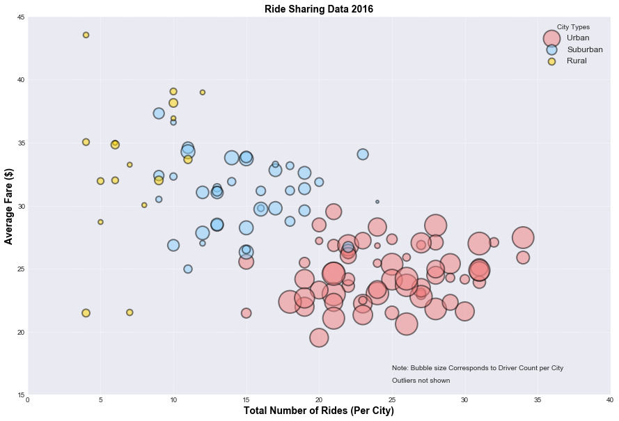
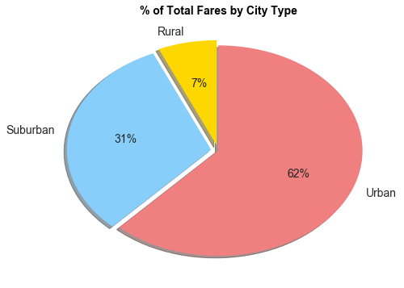
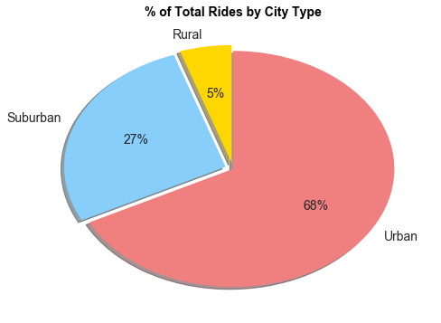
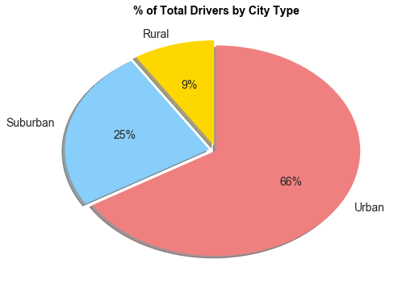

## Pyber Ride Sharing

### Analysis:
    1. Ride sharing is used in Urban areas more than rural and suburban combined: as evidenced by total urban fares, 
    total urban drivers and total urban rides
    2. Average city fares decrease with increasing number of rides per city
    3. Urban areas have a greater number of rides, corresponding to decreased average fares
    


```python
import pandas as pd
import os
import numpy as np
import matplotlib.pyplot as plt
import seaborn as sns
```


```python
city=pd.read_csv("city_data.csv")
ride=pd.read_csv("ride_data.csv")

```


```python
city_df=pd.DataFrame(city)
city.head()
```


<div>
<style>
    .dataframe thead tr:only-child th {
        text-align: right;
    }

    .dataframe thead th {
        text-align: left;
    }

    .dataframe tbody tr th {
        vertical-align: top;
    }
</style>
<table border="1" class="dataframe">
  <thead>
    <tr style="text-align: right;">
      <th></th>
      <th>city</th>
      <th>driver_count</th>
      <th>type</th>
    </tr>
  </thead>
  <tbody>
    <tr>
      <th>0</th>
      <td>Kelseyland</td>
      <td>63</td>
      <td>Urban</td>
    </tr>
    <tr>
      <th>1</th>
      <td>Nguyenbury</td>
      <td>8</td>
      <td>Urban</td>
    </tr>
    <tr>
      <th>2</th>
      <td>East Douglas</td>
      <td>12</td>
      <td>Urban</td>
    </tr>
    <tr>
      <th>3</th>
      <td>West Dawnfurt</td>
      <td>34</td>
      <td>Urban</td>
    </tr>
    <tr>
      <th>4</th>
      <td>Rodriguezburgh</td>
      <td>52</td>
      <td>Urban</td>
    </tr>
  </tbody>
</table>
</div>


```python
ride_df=pd.DataFrame(ride)
ride_df.head()
```


<div>
<style>
    .dataframe thead tr:only-child th {
        text-align: right;
    }

    .dataframe thead th {
        text-align: left;
    }

    .dataframe tbody tr th {
        vertical-align: top;
    }
</style>
<table border="1" class="dataframe">
  <thead>
    <tr style="text-align: right;">
      <th></th>
      <th>city</th>
      <th>date</th>
      <th>fare</th>
      <th>ride_id</th>
    </tr>
  </thead>
  <tbody>
    <tr>
      <th>0</th>
      <td>Sarabury</td>
      <td>2016-01-16 13:49:27</td>
      <td>38.35</td>
      <td>5403689035038</td>
    </tr>
    <tr>
      <th>1</th>
      <td>South Roy</td>
      <td>2016-01-02 18:42:34</td>
      <td>17.49</td>
      <td>4036272335942</td>
    </tr>
    <tr>
      <th>2</th>
      <td>Wiseborough</td>
      <td>2016-01-21 17:35:29</td>
      <td>44.18</td>
      <td>3645042422587</td>
    </tr>
    <tr>
      <th>3</th>
      <td>Spencertown</td>
      <td>2016-07-31 14:53:22</td>
      <td>6.87</td>
      <td>2242596575892</td>
    </tr>
    <tr>
      <th>4</th>
      <td>Nguyenbury</td>
      <td>2016-07-09 04:42:44</td>
      <td>6.28</td>
      <td>1543057793673</td>
    </tr>
  </tbody>
</table>
</div>


```python
ride_city=pd.merge(city_df,ride_df,on="city",how="inner")
ride_city.head()
```


<div>
<style>
    .dataframe thead tr:only-child th {
        text-align: right;
    }

    .dataframe thead th {
        text-align: left;
    }

    .dataframe tbody tr th {
        vertical-align: top;
    }
</style>
<table border="1" class="dataframe">
  <thead>
    <tr style="text-align: right;">
      <th></th>
      <th>city</th>
      <th>driver_count</th>
      <th>type</th>
      <th>date</th>
      <th>fare</th>
      <th>ride_id</th>
    </tr>
  </thead>
  <tbody>
    <tr>
      <th>0</th>
      <td>Kelseyland</td>
      <td>63</td>
      <td>Urban</td>
      <td>2016-08-19 04:27:52</td>
      <td>5.51</td>
      <td>6246006544795</td>
    </tr>
    <tr>
      <th>1</th>
      <td>Kelseyland</td>
      <td>63</td>
      <td>Urban</td>
      <td>2016-04-17 06:59:50</td>
      <td>5.54</td>
      <td>7466473222333</td>
    </tr>
    <tr>
      <th>2</th>
      <td>Kelseyland</td>
      <td>63</td>
      <td>Urban</td>
      <td>2016-05-04 15:06:07</td>
      <td>30.54</td>
      <td>2140501382736</td>
    </tr>
    <tr>
      <th>3</th>
      <td>Kelseyland</td>
      <td>63</td>
      <td>Urban</td>
      <td>2016-01-25 20:44:56</td>
      <td>12.08</td>
      <td>1896987891309</td>
    </tr>
    <tr>
      <th>4</th>
      <td>Kelseyland</td>
      <td>63</td>
      <td>Urban</td>
      <td>2016-08-09 18:19:47</td>
      <td>17.91</td>
      <td>8784212854829</td>
    </tr>
  </tbody>
</table>
</div>


## Bubble Plot of Ride Sharing Data


```python
typ=ride_city["type"].groupby(ride_city["city"]).max()
numrides=ride_city["ride_id"].groupby(ride_city["city"]).count()
avgfare=ride_city["fare"].groupby(ride_city["city"]).mean()
numdrivers=ride_city["driver_count"].groupby(ride_city["city"]).max()
data=pd.DataFrame({"Type":typ,"Ride Count":numrides,"Driver Count":numdrivers,"Avg Fare":avgfare})
pyber=data.reset_index(drop=False)
pyber.head()
```


<div>
<style>
    .dataframe thead tr:only-child th {
        text-align: right;
    }

    .dataframe thead th {
        text-align: left;
    }

    .dataframe tbody tr th {
        vertical-align: top;
    }
</style>
<table border="1" class="dataframe">
  <thead>
    <tr style="text-align: right;">
      <th></th>
      <th>city</th>
      <th>Avg Fare</th>
      <th>Driver Count</th>
      <th>Ride Count</th>
      <th>Type</th>
    </tr>
  </thead>
  <tbody>
    <tr>
      <th>0</th>
      <td>Alvarezhaven</td>
      <td>23.928710</td>
      <td>21</td>
      <td>31</td>
      <td>Urban</td>
    </tr>
    <tr>
      <th>1</th>
      <td>Alyssaberg</td>
      <td>20.609615</td>
      <td>67</td>
      <td>26</td>
      <td>Urban</td>
    </tr>
    <tr>
      <th>2</th>
      <td>Anitamouth</td>
      <td>37.315556</td>
      <td>16</td>
      <td>9</td>
      <td>Suburban</td>
    </tr>
    <tr>
      <th>3</th>
      <td>Antoniomouth</td>
      <td>23.625000</td>
      <td>21</td>
      <td>22</td>
      <td>Urban</td>
    </tr>
    <tr>
      <th>4</th>
      <td>Aprilchester</td>
      <td>21.981579</td>
      <td>49</td>
      <td>19</td>
      <td>Urban</td>
    </tr>
  </tbody>
</table>
</div>


```python
pyber_types=list(pyber["Type"].unique())
city_types=pyber_types[:]

```


```python
numtypes=len(city_types)
for typ in range(numtypes):
    pyber_types[typ]=pyber.loc[pyber["Type"]==pyber_types[typ]]
numlist=list(range(0,numtypes,1))

```


```python
font={'family': 'arial',
        'color':  'black',
        'weight': 'bold',
        'size': 14,
        }
colors=["lightcoral","lightskyblue","gold"]
```


```python
#Need to plt ride count vs. avg fare for each type, size is driver count
fig1=plt.figure(figsize=(15,10))
sns.set_style("darkgrid")
for typ,num,color in zip(city_types,numlist,colors):
    bubble=plt.scatter(pyber_types[num]["Ride Count"],pyber_types[num]["Avg Fare"],s=15*pyber_types[num]["Driver Count"],c=color,alpha=0.5,linewidth=2,edgecolors="black",label=typ)
plt.grid(alpha=0.6,linestyle="--")
plt.title("Ride Sharing Data 2016",fontdict=font)
plt.xlabel("Total Number of Rides (Per City)",fontdict=font)
plt.ylabel("Average Fare ($)",fontdict=font)
plt.xlim(0,40)
plt.ylim(15,45)
plt.legend(loc="upper right",title="City Types",fontsize=12)
plt.text(25,17,"Note: Bubble size Corresponds to Driver Count per City")
plt.text(25,16,"Outliers not shown")
plt.show()
```





```python
avgfaresum=ride_city["fare"].groupby(ride_city["type"]).sum()
totdriver=ride_city["driver_count"].groupby(ride_city["type"]).max()
totride=ride_city["ride_id"].groupby(ride_city["type"]).count()
typegroup=pd.DataFrame({"Total Fare":avgfaresum,"Total Driver Count":totdriver,"Total Rides":totride,"Colors":["gold","lightskyblue","lightcoral"],"Explode":[0.05,0.05,0]})
typegroup
```


<div>
<style>
    .dataframe thead tr:only-child th {
        text-align: right;
    }

    .dataframe thead th {
        text-align: left;
    }

    .dataframe tbody tr th {
        vertical-align: top;
    }
</style>
<table border="1" class="dataframe">
  <thead>
    <tr style="text-align: right;">
      <th></th>
      <th>Colors</th>
      <th>Explode</th>
      <th>Total Driver Count</th>
      <th>Total Fare</th>
      <th>Total Rides</th>
    </tr>
    <tr>
      <th>type</th>
      <th></th>
      <th></th>
      <th></th>
      <th></th>
      <th></th>
    </tr>
  </thead>
  <tbody>
    <tr>
      <th>Rural</th>
      <td>gold</td>
      <td>0.05</td>
      <td>10</td>
      <td>4255.09</td>
      <td>125</td>
    </tr>
    <tr>
      <th>Suburban</th>
      <td>lightskyblue</td>
      <td>0.05</td>
      <td>27</td>
      <td>20335.69</td>
      <td>657</td>
    </tr>
    <tr>
      <th>Urban</th>
      <td>lightcoral</td>
      <td>0.00</td>
      <td>73</td>
      <td>40078.34</td>
      <td>1625</td>
    </tr>
  </tbody>
</table>
</div>


## Total Fares by City Type


```python
plt.figure(figsize=(8,6))
totalfare=plt.pie(typegroup["Total Fare"],labels=typegroup.index,colors=typegroup["Colors"],explode=typegroup["Explode"],autopct='%1.0f%%',shadow=True,startangle=90)
plt.title("% of Total Fares by City Type",fontdict=font)
indexlist=list(range(0,len(typegroup.index),1))
textcount=list(range(1,3,1))
#pie plot returns patches, labels, text---take labels and text to set fontsize
[totalfare[i][j].set_fontsize(14) for i in textcount for j in indexlist]
plt.show()

```





## Total Rides by City Type


```python
plt.figure(figsize=(8,6))
totalfare=plt.pie(typegroup["Total Rides"],labels=typegroup.index,colors=typegroup["Colors"],explode=typegroup["Explode"],autopct='%1.0f%%',shadow=True,startangle=90)
plt.title("% of Total Rides by City Type",fontdict=font)
[totalfare[i][j].set_fontsize(14) for i in textcount for j in indexlist]
plt.show()
```





## Total Drivers by City Type


```python
plt.figure(figsize=(8,6))
totalfare=plt.pie(typegroup["Total Driver Count"],labels=typegroup.index,colors=typegroup["Colors"],explode=typegroup["Explode"],autopct='%1.0f%%',shadow=True,startangle=90)
plt.title("% of Total Drivers by City Type",fontdict=font)
[totalfare[i][j].set_fontsize(14) for i in textcount for j in indexlist]
plt.show()
```




